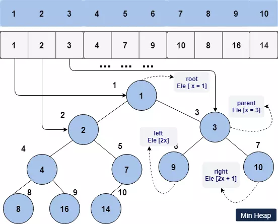

# heapq

- [heapq](#heapq)
  - [简介](#%e7%ae%80%e4%bb%8b)
  - [优先队列](#%e4%bc%98%e5%85%88%e9%98%9f%e5%88%97)
  - [堆](#%e5%a0%86)
  - [函数](#%e5%87%bd%e6%95%b0)
    - [heappush](#heappush)
    - [heappop](#heappop)
    - [heappushpop](#heappushpop)
    - [heapify](#heapify)
    - [heapreplace](#heapreplace)
    - [nlargest](#nlargest)
    - [nsmallest](#nsmallest)
  - [获得集合中最大或最小的 N 个元素](#%e8%8e%b7%e5%be%97%e9%9b%86%e5%90%88%e4%b8%ad%e6%9c%80%e5%a4%a7%e6%88%96%e6%9c%80%e5%b0%8f%e7%9a%84-n-%e4%b8%aa%e5%85%83%e7%b4%a0)

***

## 简介

heapq 模块使用 bineary heap 数据结构实现了堆队列算法（优先队列算法）。

heapq 模块使用常规的 Python list 创建 heap。它支持 O(log n)时间内添加和删除最小的元素。是优先队列实现的很好选择。

heap 数据结构有个特征，它总是弹出最小的元素（最小堆）。不管多少压入或弹出操作，它总是保持其结构的完整性。

## 优先队列

优先队列（Priority Queue）是一种高级数据结构（ADT），优先级高的元素比优先级低的元素先从队列中出来。大多数编程语言（如 Python）使用 Binary heap 实现它。

heapq 提供了最小堆的实现。

## 堆

堆（Heap）在计算机领域有多种含义，它可能是指程序中用于动态分配的内存区，在这里，指的是数据结构，是一个完整的二叉树。它辅助实现优先队列，堆排序以及一些基于图的算法。

堆有两种类型:

- 最大堆（max-heap），父节点不小于其子节点。
- 最小堆（min-heap），父节点不大于其子节点。

下面是二叉堆的示意图：



## 函数

| 函数                 | 功能                                            |
| -------------------- | ----------------------------------------------- |
| heapify(x)           | 将 list x 转换为 heap，in-place, in linear time |
| heappush(heap, item) | 将 `item` 添加到 `heap`                         |
| nlargest             | 返回最大 n 个值的 list                          |
| nsmallest            | 返回最小 n 个值的 list                          |

`nlargest` 和 `nsmallest` 适合于 `n` 较小的情况，如果 `n` 很大，使用 `sorted()` 函数效率更高，如果 `n=1`，使用 `min()` 和 `max()` 更有效。

如果需要反复使用这些函数，最好将 `iterable` 转换为 heap。

### heappush

添加元素到 heap。

```py
>>> init_list = [2, 5, 1, 8, 3]
>>> heap = []
>>> [hq.heappush(heap, x) for x in init_list]
>>> heap
[1, 3, 2, 8, 5]
```

第一个元素总是最小的。但是后面不一定是按顺序排列的。

### heappop

从 index 0 处移除最小的元素。 heap 会保证下一个最小的元素移到该位置。

```py
init_list = [2, 5, 1, 8, 3]
heap = []
[hq.heappush(heap, x) for x in init_list]
assert heap[0] == 1
assert hq.heappop(heap) == 1
assert heap[0] == 2
assert hq.heappop(heap) == 2
```

### heappushpop

该函数首先添加元素到 heap，然后移除并返回最小值。即它同时调用了 `heappush` 和 `heappop`，但是并同时调用这两个方法快一点。

```py
init_list = [2, 5, 1, 8, 3]
heap = []
[hq.heappush(heap, x) for x in init_list]

assert hq.heappushpop(heap, 7) == 1
assert len(heap) == 5
```

### heapify

将 list 转换为 heap。

`hq.heapify(heap)`

例如：

```py
heap = [2, 5, 1, 8, 3]
hq.heapify(heap)
assert heap[0] == 1
```

### heapreplace

`heapreplace(heap, item)`

删除最小元素，然后添加新的元素。heap size 不变，如果 heap 为空，抛出 `IndexError`。

其操作比 `heappop()` + `heappush()` 操作快，对固定大小的 heap 更合适。例如：

```py
init_list = [2, 5, 1, 8, 3]
heap = []
[hq.heappush(heap, x) for x in init_list]
assert 1 == hq.heapreplace(heap, 4)  # remove 1 and add 4
assert 2 == hq.heapreplace(heap, 0)  # remove 2 and add 0
```

其返回的值可能比添加的 `item` 大，如果不希望如此，可以使用 `heappushpop()`，该方法返回两者较小的值。

### nlargest

`nlargest(n, iterable, key=None)`

返回 `iterable` 中最大的 `n` 个元素的列表。

`key` 提供一个函数，用于从元素中提取用于比较的信息，例如 `key=str.lower`。

该函数等价于 `sorted(iterable, key=key, reverse=True)[: n]`

```py
ints = [3, 5, 6, 2, 1]
top2_nums = hq.nlargest(2, ints)
assert top2_nums == [6, 5]
```

### nsmallest

`nsmallest(n, iterable, key=None)`

返回 `iterable` 中的 `n` 个最小元素。`key` 是用于从元素中提取用于比对的信息。

等价于 `sorted(iterable, key=key)[:n]`。

```py
ints = [3, 5, 6, 2, 1]
low3 = hq.nsmallest(3, ints)
assert low3 == [1, 2, 3]
```

## 获得集合中最大或最小的 N 个元素

实现该功能的方法有多种，但是使用 heapq 最直观，也最快。

```py
import heapq
nums = [1, 8, 2, 23, 7, -4, 18, 23, 42, 37, 2]
print(heapq.nlargest(3, nums)) # Prints [42, 37, 23]
print(heapq.nsmallest(3, nums)) # Prints [-4, 1, 2]
```

对复杂的数据，指定 `key` 提取对比信息：

```py
portfolio = [
    {'name': 'IBM', 'shares': 100, 'price': 91.1},
    {'name': 'AAPL', 'shares': 50, 'price': 543.22},
    {'name': 'FB', 'shares': 200, 'price': 21.09},
    {'name': 'HPQ', 'shares': 35, 'price': 31.75},
    {'name': 'YHOO', 'shares': 45, 'price': 16.35},
    {'name': 'ACME', 'shares': 75, 'price': 115.65}
]
cheap = heapq.nsmallest(3, portfolio, key=lambda s: s['price'])
expensive = heapq.nlargest(3, portfolio, key=lambda s: s['price'])
```
