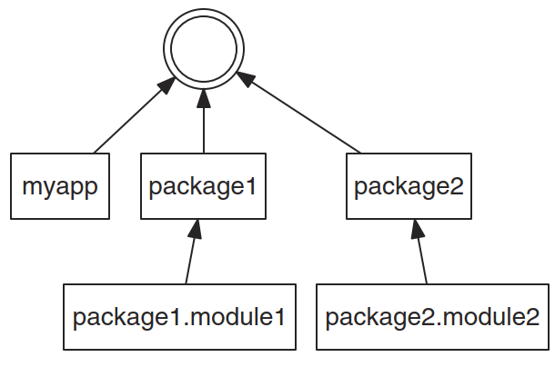
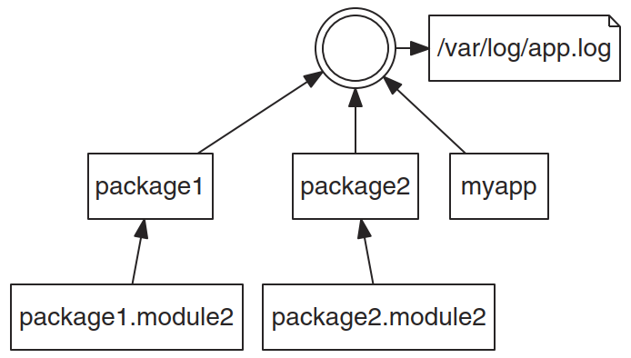

# logging

- [logging](#logging)
  - [1. 简介](#1-简介)
  - [2. 组成](#2-组成)
  - [3. 日志到文件](#3-日志到文件)
  - [4. 日志文件轮转](#4-日志文件轮转)
  - [5. 日志级别](#5-日志级别)
  - [6. 命名 Logger](#6-命名-logger)
  - [7. Logging Tree](#7-logging-tree)
  - [8. 集成 warnings 模块](#8-集成-warnings-模块)
  - [9. 参考](#9-参考)

Last updated: 2023-01-17, 13:35
****

## 1. 简介

`logging` 模块提供日志功能。`logging` 标准日志模块与 Python 兼容性好，不需要额外安装模块。

## 2. 组成

`logging` 主要由四个类组成：

- `Logger`，用于添加日志
- `LogRecord`，用于表示日志信息
- `Handler`，用于接收和处理日志信息
- `Formatter`，用于格式化日志信息

## 3. 日志到文件

将日志输出到文件。使用 `basicConfig()` 函数设置默认的 `handler`，debug 日志将写入文件。

```python
import logging

LOG_FILENAME = 'logging_example.out'
logging.basicConfig(
    filename=LOG_FILENAME,
    level=logging.DEBUG
)

logging.debug('This message should go to the log file')

with open(LOG_FILENAME, 'rt') as f:
    msg = f.read()

print('FILE:')
print(msg)
```

```txt
FILE:
DEBUG:root:This message should go to the log file
```

## 4. 日志文件轮转

上面的日志到文件示例，重复运行脚本，日志会附加到相同文件。也可以每次创建一个新的文件，在 `basicConfig()` 添加 `filemode='w'` 设置即可。

不过还有更好的文件管理方式，使用 `RotatingFileHandler` 可以周期性的自动创建文件，同时保留旧的日志文件。

```python
import glob

import logging.handlers

LOG_FILENAME = 'logging_rotatingfile_example.out'
# 设置具有指定 level 的 logger
my_logger = logging.getLogger("MyLogger")
my_logger.setLevel(logging.DEBUG)

# 添加 handler
handler = logging.handlers.RotatingFileHandler(
    LOG_FILENAME,
    maxBytes=20,
    backupCount=5
)
my_logger.addHandler(handler)

# 添加日志
for i in range(20):
    my_logger.debug('i = %d' % i)

# 查看创建的日志文件
logfiles = glob.glob('%s*' % LOG_FILENAME)
for filename in logfiles:
    print(filename)
```

```txt
logging_rotatingfile_example.out
logging_rotatingfile_example.out.1
logging_rotatingfile_example.out.2
logging_rotatingfile_example.out.3
logging_rotatingfile_example.out.4
logging_rotatingfile_example.out.5
```

生成 6 个日志文件，每个文件包含部分日志纪录。其中 `logging_rotatingfile_example.out` 是最新的日志文件。每当文件达到大小限制 `maxBytes=20`，该文件添加后缀 `.1`，已有备份文件后缀依次增加，即 `.1` 变为 `.2`，`.2` 变为 `.3`，而最后的 `.5` 被删除。

## 5. 日志级别

|级别|值|说明|
|---|---|---|
|CRITICAL|50|严重错误，程序可能无法继续执行|
|FATAL|50|同上|
|ERROR|40|出错，不能按预期运行|
|WARNING|30|按预期运行，但可能出现问题|
|WARN|30|同上|
|INFO|20|常规信息，按预期运行|
|DEBUG|10|debug 详细信息|
|NOTSET|0|输出所有信息|

示例：

```python
import logging
import sys

LEVELS = {
    'debug': logging.DEBUG,
    'info': logging.INFO,
    'warning': logging.WARNING,
    'error': logging.ERROR,
    'critical': logging.CRITICAL,
}

if len(sys.argv) > 1:
    level_name = sys.argv[1]
    level = LEVELS.get(level_name, logging.NOTSET)
    logging.basicConfig(level=level)

logging.debug('This is a debug message')
logging.info('This is an info message')
logging.warning('This is a warning message')
logging.error('This is an error message')
logging.critical('This is a critical error message')
```

使用 'debug' 或 'warning' 运行上述脚本，可以查看设置不同 log 级别对输出日志的影响。

## 6. 命名 Logger

前面的示例输出的日志开头都有 `root` 单词，因为它们都使用默认的 `root` logger。一种判断特定日志来源的方法是在每个模块使用一个单独的日志对象。如下所示：

```python
import logging

logging.basicConfig(level=logging.WARNING)

logger1 = logging.getLogger('package1.module1')
logger2 = logging.getLogger('package2.module2')

logger1.warning("This message comes from one module")
logger2.warning("This comes from another module")
```

```txt
WARNING:package1.module1:This message comes from one module
WARNING:package2.module2:This comes from another module
```

## 7. Logging Tree

如下图所示，`Logger` 根据名称以属性结构配置。通常，每个应用程序或库定义一个基础名称，然后各个模块的 logger 设置为子 logger。



树形结构对配置 logging 非常有用，可以避免为每个 logger 设置 handler。如果一个 logger 没有设置 handler，其日志消息会自动传递到上层。因此，应用程序只需要在 root logger 上配置 handler，其下所有日志都自动收集发到同一位置。如下图所示：



## 8. 集成 warnings 模块

`logging` 模块通过 `captureWarnings()` 函数集成 `warnings`，使得 `warnings` 信息发送到日志系统。例如：

```python
import logging
import warnings

logging.basicConfig(
    level=logging.INFO
)

warnings.warn("This warning is not sent to the logs")

logging.captureWarnings(True)

warnings.warn("This warning is sent to the logs")
```

```txt
logging_file.py:8: UserWarning: This warning is not sent to the logs
  warnings.warn("This warning is not sent to the logs")
WARNING:py.warnings:logging_file.py:12: UserWarning: This warning is sent to the logs
  warnings.warn("This warning is sent to the logs")
```

warnings 信息以名称 py.warnings 和 `WARNING` 级别发送到日志。

## 9. 参考

- https://docs.python.org/3/howto/logging.html
- https://docs.python.org/3/howto/logging-cookbook.html
