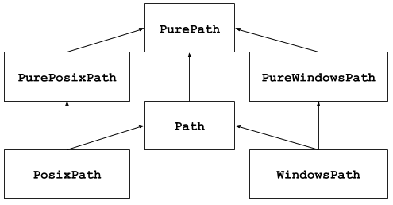

# 简介
这个模块提供了表示文件系统路径的类。其路径类分为两类：
- 纯路径（pure path），单纯提供路径计算操作，不包含I/O
- 实体路径（concrete paths），继承 pure path，提供I/O操作

大部分时候我们需要的是 `Path` 类，它为当前平台实例化一个实体路径。

纯路径在特定情况下很有用，例如：
1. 如果你想在 Unix 上操作 Windows 路径（反之亦然）。在 Unix 上你无法实例化 `WindowsPath`，不过你可以实例化 `PureWindowsPath`
2. 你只是想操作路径，而不是需要访问 OS。此时，实例化纯路径更合适，因为它们没有任何访问OS的操作。

# Reference
- https://docs.python.org/3/library/pathlib.html
