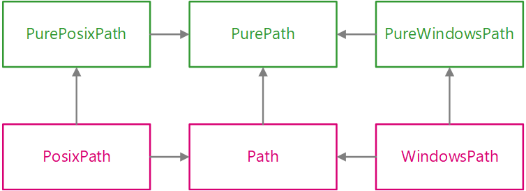

# pathlib

- [pathlib](#pathlib)
  - [简介](#简介)
  - [基本操作](#基本操作)
    - [列出子目录](#列出子目录)
    - [列出源文件](#列出源文件)
    - [在目录树中导航](#在目录树中导航)
    - [查询路径属性](#查询路径属性)
    - [打开文件](#打开文件)
  - [纯路径](#纯路径)
    - [实现类](#实现类)
      - [PurePath](#purepath)
      - [PurePosixPath](#pureposixpath)
      - [PureWindowsPath](#purewindowspath)
    - [属性](#属性)
    - [运算符](#运算符)
    - [分段访问路径](#分段访问路径)
    - [纯路径的方法和属性](#纯路径的方法和属性)
      - [PurePath.drive](#purepathdrive)
      - [PurePath.root](#purepathroot)
      - [PurePath.anchor](#purepathanchor)
      - [PurePath.parents](#purepathparents)
      - [PurePath.parent](#purepathparent)
      - [PurePath.name](#purepathname)
      - [PurePath.suffix](#purepathsuffix)
      - [PurePath.suffixes](#purepathsuffixes)
      - [PurePath.stem](#purepathstem)
      - [PurePath.as\_posix()](#purepathas_posix)
      - [PurePath.as\_uri()](#purepathas_uri)
      - [PurePath.is\_absolute()](#purepathis_absolute)
  - [实路径](#实路径)
    - [Path.exists](#pathexists)
  - [os 中对应工具](#os-中对应工具)
  - [方法和属性](#方法和属性)
    - [PurePath.joinpath](#purepathjoinpath)
    - [PurePath.with\_suffix](#purepathwith_suffix)
    - [Path.glob](#pathglob)
    - [Path.iterdir](#pathiterdir)
    - [Path.rename](#pathrename)
  - [参考](#参考)

Last updated: 2023-02-03, 10:39
****

## 简介

`pathlib` 模块提供了表示操作系统文件路径的类。路径分为两种：

- 纯路径，只提供路径计算，没有 I/O 功能
- 实路径，继承纯路径，额外提供 I/O 功能

类的继承关系如下所示：



其中 `Path` 是基于平台的具体路径，使用最为广泛。

纯路径有如下应用场景：

- 在 Unix 系统上操作 Windows 路径（反之亦然），在 Unix 上无法实例化 `WindowsPath`，但是可以实例化 `PureWindowsPath`；
- 不需要访问 OS，只需要操作路径。

## 基本操作

### 列出子目录

用 `Path.iterdir()` 列出子项，用 `Path.is_dir()` 判断是否为目录。

现有如下目录结构：

```txt
D:\data\test\
      |
      |--dir1
      |--dir2
      |--dir3
      |--file1.txt
```

```py
from pathlib import Path

p = Path(r'D:\data\test')
dir_lst = [x for x in p.iterdir() if x.is_dir()]
print(dir_lst)
# [WindowsPath('D:/data/test/dir1'), WindowsPath('D:/data/test/dir2'), WindowsPath('D:/data/test/dir3')]
```

### 列出源文件

```py
>>> list(p.glob('**/*.py'))
[PosixPath('test_pathlib.py'), PosixPath('setup.py'),
 PosixPath('pathlib.py'), PosixPath('docs/conf.py'),
 PosixPath('build/lib/pathlib.py')]
```

### 在目录树中导航

这里用 `/` 将路径串起来：

```py
>>> p = Path('/etc')
>>> q = p / 'init.d' / 'reboot'
>>> q
PosixPath('/etc/init.d/reboot')
>>> q.resolve()
PosixPath('/etc/rc.d/init.d/halt')
```

### 查询路径属性

```py
>>> q.exists()
True
>>> q.is_dir()
False
```

### 打开文件

```py
>>> with q.open() as f: f.readline()
...
'#!/bin/bash\n'
```

## 纯路径

纯路径提供文件路径操作功能。有三种访问这些类的方法。

不管在哪个操作系统，可以实例化 `PurePath`、`PurePosixPath`和 `PureWindowsPath`，因为它们不执行任何系统调用。

### 实现类

#### PurePath

```py
class pathlib.PurePath(*pathsegments)
```

代表文件路径的通用类，实例化该类，根据系统不同返回 `PurePosixPath` 或 `PureWindowsPath`。例如：

```py
>>> PurePath('setup.py')      # Running on a Unix machine
PurePosixPath('setup.py')
```

`pathsegments` 参数：

- 表示路径的字符串
- 或者是实现 `os.PathLike` 接口的对象
- 或者另一个 path 对象

例如：

```py
p = PurePath('path', 'to', "hell")
assert p == PurePath('path/to/hell')
assert PurePath(Path('path'), 'to/hell') == PurePath('path/to/hell')
```

如果 `pathsegments` 为空，返回当前目录：

```py
>>> PurePath()
PurePosixPath('.')
```

当 `pathsegments` 中有多个绝对路径，使用最后一个：

```py
>>> PurePath('/etc', '/usr', 'lib64')
PurePosixPath('/usr/lib64')
>>> PureWindowsPath('c:/Windows', 'd:bar')
PureWindowsPath('d:bar')
```

不过在 Windows 路径中，修改本地根目录不改变前面的驱动器：

```py
>>> PureWindowsPath('c:/Windows', '/Program Files')
PureWindowsPath('c:/Program Files')
```

路径中多余的斜杠和单点会被舍弃，但是不改变双点 `..`，因为在符号链接中修改双点可能改变路径的含义：

```py
>>> PurePath('foo//bar')
PurePosixPath('foo/bar')
>>> PurePath('foo/./bar')
PurePosixPath('foo/bar')
>>> PurePath('foo/../bar')
PurePosixPath('foo/../bar')
```

`PurePath` 实现了 `os.PathLike` 接口。

#### PurePosixPath

```py
class pathlib.PurePosixPath(*pathsegments)
```

`PurePath` 的子类，表示非 windows 文件系统的文件路径：

```py
>>> PurePosixPath('/etc')
PurePosixPath('/etc')
```

`pathsegments` 和 `PurePath` 类似。

#### PureWindowsPath

```py
class pathlib.PureWindowsPath(*pathsegments)
```

`PurePath` 的子类，表示 Windows 文件系统的文件路径:

```py
>>> PureWindowsPath('c:/Program Files/')
PureWindowsPath('c:/Program Files')
```

### 属性

Paths 为 immutable, hashable，因此对相同实现类的 path 执行对比和排序操作。这些性质和对应的系统文件路径性质一致。例如：

```py
assert not (PurePosixPath('foo') == PurePosixPath('FOO'))
assert PureWindowsPath('foo') == PureWindowsPath("FOO")
assert PureWindowsPath("FOO") in {PureWindowsPath("foo")}
assert PureWindowsPath("C:") < PureWindowsPath("d:")
```

> Windows 系统文件路径不区分大小写。

不同实现的路径比较总是不相等，也无法排序：

```py
>>> PureWindowsPath('foo') == PurePosixPath('foo')
False
>>> PureWindowsPath('foo') < PurePosixPath('foo')
Traceback (most recent call last):
  File "<stdin>", line 1, in <module>
TypeError: '<' not supported between instances of 'PureWindowsPath' and 'PurePosixPath'
```

### 运算符

斜杠运算符可用于创建子路径，和 `os.path.join()` 功能类似：

```py
assert PurePosixPath('/etc') / 'init.d' / 'apache2' == PurePosixPath('/etc/init.d/apache2')
assert '/usr' / PurePath('bin') == PurePath('/usr/bin')
```

path 对象可以用在任何接受 `os.PathLike` 的地方：

```py
>>> import os
>>> p = PurePath('/etc')
>>> os.fspath(p)
'/etc
```

路径的字符串表示为原始文件系统路径（native 形式，如 Windows 下使用反斜杠），可以将其传递给任意接受字符串路径的函数：

```py
>>> p = PurePath('/etc')
>>> str(p)
'/etc'
>>> p = PureWindowsPath('c:/Program Files')
>>> str(p)
'c:\\Program Files'
```

同样的，对 path 调用 `bytes` 将原始路径转换为字节对象，由 `os.fsencode()` 编码：

```py
>>> bytes(p)
b'/etc'
```

> 建议只在 Unix 上调用 `bytes`，因为 Windows 中 unicode 形式是文件系统路径的规范表示。

### 分段访问路径

通过 `PurePath.parts` 属性访问路径的不同部分。

`PurePath.parts` 是 path 不同部分的 tuple 表示。

```py
>>> p = PurePath('/usr/bin/python3')
>>> p.parts
('/', 'usr', 'bin', 'python3')

>>> p = PureWindowsPath('c:/Program Files/PSF')
>>> p.parts
('c:\\', 'Program Files', 'PSF')
```

### 纯路径的方法和属性

#### PurePath.drive

代表驱动器名称的字符串：

```py
>>> PureWindowsPath('c:/Program Files/').drive
'c:'
>>> PureWindowsPath('/Program Files/').drive
''
>>> PurePosixPath('/etc').drive
''
```

UNC 共享也视作驱动：

```py
>>> PureWindowsPath('//host/share/foo.txt').drive
'\\\\host\\share'
```

#### PurePath.root

表示根目录的字符串：

```py
>>> PureWindowsPath('c:/Program Files/').root
'\\'
>>> PureWindowsPath('c:Program Files/').root
''
>>> PurePosixPath('/etc').root
'/'
```

UNC shares 也有 root:

```py
>>> PureWindowsPath('//host/share').root
'\\'
```

#### PurePath.anchor

驱动器和根目录的合并：

```py
>>> PureWindowsPath('c:/Program Files/').anchor
'c:\\'
>>> PureWindowsPath('c:Program Files/').anchor
'c:'
>>> PurePosixPath('/etc').anchor
'/'
>>> PureWindowsPath('//host/share').anchor
'\\\\host\\share\\'
```

#### PurePath.parents

路径的父路径不可变序列，支持切片和负数索引。

```py
>>> p = PureWindowsPath('c:/foo/bar/setup.py')
>>> p.parents[0]
PureWindowsPath('c:/foo/bar')
>>> p.parents[1]
PureWindowsPath('c:/foo')
>>> p.parents[2]
PureWindowsPath('c:/')
```

#### PurePath.parent

路径的直接父路径：

```py
>>> p = PurePosixPath('/a/b/c/d')
>>> p.parent
PurePosixPath('/a/b/c')
```

该操作无法跨越锚点或空路径：

```py
>>> p = PurePosixPath('/')
>>> p.parent
PurePosixPath('/')
>>> p = PurePosixPath('.')
>>> p.parent
PurePosixPath('.')
```

#### PurePath.name

路径末端名称，排除驱动器和根目录：

```py
>>> PurePosixPath('my/library/setup.py').name
'setup.py'
```

该属性对 UNC 驱动名词无效：

```py
>>> PureWindowsPath('//some/share/setup.py').name
'setup.py'
>>> PureWindowsPath('//some/share').name
''
```

#### PurePath.suffix

文件后缀：

```py
>>> PurePosixPath('my/library/setup.py').suffix
'.py'
>>> PurePosixPath('my/library.tar.gz').suffix
'.gz'
>>> PurePosixPath('my/library').suffix
''
```

#### PurePath.suffixes

文件后缀列表：

```py
>>> PurePosixPath('my/library.tar.gar').suffixes
['.tar', '.gar']
>>> PurePosixPath('my/library.tar.gz').suffixes
['.tar', '.gz']
>>> PurePosixPath('my/library').suffixes
[]
```

#### PurePath.stem

路径最后的部分，不包含后缀：

```py
>>> PurePosixPath('my/library.tar.gz').stem
'library.tar'
>>> PurePosixPath('my/library.tar').stem
'library'
>>> PurePosixPath('my/library').stem
'library'
```

#### PurePath.as_posix()

返回以正斜杠分割的路径字符串表示：

```py
>>> p = PureWindowsPath('c:\\windows')
>>> str(p)
'c:\\windows'
>>> p.as_posix()
'c:/windows'
```

#### PurePath.as_uri()

将路径表示为 `file` URI。对非绝对路径抛出 `ValueError`：

```py
>>> p = PurePosixPath('/etc/passwd')
>>> p.as_uri()
'file:///etc/passwd'
>>> p = PureWindowsPath('c:/Windows')
>>> p.as_uri()
'file:///c:/Windows'
```

#### PurePath.is_absolute()

判断是否为绝对路径。包含驱动器和根目录的路径为绝对路径。

```py
>>> PurePosixPath('/a/b').is_absolute()
True
>>> PurePosixPath('a/b').is_absolute()
False

>>> PureWindowsPath('c:/a/b').is_absolute()
True
>>> PureWindowsPath('/a/b').is_absolute()
False
>>> PureWindowsPath('c:').is_absolute()
False
>>> PureWindowsPath('//some/share').is_absolute()
True
```

## 实路径

实路径（concrete path）是纯路径（pure path）的子类，额外提供了 IO 功能。

### Path.exists

path 是否指向已有的文件或目录：

```python
>>> Path('.').exists()
True
>>> Path('setup.py').exists()
True
>>> Path('/etc').exists()
True
>>> Path('nonexistentfile').exists()
False
```

如果 path 指向 symlink，`exists()` 返回 symlink 是否指向已有文件或目录。

## os 中对应工具

下面是 os 函数映射到 PurePath/Path 等效函数列表：

| os and os.path | pathlib |
|---|---|
| os.path.abspath() | Path.resolve() |
| os.chmod() | Path.chmod() |
| os.mkdir() | Path.mkdir() |
| os.rename() | Path.rename() |
| os.replace() | Path.replace() |
| os.rmdir() | Path.rmdir() |
| os.remove(), os.unlink() | Path.unlink() |
| os.getcwd() | Path.cwd() |
| os.path.exists() | Path.exists() |
| os.path.expanduser() | Path.expanduser() and Path.home() |
| os.path.isdir() | Path.is_dir() |
| os.path.isfile() | Path.is_file() |
| os.path.islink() | Path.is_symlink() |
| os.stat() | Path.stat(), Path.owner(), Path.group() |
| os.path.isabs() | PurePath.is_absolute() |
| os.path.join() | PurePath.joinpath() |
| os.path.basename() | PurePath.name |
| os.path.dirname() | PurePath.parent |
| os.path.samefile() | Path.samefile() |
| os.path.splitext() | PurePath.suffix |

## 方法和属性


### PurePath.joinpath

```py
PurePath.joinpath(*other)
```

合并路径操作。例如：

```py
>>> PurePosixPath('/etc').joinpath('passwd')
PurePosixPath('/etc/passwd')
>>> PurePosixPath('/etc').joinpath(PurePosixPath('passwd'))
PurePosixPath('/etc/passwd')
>>> PurePosixPath('/etc').joinpath('init.d', 'apache2')
PurePosixPath('/etc/init.d/apache2')
>>> PureWindowsPath('c:').joinpath('/Program Files')
PureWindowsPath('c:/Program Files')
```

### PurePath.with_suffix

```py
PurePath.with_suffix(suffix)
```

返回一个更改后缀的新路径。如果原路径没有后缀，则添加新的后缀。如果新后缀 `suffix` 是空字符串，则移除原后缀；

```py
>>> p = PureWindowsPath('c:/Downloads/pathlib.tar.gz')
>>> p.with_suffix('.bz2')
PureWindowsPath('c:/Downloads/pathlib.tar.bz2')
>>> p = PureWindowsPath('README')
>>> p.with_suffix('.txt')
PureWindowsPath('README.txt')
>>> p = PureWindowsPath('README.txt')
>>> p.with_suffix('')
PureWindowsPath('README')
```


### Path.glob


`Path.glob(pattern)`


使用指定的模式在此路径对应的目录中查找匹配的文件。


```py
>>> sorted(Path('.').glob('*.py'))
[PosixPath('pathlib.py'), PosixPath('setup.py'), PosixPath('test_pathlib.py')]
>>> sorted(Path('.').glob('*/*.py'))
[PosixPath('docs/conf.py')]
```


"**" 表示此目录及其及目录，递归查找匹配项：


```py
>>> sorted(Path('.').glob('**/*.py'))
[PosixPath('build/lib/pathlib.py'),
 PosixPath('docs/conf.py'),
 PosixPath('pathlib.py'),
 PosixPath('setup.py'),
 PosixPath('test_pathlib.py')]
```


### Path.iterdir


`Path.iterdir()`


当 path 指向目录，返回目录中所有文件的 path 对象。例如：


```py
>>> p = Path('docs')
>>> for child in p.iterdir(): child
...
PosixPath('docs/conf.py')
PosixPath('docs/_templates')
PosixPath('docs/make.bat')
PosixPath('docs/index.rst')
PosixPath('docs/_build')
PosixPath('docs/_static')
PosixPath('docs/Makefile')
```

### Path.rename

```py
Path.rename(target)
```

## 参考

- https://docs.python.org/3/library/pathlib.html
