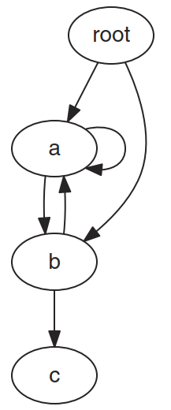

# pickle

- [pickle](#pickle)
  - [1. 简介](#1-简介)
  - [2. 序列化字符串](#2-序列化字符串)
  - [3. Stream](#3-stream)
  - [4. 重构对象问题](#4-重构对象问题)
  - [5. Unpicklable 对象](#5-unpicklable-对象)
  - [6. 循环引用](#6-循环引用)
  - [API](#api)
    - [pickle.dump](#pickledump)
    - [pickle.load](#pickleload)
    - [pickle.loads](#pickleloads)
  - [7. 参考](#7-参考)

Last updated: 2023-01-17, 15:12
****

## 1. 简介

`pickle` 模块提供了序列化方法，可将 Python 对象转换为字节序列。生成的字节序列可以传输或存储，并可以重构为相同的新对象。

## 2. 序列化字符串

下面使用 `dumps()` 序列化字符串，将其转换为字节。序列化的数据结构完全由内置类型组成：

```python
import pickle
import pprint

data = [{'a': 'A', 'b': 2, 'c': 3.0}]
print('DATA:', end=' ')
pprint.pprint(data)

data_string = pickle.dumps(data)
print('PICKLE: {!r}'.format(data_string))
```

```txt
DATA: [{'a': 'A', 'b': 2, 'c': 3.0}]
PICKLE: b'\x80\x04\x95#\x00\x00\x00\x00\x00\x00\x00]\x94}\x94(\x8c\x01a\x94\x8c\x01A\x94\x8c\x01b\x94K\x02\x8c\x01c\x94G@\x08\x00\x00\x00\x00\x00\x00ua.'
```

可以看到，pickle 默认使用二进制格式保存字符串。

序列化数据后，可以将其写入文件、socket、pipe 或其它位置。随后，可以读取文件并以数据构建一个包含相同值的新对象。

```python
import pickle
import pprint

data1 = [{'a': 'A', 'b': 2, 'c': 3.0}]
print('BEFORE: ', end=' ')
pprint.pprint(data1)

data1_string = pickle.dumps(data1)

data2 = pickle.loads(data1_string)
print('AFTER: ', end=' ')
pprint.pprint(data2)

print('SAME? :', (data1 is data2))
print('EQUAL?:', (data1 == data2))
```

```txt
BEFORE:  [{'a': 'A', 'b': 2, 'c': 3.0}]
AFTER:  [{'a': 'A', 'b': 2, 'c': 3.0}]
SAME? : False
EQUAL?: True
```

新构建的对象与原始对象**相等但是不相同**。

## 3. Stream

pickle 支持文件流，可以将多个对象写入流，然后从流中读取对象，不需要提前知道这些对象的数目和大小。使用 `dump()` 和 `load()` 这两个方法。

```python
class SimpleObject:
    def __init__(self, name):
        self.name = name
        self.name_backwards = name[::-1]
```

```python
import io
import pickle
from simple_obj import SimpleObject

data = []
data.append(SimpleObject("pickle"))
data.append(SimpleObject("preserve"))
data.append(SimpleObject("last"))

# 模拟文件
out_s = io.BytesIO()

# 写入流
for o in data:
    print('WARNING : {} ({})'.format(o.name, o.name_backwards))
    pickle.dump(o, out_s)
    out_s.flush()

# 设置可读流
in_s = io.BytesIO(out_s.getvalue())

# 读取数据
while True:
    try:
        o = pickle.load(in_s)
    except EOFError:
        break
    else:
        print('READ : {} ({})'.format(o.name, o.name_backwards))
```

```txt
WARNING : pickle (elkcip)
WARNING : preserve (evreserp)
WARNING : last (tsal)
READ : pickle (elkcip)
READ : preserve (evreserp)
READ : last (tsal)
```

这里用两个 `BytesIO` buffer 模拟 stream。第一个 buffer 接收 pickled 对象，将其传入第二个 buffer，然后使用 `load()` 读取数据。

简单的数据库可以使用 pickle 来存储对象，shelve 模块就是这类实现。

除了存储数据，pickle 也可以用来进行进程间通信。例如，`os.fork()` 和 `os.pipe()` 可以用来建立从一个管道读取指令并将就结果写入另一个管道的工作进程。

## 4. 重构对象问题

在使用自定义类时，被 pickle 的类在读取 pickle 进程的命名空间中必须可访问。即被 pickle 的是类实例，不是类定义。类名用于在 unpickling 时查找构造函数创建新对象。例如，将一个类实例写入文件：

```python
import sys
import pickle

from simple_obj import SimpleObject

if __name__ == '__main__':
    data = []
    data.append(SimpleObject('pickle'))
    data.append(SimpleObject('preserve'))
    data.append(SimpleObject('last'))
    filename = sys.argv[1]

    with open(filename, 'wb') as out_s:
        for o in data:
            print('WRITING: {} ({})'.format(
                o.name, o.name_backwards))
            pickle.dump(o, out_s)
```

该脚本根据命令行参数给出的名称创建文件。

```txt
WRITING: pickle (elkcip)
WRITING: preserve (evreserp)
WRITING: last (tsal)
```

如果不导入 `SimpleObject` 对象，直接 unpickle 可能报错：

```python
import pickle
import sys

filename = sys.argv[1]

with open(filename, 'rb') as in_s:
    while True:
        try:
            o = pickle.load(in_s)
        except EOFError:
            break
        else:
            print('READ: {} ({})'.format(o.name, o.name_backwards))
```

## 5. Unpicklable 对象

Socket, file handles, 数据库连接等状态依赖于操作系统或其它进程的对象可能无法保存。对包含 non-picklable 属性的对象，可以定义 `__getstate__()` 和 `__setstate__()` 定义需要 pickle 的属性。

`__getstate__()` 返回包含对象内部状态的对象，可以用 dict，但是 dict 的值需要是可 pickle 对象。在 pickle 时 `__getstate__()` 返回的对象被存储，从 pickle 加载对象时存储的状态被传递给 `__setstate__()`。

例如：

```python
import pickle

class State:
    def __init__(self, name):
        self.name = name

    def __repr__(self):
        return 'State({!r})'.format(self.__dict__)

class MyClass:
    def __init__(self, name):
        print('MyClass.__init__({})'.format(name))
        self._set_name(name)

    def _set_name(self, name):
        self.name = name
        self.computed = name[::-1]

    def __repr__(self):
        return 'MyClass({!r}) (computed={!r})'.format(
            self.name, self.computed)

    def __getstate__(self):
        state = State(self.name)
        print('__getstate__ -> {!r}'.format(state))
        return state

    def __setstate__(self, state):
        print('__setstate__({!r})'.format(state))
        self._set_name(state.name)

inst = MyClass('name here')
print('Before:', inst)
dumped = pickle.dumps(inst)

reloaded = pickle.loads(dumped)
print('After:', reloaded)
```

这里用 `State` 对象持有 `MyClass` 的内部状态。

## 6. 循环引用

pickle 会自动处理对象之间的循环引用，不需要特殊处理。如下所示的有向图：



虽然它包含多个环，但依然可以正确地 pickle。

## API

### pickle.dump

```python
pickle.dump(obj, 
    file, 
    protocol=None, 
    *, 
    fix_imports=True, 
    buffer_callback=None)
```

### pickle.load

```python
pickle.load(file, *, 
    fix_imports=True, 
    encoding='ASCII', 
    errors='strict', 
    buffers=None)
```

从**文件**对象 `file` 读取序列化对象。等价于` Unpickler(file).load()`。

### pickle.loads

```python
pickle.loads(data, /, *, 
    fix_imports=True, 
    encoding='ASCII', 
    errors='strict', 
    buffers=None)
```

从 bytes 读取对象的序列化信息，即 `data` 必须为 bytes 类型。

`fix_imports`, `encoding`, `errors`, `strict` 和 `buffers` 参数含义与 `Unpickler` 构造函数一样。


## 7. 参考

- https://docs.python.org/3/library/pickle.html
- 《The Python 3 Standard Library by Example》, Doug Hellmann