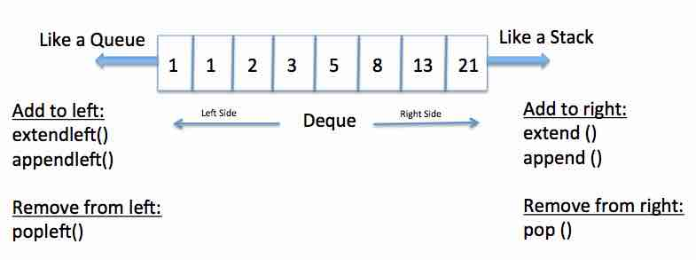

# deque

- [deque](#deque)
  - [简介](#%e7%ae%80%e4%bb%8b)
  - [创建 deque](#%e5%88%9b%e5%bb%ba-deque)
    - [创建空 deque](#%e5%88%9b%e5%bb%ba%e7%a9%ba-deque)
    - [从 iterable 对象创建](#%e4%bb%8e-iterable-%e5%af%b9%e8%b1%a1%e5%88%9b%e5%bb%ba)
    - [固定长度](#%e5%9b%ba%e5%ae%9a%e9%95%bf%e5%ba%a6)
  - [方法](#%e6%96%b9%e6%b3%95)
    - [append](#append)
  - [应用](#%e5%ba%94%e7%94%a8)
    - [保留最后 N 个元素](#%e4%bf%9d%e7%95%99%e6%9c%80%e5%90%8e-n-%e4%b8%aa%e5%85%83%e7%b4%a0)

***

## 简介

`collections.deque` 类似 list，两端可以快速添加和移除元素。即 `deque` 是双端队列，可以在任意一端添加或删除元素，时间复杂度均为 O(1)。



## 创建 deque

### 创建空 deque

```py
>>> d1 = collections.deque()
# add elements to the right side
>>> d1.append(10)
>>> d1.append(10.1)
>>> d1.append("abc")
>>> d1
deque([10, 10.1, 'abc'])
```

### 从 iterable 对象创建

```py
>>> primeNumbers = (3, 5, 7, 11)
>>> primeDeque = collections.deque(primeNumbers)
>>> primeDeque
deque([3, 5, 7, 11])
>>> primeDeque.append(13)
>>> primeDeque.append(17)
>>> primeDeque.appendleft(2)
>>> primeDeque
deque([2, 3, 5, 7, 11, 13, 17])
```

`appendleft` 添加元素到左侧。

### 固定长度

```py
>>> dq = collections.deque(maxlen=5)
>>> dq.append(10)
>>> dq.append(20)
>>> dq.append(30)
>>> dq.append(40)
>>> dq.append(50)
deque([10, 20, 30, 40, 50], maxlen=5)
>>> dq.append(60)
deque([20, 30, 40, 50, 60], maxlen=5)
>>> dq.appendleft(6)
deque([6, 20, 30, 40, 50], maxlen=5)
```

向右侧添加，当长度超过设置值，左侧的被移除；
向左侧添加，当长度超过设置值，右侧的被移除。

## 方法

### append

向 `deque` 右侧添加元素。

对固定长度的 `deque`，向右侧添加元素时若超过限制，移除左侧元素。

## 应用

### 保留最后 N 个元素

保留有限历史记录正是 collections.deque 大显身手的时候。比如，下面的代码在多行上面做简单的文本匹配， 并返回匹配所在行的最后N行：

```py
from collections import deque

def search(lines, pattern, history=5):
    previous_lines = deque(maxlen=history)
    for line in lines:
        if pattern in line:
            yield line, previous_lines
        previous_lines.append(line)

# Example use on a file
if __name__ == '__main__':
    with open(r'../../cookbook/somefile.txt') as f:
        for line, prevlines in search(f, 'python', 5):
            for pline in prevlines:
                print(pline, end='')
            print(line, end='')
            print('-' * 20)
```
