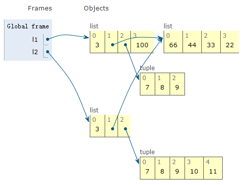

# Copy

- [Copy](#copy)
  - [概述](#概述)
  - [== 和 is](#-和-is)
  - [浅拷贝](#浅拷贝)
  - [深拷贝](#深拷贝)

## 概述

在 Python 中，我们使用 `=` 复制对象，但是并没有创建新的对象，而是创建了一个对原对象的引用。

而要深拷贝原对象，可以使用 `copy` 模块。

- 浅拷贝创建一个对原对象里元素的引用，但是不会递归的去创建内嵌对象的拷贝，而仅仅是引用;
- 深拷贝完整拷贝对象。

## == 和 is

`==` 运算符比价两个对象的值（对象中保存的数据），而 `is` 比较对象的标识。

通常我们关注的是值，而不是标识，所以 Python 代码中 `==` 出现的频率比 `is` 高。

`is` 运算符比 `==` 速度快，因为它不能重载，Python 直接比较两个对象的ID。而 `a == b` 是语法糖，等同于 `a.__eq__(b)`。继承自 `object` 的 `__eq__` 方法比较两个对象的ID，结果与 `is` 一样。但是多数内置类型使用更有意义的方式覆盖了 `__eq__` 方法，会考虑对象属性值。

## 浅拷贝

`copy.copy()` 方法用于浅拷贝。例如：

```py
import copy
o_list = [[1, 2, 3], [4, 5, 6], [7, 8, 9]]
n_list = copy.copy(o_list)

o_list.append([4, 4, 4])

assert len(o_list) == 4
assert len(n_list) == 3

o_list[0][0] = 0
assert n_list[0][0] == 0
```

由于是浅拷贝，所以 `n_list` 只是创建了对 `o_list` 内元素的引用即指向 `[1, 2, 3]`, `[4, 5, 6]` 和 `[7, 8, 9]` 的引用，所以在 `o_list` 添加新的列表时，由于复制时没有创建对应的引用，所以`n_list` 不改变。

也由于是浅拷贝，在修改已有内嵌元素的值 `o_list[0][0]` 时，`n_list` 也随之改变。

复制列表（或多数内置的可变集合）最简单的方式是使用内置的类型构造方法。例如：

```py
l1 = [3, [55, 44], (7, 8, 9)]
l2 = list(l1)
assert l2 == [3, [55, 44], (7, 8, 9)]
assert l2 == l1
assert l2 is not l1
```

构造方法或者 `[:]` 做的是浅复制，即复制了最外层容器，副本中的元素是源容器中元素的引用。

如果所有元素不可变，那么这样没有问题，还能节省内存，但是如果有可变元素，可能就会导致意想不到的问题。例如：

```py
l1 = [3, [66, 55, 44], (7, 8, 9)]
l2 = list(l1)  # 浅复制

l1.append(100)
l1[1].remove(55)
assert l1 == [3, [66, 44], (7, 8, 9), 100]  # l1 被修改
assert l2 == [3, [66, 44], (7, 8, 9)]  # l2 中引用列表也被修改

l2[1] += [33, 22]
l2[2] += (10, 11)
assert l2 == [3, [66, 44, 33, 22], (7, 8, 9, 10, 11)]
assert l1 == [3, [66, 44, 33, 22], (7, 8, 9), 100] # 修改 l2，l1 中的引用类型随时改变
```

运行后 `l1` 和 `l2` 的状态图如下所示：



## 深拷贝

使用 `copy.deepcopy()` 方法可以进行深拷贝。

深拷贝会递归的进行拷贝，创建的对象完全独立于原来的对象。还是以上面的例子说明：

```py
o_list = [[1, 2, 3], [4, 5, 6], [7, 8, 9]]
n_list = copy.deepcopy(o_list)

o_list[0][0] = 0
assert n_list[0][0] == 1
```

此时对原对象进行修改，对 `n_list` 没有影响。
