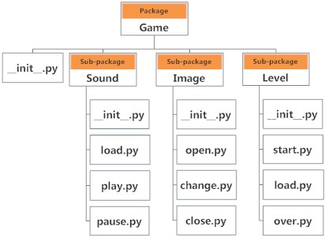

# Package

- [Package](#package)
  - [简介](#简介)
  - [创建包](#创建包)
  - [控制模块导出的内容](#控制模块导出的内容)
  - [从包中导入模块](#从包中导入模块)
  - [使用相对路径导入子模块](#使用相对路径导入子模块)
  - [QAs](#qas)
    - [ImportError: attempted relative import with no known parent package](#importerror-attempted-relative-import-with-no-known-parent-package)

2020-04-17, 11:55
添加更多内容。

2020-04-12, 16:31
***

## 简介

我们通常不会将所有文件保存在一个目录，层次结构目录有助于查找和访问。

类似的，Python 中包（package）和目录对应，模块和文件对应。

随着项目的增大，模块越来越多，我们将类似的模块放在一个包中，将其它模块放在其它包中。从而方便项目的管理。

同理，目录可以有子目录，Python 包也可以有子包和模块。

一个目录中必须有 `__init__.py` 文件才算包。这个文件可以为空，不过我们一般将这个包的初始化代码放在其中。

假设我们开发一个游戏，包和模块一个可能组织结构如下：



## 创建包

创建包和简单，在文件系统上组织代码，并保证每个目录都定义了 `_init__.py` 文件。例如：

```text
graphics/
    __init__.py
    primitive/
        __init__.py
        line.py
        fill.py
        text.py
    formats/
        __init__.py
        png.py
        jpg.py
```

这样就可以按照如下方式执行各种 import 语句：

```py
import graphics.primitive.line
from graphics.primitive import line
import graphics.formats.jpg as jpg
```

定义模块的层次结构和在文件系统上建立目录结构一样简单。

文件 `__init__.py` 用于包含包的初始化代码。

- 举个例子，执行 `import graphics`会导入 `graphics/__init__.py` 文件，建立 `graphics` 命名空间的内容。
- 执行 `import graphics.formats.jpg` 会先导入 `graphics/__init__.py` 和 `graphics/formats/__init__.py`，然后导入 `graphics/formats/jpg.py`。

大部分时候让 `__init__.py` 空着就好。但有时候也可以包含代码。例如，可以用 `__init__.py` 自动加载子模块：

```py
# graphics/formats/__init__.py
from . import jpg
from . import png
```

这样用户可以仅通过 `import grahpics.formats` 就可以同时导入 `import graphics.formats.jpg` 和 `import graphics.formats.png`。

## 控制模块导出的内容

使用 `from module import *` 语句导出模块所有内容，使用 `__all__` 可以控制导出的**所有内容**包含哪些内容，例如：

```py
# somemodule.py
def spam():
    pass

def grok():
    pass

blah = 42
# Only export 'spam' and 'grok'
__all__ = ['spam', 'grok']
```

尽管强烈反对使用 `from module import *`，但是在定义了大量变量名的模块中，依然使用频繁。如果不进行控制，该操作会导入所有不以下划线开头的内容。

- 定义了 `__all__`，只有被列出的东西才被导出。
- 如果 `__all__` 定义成空列表，则不导出任何内容。
- 如果 `__all__` 包含未定义的名字，在导入时抛出 `AttributeError`。

## 从包中导入模块

通过 `.` 运算符可以从包中导入特定模块。

例如，导入上图中的 `start` 模块：

```py
import Game.Level.start
```

假设模块中包含 `select_difficulty()` 函数，此时可以使用完整名引用：

```py
Game.Level.start.select_difficulty(2)
```

还可以采用如下方式简化导入：

```py
from Game.Level import start
```

然后可以直接使用：

```py
start.select_difficulty(2)
```

还可以直接导入模块中的函数：

```py
from Game.Level.start import select_difficulty
```

然后就可以直接使用该函数：

```py
select_difficulty(2)
```

虽然这种更简单，但是不推荐如此。使用完整的命名空间可以很好的避免命名冲突。

## 使用相对路径导入子模块

如何使用 `import` 语句从另一个包中导入子模块？

假设你的文件系统上有 `mypackage` 包，结构如下：

```py
mypackage/
    __init__.py
    A/
        __init__.py
        spam.py
        grok.py
    B/
        __init__.py
        bar.py
```

如果 `mypackage.A.spam` 要导入同目录下的 `grok` 模块，需要：

```py
# mypackage/A/spam.py
from . import grok
```

如果 `mypackage.A.spam` 要导入不同目录下的模块 `B.bar`，需要：

```py
# mypackage/A/spam.py
from ..B import bar
```

两个 import 语句都没有包含顶层包名，而是使用 `spam.py` 的相对路径。

在包内，可以使用相对路径和绝对路径导入包，例如：

```py
# mypackage/A/spam.py
from mypackage.A import grok # 绝对路径
from . import grok # 相对路径
import grok # Error (not found)
```

像 `mypackage.A` 这样使用绝对路径的缺点是，这将顶层包名硬编码到源码中。如果你想重新组织它，比如改变包名，你就必须检查所有文件来修正源码。同样，硬编码的名称会使移动代码变得困难。

`.` 表示当前目录；`..` 为父目录；`..B` 等价于 `../B`，这种语法只适用于 import 语句。

## QAs

### ImportError: attempted relative import with no known parent package

解决方案：

1. 使用 `-m` 命令运行脚本；
2. 手动设置 `__package__`；
3. 使用绝对引用。
