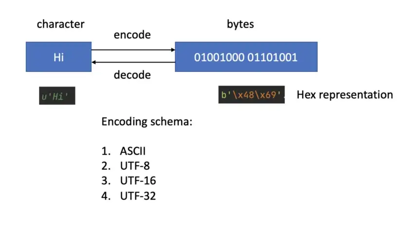

# 字符串

- [字符串](#字符串)
  - [简介](#简介)
    - [str](#str)
    - [immutable](#immutable)
  - [Unicode](#unicode)
  - [序列操作](#序列操作)
    - [长度](#长度)
    - [切片](#切片)
    - [串联](#串联)
  - [字符串方法](#字符串方法)
    - [包含](#包含)
    - [rfind](#rfind)
    - [capitalize](#capitalize)
    - [encode](#encode)
    - [endswith](#endswith)
    - [isalpha](#isalpha)
    - [index](#index)
    - [isdigit](#isdigit)
    - [find](#find)
    - [maketrans](#maketrans)
    - [replace](#replace)
    - [rstrip](#rstrip)
    - [startswith](#startswith)
    - [strip](#strip)
    - [translate](#translate)
    - [拆分和连接](#拆分和连接)
    - [相等测试](#相等测试)
    - [upper](#upper)
  - [string](#string)
    - [常量](#常量)
  - [参考](#参考)

2020-04-22, 11:36
***

## 简介

Python 中以 `str` 对象处理文本数据。字符串字面量有三种格式：

- 单引号 `'allows embedded "double" quotes''`
- 双引号 `"allows embedded 'single' quotes"`
- 三引号 `'''Three single quotes'''`, `"""Three double quotes"""`

单引号和双引号可以互相嵌套。

三引号可以跨越多行，字符串包含其中所有的空格。

如果两个字符串之间只有空格，且它们是单个表达式的一部分，则它们被隐式住哪和为一个字符串。即 `("spam " "eggs") == "spam eggs"`。

也可以使用 `str` 构造函数创建字符串。

Python **不支持字符类型**，所有的字符都是字符串类型。

### str

```py
class str(object='')
class str(object=b'', encoding='utf-8', errors='strict')
```

返回 `object` 的字符串形式。如果不提供 `object`，返回空字符串。`str()` 的行为依赖于 `encoding` 和 `errors` 设置。

如果不提供 `encoding` 和 `errors`，`str(object)` 返回 `object.__str__()`。如果 `object` 没有实现 `__str__()` 方法，`str()` 返回 `repr(object)`。

如果提供了 `encoding` 或 `errors`，则 `object` 为字节类对象（如 `bytes` 或 `bytearray`）。此时，比如对 `bytes`，`str(bytes,encoding, errors)` 等价于 `bytes.decode(encoding, errors)`。

如果不指定 `encoding` 和 `errors` 时传入 `bytes` 对象，

### immutable

Python 中字符串不可变，即创建后，不能修改，只能复制。例：

```py
str1 = "welcome"
str2 = "welcome"
```

str1 和 str2 引用相同字符串 "welcome"，使用 `id()` 函数，可以确认 str1 和 str2 引用相同对象。

每个 python 对象存储在内存中，使用 `id()` 可以获得内存地址。

虽然是 immutable 类型，但是使用 `str.join()` 和 `io.StringIO` 可以高效的合并字符串。

Python 核心类型，numbers、strings 和 tuple 不可变，list、dict、set 可变。

如果想**原位修改**文本，可以将 string 先扩展为字符的 `list`，修改后再连接为字符串：

```py
s = 'python'
l = list(s)
assert l == ['p', 'y', 't', 'h', 'o', 'n']
l[1] = 'x'
assert ''.join(l) == 'pxthon'
```

也可以使用 `bytearray`，不过只支持 8 字节字符的修改，如 ASCII 字符，其它字符依然不可修改：

```py
a = bytearray(b'python')
a.extend(b' java')
b = a.decode()
assert b == 'python java'
```

## Unicode



Python 3 的默认字符串类型为 Unicode (u string)，可以将其 encode 为 byte string (b string)，b string 也可以 decode 回 Unicode：

```python
>>> u'Hi'.encode('ASCII')
b'Hi'
>>> b'\x48\x69'.decode('ASCII')
'Hi'
```

在 Python IDE 中，在输出时 b string 会自动解码为 ASCII，所以看到的是 `b'Hi`'。如上图所示，bstring 一般表示为 Hex 编码。

## 序列操作

字符串是序列类型，即有序的字符序列类型。在字符串中，所有字符保持前后顺序不变，可以根据位置查找和存储字符。

### 长度

序列类型可以执行索引和 `len()` 查询长度操作：

```py
S = "Python"
assert len(S) == 6
assert S[0] == 'P'
assert S[1] == 'y'
assert S[-1] == 'n'
```

### 切片

使用切片获得指定范围的字符。

- `[]`, 获得指定索引的字符
- `[:]`，范围切片，获得指定范围的字符。

例如：

```py
S = "Python"
assert S[1:3] == 'yt'
assert S[:3] == 'Pyt' # 起始索引默认为 0
assert S[3:] == 'hon' # 结束索引默认为序列长度
assert S[:] == 'Python' # 复制序列
assert S[:-1] == 'Pytho' # -1 等价于 len(S)-1
```

### 串联

1. 序列对象可以直接使用 `+` 连接起来：

```py
s = 'Python'
t = 'Java'
y = s + t
assert y == 'PythonJava'
assert s * 3 == 'PythonPythonPython' # 可以直接使用该方式创建重复序列
```

这种方式效率较低。

2. str.join

```python
str.join(iterable)
```

返回一个由 `iterable` 中的字符串拼接而成的字符串。

## 字符串方法

### 包含

检查一个字符串是否包含另一个字符串。

使用关键字 `in` 可以检查一个字符串是否在另一个字符串中，使用 `not in` 可以执行相反检查。例如：

```py
def test_in():
    assert 'a' in 'program'
    assert 'at' in 'battle'
    assert 'file' not in 'windows'
```

### rfind

```py
str.rfind(sub[, start[, end]])
```

`sub` 出现的最高索引。`start` 和 `end` 用于指定检索范围。如果没找到，返回 -1。

### capitalize

首字母大写，即第一个字符大写，余下小写。例如：

```py
a = "python name"
assert a.capitalize() == 'Python name'
```

### encode

```py
str.encode(encoding='utf-8', errors='strict')
```

将字符串以指定编码转换为字节对象。

`encoding` 用于指定编码，默认编码为 'utf-8'。例如：

```py
txt = "My name is Ståle"
x = txt.encode()
assert x == b'My name is St\xc3\xa5le'
```

`errors` 用于指定针对错误的处理方法：

|方案|说明|
|---|---|
|`'backslashreplace'`|使用反斜杠替代无法编码的字符|
|`'ignore'`|忽略无法编码的字符|
|`'strict'`|默认方案，对无法编码的字符抛出 `UnicodeError`|
|`'replace'`|使用问号替代无法编码的字符|
|`'xmlcharrefreplace'`|使用 xml 字符替代无法编码的字符|

### endswith


### isalpha

如果字符串非空且所有字符为 ASCII 字母，返回 `True`，否则返回 `False`。ASCII 字母包括 `b'abcdefghijklmnopqrstuvwxyzABCDEFGHIJKLMNOPQRSTUVWXYZ'`。

例如：

```py
>>> b'ABCabc'.isalpha()
True
>>> b'ABCabc1'.isalpha()
False
```

### index

### isdigit

判断是否所有字符为数字，Python 没有字符类型，对当个字符也用这个方法：

- 至少有一个字符，且全部为数字，返回 True
- 否则返回 False

例如：

```py
a = '123456'
assert a.isdigit()
assert '1'.isdigit()
assert not 'a'.isdigit()
```

### find

```py
str.find(sub[,start[,end]])
```

在切片 `s[start:end]` 查找 `sub` 第一次出现的索引。`start` 和 `end` 为切片参数。

如果没有找到 `sub`，返回 -1.

```py
x = 'python'
assert x.find('th') == 2
```

> **NOTE**：`find()` 只在需要知道 `sub` 的位置时使用，如果只为了检查 `sub` 是否为子字符串，用 `in` 操作符。

### maketrans

```py
static str.maketrans(x[, y[, z]])
```

创建一个映射表，该映射表可用在 [translate()](#translate)中以替换指定字符。

| 参数 | 说明 |
| --- | --- |
| x | 如果只指定 x，则 x 为描述映射关系的 dict ；如果有多个参数，则 x 为待替换的字符串 |
| y | 和 x 等长的字符串。x 中相同位置的字符被 y 中对应位置字符替换 |
| z | 原字符串中待移除的字符 |

### replace

```py
str.replace(old, new[, count])
```

将字符串中所有 `old` 字符串替换为 `new` 字符串。如果提供 `count` 参数，则只替换前 `count` 各个 `old` 字符串。

```py
oldstring = 'I like Python'
newstring = oldstring.replace('like', 'use')
assert newstring == 'I use Python'
```

### rstrip

```py
str.rstrip([chars])
```

返回删除末尾指定字符的副本。

`chars` 参数指定移除的字符集合。如果不指定 `chars` 参数或者为 `None` ， `chars` 默认为空白。例如：

```py
lang = ' python '
assert lang.rstrip() == ' python'
```

### startswith

```py
str.startswith(prefix[, start[, end]])
```

如果字符串以 `prefix` 开头，返回 `True` ，否则返回 `False` 。

- `start` 可选参数，表示测试的起始位置；
- `end` 参数，表示测试的终点位置。

### strip

```py
str.strip([chars])
```

返回移除前后指定字符的字符串副本。`chars` 参数指定移除的字符集。如果 `chars` 为 `None`，其默认为空格。例如:

```py
>>> '   spacious   '.strip()
'spacious'
>>> 'www.example.com'.strip('cmowz.')
'example'
```

移除字符串前后的指定字符。但中间的不移除，例如：

```py
>>> comment_string = '#....... Section 3.2.1 Issue #32 .......'
>>> comment_string.strip('.#! ')
'Section 3.2.1 Issue #32'
```

### translate

```python
str.translate(table)
```

将字符串中的指定字符以 `table` 中的字符替换，返回替换后的副本。`table` 是实现 `__getitem__()` 索引方法的对象，通常为 `mapping` 或 `sequence`。

当使用 Unicode 号（整数）进行索引时，`table` 对象可以执行以下任何操作：

- 返回 Unicode 号或字符串；
- 将字符映射到一个或多个其它字符；
- 返回 None，从而将对应字符从字符串中移除；
- 抛出 `LookupError`，以将字符映射到自身。

使用 [maketrans()](#maketrans) 方法创建映射表。如果使用 dict 作为参数，则需要使用 UNICODE 编码，而不是字符。

- 例：将 "S" 替换为 "P"

```py
txt = "Hello Sam!"
table = txt.maketrans("S", "P")
new_txt = txt.translate(table)
assert new_txt == "Hello Pam!"
```

- 例：替换多个字符

```py
txt = "Hi Sam!"
x = 'mSa'
y = 'eJo'
table = txt.maketrans(x, y)
assert txt.translate(table) == 'Hi Joe!'
```

- 例：移除字符

```py
txt = 'Good night Sam!'
x = 'mSa'
y = 'eJo'
z = 'odnght'
table = txt.maketrans(x, y, z)
assert txt.translate(table) == 'G i Joe!'
```

- 例：使用字典

```py
txt = "Good night Sam!"
mydict = {109: 101, 83: 74, 97: 111, 111: None, 100: None, 110: None, 103: None, 104: None, 116: None}
assert txt.translate(mydict) == 'G i Joe!'
```

这里，字符全部用 Unicode 代码表示，移除的映射为 `None` 。

### 拆分和连接

`split` 用于拆分字符串，例如：

```py
def test_split():
    """
    默认分隔符为空格
    """
    s = "a b c d"
    ss = s.split()
    assert ss == ['a', 'b', 'c', 'd']


def test_split_max():
    # 设置最多只拆分前两个单词
    s = "a b c d"
    ss = s.split(maxsplit=2)
    assert ss == ['a', 'b', 'c d']


def test_split_comma():
    s = 'a,b c,d'
    ss = s.split(',')
    assert ss == ['a', 'b c', 'd']
```

`join` 用于连接字符串，例如：

```py
def test_join():
    ss = ["a", 'b', 'c']
    s = ','.join(ss)
    assert s == 'a,b,c'
```

### 相等测试

- `==` 操作符逐个比较字符，全部相同就返回 True。

### upper

大小写转换：

```py
a = "lower"
assert a.upper() == "LOWER"
name = 'Zhang Chen'
assert name.lower() == 'zhang chen'
```

## string

### 常量

string 模块中定义了如下常量：

| 常量 | 说明 |
| --- | --- |
| string.punctuation | C 语言中定义的ASCII 标点符号字符：!"#$%&'()*+,-./:;<=>?@[\]^_`{|}~ |

## 参考

- [Zetcode Python f-string](https://zetcode.com/python/fstring/)
- https://docs.python.org/3/library/stdtypes.html#text-sequence-type-str
- https://docs.python.org/3/library/string.html
- https://www.w3schools.com/python/python_strings_methods.asp
