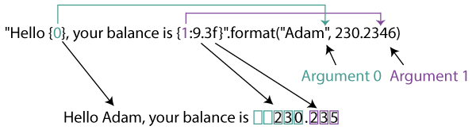
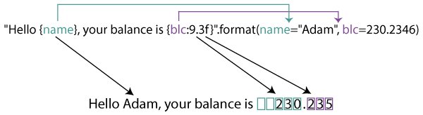

# String

- [String](#string)
  - [简介](#简介)
    - [创建字符串](#创建字符串)
    - [str](#str)
    - [immutable](#immutable)
  - [字符串操作](#字符串操作)
    - [切片](#切片)
    - [包含](#包含)
    - [rfind](#rfind)
    - [index](#index)
    - [find](#find)
  - [format](#format)
    - [位置参数](#位置参数)
    - [关键字参数](#关键字参数)
    - [数字格式化](#数字格式化)
    - [数字对齐](#数字对齐)
    - [字符串格式化](#字符串格式化)
    - [class 格式化](#class-格式化)
    - [动态参数](#动态参数)
    - [日期格式化](#日期格式化)

2020-04-22, 11:36
***

## 简介

Python 中以 `str` 对象处理文本数据。

### 创建字符串

字符串字面量格式有三种：

- 单引号 `'allows embedded "double" quotes''`
- 双引号 `"allows embedded 'single' quotes"`
- 三引号 `'''Three single quotes'''`, `"""Three double quotes"""`

单引号和双引号可以互相嵌套。

三引号可以跨越多行，字符串包含其中所有的空格。

如果两个字符串之间只有空格，且它们是单个表达式的一部分，则它们被隐式住哪和为一个字符串。即 `("spam " "eggs") == "spam eggs"`。

也可以使用 `str` 构造函数创建字符串。

Python 不支持字符类型，所有的字符都是字符串类型。

### str

`class str(object='')`

`class str(object=b'', encoding='utf-8', errors='strict')`

返回 `object` 的字符串形式。如果不提供 `object`，返回空字符串。`str()` 的行为依赖于 `encoding` 和 `errors` 设置。

如果不提供 `encoding` 和 `errors`，`str(object)` 返回 `object.__str__()`。如果 `object` 没有实现 `__str__()` 方法，`str()` 返回 `repr(object)`。

如果提供了 `encoding` 或 `errors`，则 `object` 为字节类对象（如 `bytes` 或 `bytearray`）。此时，比如对 `bytes`，`str(bytes,encoding, errors)` 等价于 `bytes.decode(encoding, errors)`。

如果不指定 `encoding` 和 `errors` 时传入 `bytes` 对象，

### immutable

Python 中字符串不可变，即创建后，不能修改，只能复制。

例：

```py
str1 = "welcome"
str2 = "welcome"
```

str1 和 str2 引用相同字符串 "welcome"，使用 `id()` 函数，可以确认 str1 和 str2 引用相同对象。

每个 python 对象存储在内存中，使用 `id()` 可以获得内存地址。

虽然是 immutable 类型，但是使用 `str.join()` 和 `io.StringIO` 可以高效的合并字符串。

## 字符串操作

### 切片

- `[]`, 获得指定索引的字符
- `[:]`，范围切片，获得指定范围的字符。

### 包含

检查一个字符串是否包含另一个字符串。

使用关键字 `in` 可以检查一个字符串是否在另一个字符串中，使用 `not in` 可以执行相反检查。

例如：

```py
def test_in():
    assert 'a' in 'program'
    assert 'at' in 'battle'
    assert 'file' not in 'windows'
```

### rfind

`str.rfind(sub[, start[, end]])`

`sub` 出现的最高索引。`start` 和 `end` 用于指定检索范围。如果没找到，返回 -1。

### index

### find

`str.find(sub[,start[,end]])`

在切片 `s[start:end]` 查找 `sub` 第一次出现的 index。可选的 `start` 和 `end` 参数为切片参数。

如果没有找到 `sub`，返回 -1.

> `find()` 仅在需要知道 `sub` 的位置时使用，如果只为了检查 `sub` 是否为子字符串，用 `in` 操作符。

## format

用于格式化字符输出。

语法：

```py
template.format(p0, p1,..., k0=v0, k1=v1,...)
```

这里 `p0, p1,...` 是位置参数，`k0, k1,...` 是关键字参数。`template` 为格式化模板。

### 位置参数

`format()` 根据参数类型及格式化代码输出字符串，对位置参数：



这里参数 0 为 "Adam"，参数 1 为 230.2346。

`"Hello {0}, your balance is {1:9.3f}"` 为格式化字符串。

- 大括号是参数的占位符
- `{0}` 对应 `"Adam"`
- `{1:9.3f}` 对应 `230.2346`
- 上面的编号可以省略。

`{1:9.3f}` 解释：

- 1 为编号，此处可以省略
- `f` 表示浮点数类型
- `9` 表示最小宽度，包括小数点
- 没有指定对其方式，对数值默认右对齐（对字符串左对齐）
- `3` 表示小数点后位数

### 关键字参数



和上例相同，只是采用了关键字参数。关键字和格式化字符串中的占位符相同。

例如：

```py
# default
assert "Hello {}, your balance is {}.".format("Adam", 230.2346) == "Hello Adam, your balance is 230.2346."
# positional arguments
assert "Hello {0}, your balance is {1}.".format("Adam", 230.2346) == "Hello Adam, your balance is 230.2346."
# keyword arguments
assert "Hello {name}, your balance is {blc}.".format(name="Adam", blc=230.2346) \
        == "Hello Adam, your balance is 230.2346."
assert "Hello {0}, your balance is {blc}.".format("Adam", blc=230.2346) \
        == "Hello Adam, your balance is 230.2346."
```

### 数字格式化

| Type | Meaning                                                                 |
| ---- | ----------------------------------------------------------------------- |
| d    | Decimal integer                                                         |
| c    | Corresponding Unicode character                                         |
| b    | Binary format                                                           |
| o    | Octal format                                                            |
| x    | Hexadecimal format (lower case)                                         |
| X    | Hexadecimal format (upper case)                                         |
| n    | Same as 'd'. Except it uses current locale setting for number separator |
| e    | Exponential notation. (lowercase e)                                     |
| E    | Exponential notation (uppercase E)                                      |
| f    | Displays fixed point number (Default: 6)                                |
| F    | Same as 'f'. Except displays 'inf' as 'INF' and 'nan' as 'NAN'          |
| g    | General format. Rounds number to p significant digits. (Default         |  | precision: 6) |
| G    | Same as 'g'. Except switches to 'E' if the number is large.             |
| %    | Percentage. Multiples by 100 and puts % at the end.                     |

例如，简单的数字格式化：

```py
# integer
assert "The number is: {:d}".format(123) == "The number is: 123"
# float
assert "The float number is:{:f}".format(123.4567898) == "The float number is:123.456790"
# octal
assert "bin: {0:b}, oct: {0:o}, hex: {0:x}".format(12) == "bin: 1100, oct: 14, hex: c"
```

指定最小宽度：

```py
# 指定最小宽度
assert "{:5d}".format(12) == "   12"
# 数值超过最小宽度时，忽略宽度
assert "{:2d}".format(1234) == "1234"
# 浮点数
assert "{:8.3f}".format(12.2346) == "  12.235"
# 整数，宽度不足以0补充
assert "{:05d}".format(12) == "00012"
# 浮点数，宽度不足以0补充
assert "{:08.3f}".format(12.2346) == "0012.235"
```

说明：

- `{:5d}` 表示参数为整数，最小宽度为 5，默认右对齐
- 例 2 中指定宽度 2 小于数字 `1234` 宽度，所以不在左边加空格，但也不会截断数字
- 浮点数有整数和小数部分，指定宽度包含这两部分和小数点。
- 如果想将多余位置填充0而不是空额，可以在格式化字符串前面加 0，如 `{:05d}`, `{:08.3f}`

显示符号：

```py
# 显示 +
assert "{:+f} {:+f}".format(12.23, -12.23) == "+12.230000 -12.230000"
# 显示 -
assert "{:-f} {:-f}".format(12.23, -12.23) == "12.230000 -12.230000"
# 对 + 显示空格
assert "{: f} {: f}".format(12.23, -12.23) == " 12.230000 -12.230000"
```

### 数字对齐

| Type | Meaning                                            |
| ---- | -------------------------------------------------- |
| <    | Left aligned to the remaining space                |
| ^    | Center aligned to the remaining space              |
| >    | Right aligned to the remaining space               |
| =    | Forces the signed (+) (-) to the leftmost position |

```py
# 默认右对齐
assert "{:5d}".format(12) == "   12"
# 中心对齐
assert "{:^10.3f}".format(12.2346) == "  12.235  "
# 整数左对齐，不足填充0
assert "{:<05d}".format(12) == "12000"
# 浮点数带符号
assert "{:=8.3f}".format(-12.2346) == "- 12.235"
```

### 字符串格式化

字符串可以和数字一样格式化：

```py
# 字符串左对齐
assert "{:5}".format("cat") == "cat  "
# 字符串右对齐
assert "{:>5}".format("cat") == "  cat"
# 字符串中间对齐
assert "{:^5}".format("cat") == " cat "
# 字符串中间对齐，不足以 * 补齐
assert "{:*^5}".format("cat") == "*cat*"
```

截断字符串：

```py
# 截断，保留3个字符
assert "{:.3}".format("caterpillar") == "cat"
# 截断，保留3个字符，并 padding
assert "{:5.3}".format("caterpillar") == "cat  "
# 截断，保留3个字符，padding 且中心对齐
assert "{:^5.3}".format("caterpillar") == " cat "
```

### class 格式化

```py
class Person:
    age = 23
    name = "Adam"

assert "{p.name}'s age is: {p.age}".format(p=Person()) == "Adam's age is: 23"
```

Python 内部使用 `getattr()` 函数获得对象属性，即上面 `.name` 和 `.age` 内部都是通过 `getattr()` 获得字段值。

同理，对字典，引用字段内部通过 `[index]`语法获得键值：

```py
person = {'age': 23, 'name': 'Adam'}
assert "{p[name]}'s age is: {p[age]}".format(p=person) == "Adam's age is: 23"
```

对 dict，还有一种更为简洁的语法：

```py
assert "{name}'s age is: {age}".format(**person) == "Adam's age is: 23"
```

### 动态参数

```py
# 动态字符串格式化
string = "{:{fill}{align}{width}}"
# 格式化代码以参数传入
assert string.format("cat", fill='*', align='^', width=5) == '*cat*'
# 动态 float 格式化
num = "{:{align}{width}.{precision}f}"
assert num.format(123.236, align='<', width=8, precision=2) == "123.24  "
```

### 日期格式化

`format()` 除了字符串和数字，还支持格式化 datetime 和 complex 数字格式化。

对 datetime，`format()` 内部调用 datetime 的 `__format__()` 函数。

对任意对象类型，可以通过覆盖 `__format__()` 方法自定义格式化。