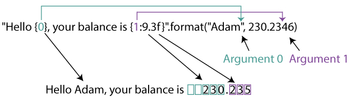
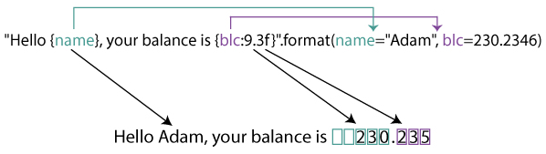

# 字符串格式化

- [字符串格式化](#字符串格式化)
  - [format](#format)
    - [语法](#语法)
      - [field\_name](#field_name)
      - [conversion flag](#conversion-flag)
    - [位置参数](#位置参数)
    - [关键字参数](#关键字参数)
    - [数字格式化](#数字格式化)
    - [数字对齐](#数字对齐)
    - [字符串格式化](#字符串格式化-1)
    - [class 格式化](#class-格式化)
    - [动态参数](#动态参数)
    - [日期格式化](#日期格式化)
  - [f-string](#f-string)
    - [`=` 表达式](#-表达式)
    - [多行格式化](#多行格式化)
    - [调用函数](#调用函数)
    - [对象](#对象)
    - [转义字符](#转义字符)
    - [格式化日期](#格式化日期)
    - [格式化 float](#格式化-float)
    - [指定宽度](#指定宽度)
    - [对齐方式](#对齐方式)
    - [数值类型](#数值类型)

Last updated: 2023-02-07, 10:16
****

## format

`str.format()` 方法和 `Formatter` 类使用相同语法格式化字符串。

```py
template.format(p0, p1,..., k0=v0, k1=v1,...)
```

这里 `p0, p1,...` 是位置参数，`k0, k1,...` 是关键字参数。`template` 为格式化模板。

### 语法

格式化字符串中的花括号 `{}` 为替换字段。花括号之外的任何内容作为文本处理，直接复制到输出。如果要在输出中添加花括号，可以通过重复实现转义 `{{` 和 `}}`。

替换字段语法：

```txt
replacement_field ::=  "{" [field_name] ["!" conversion] [":" format_spec] "}"
field_name        ::=  arg_name ("." attribute_name | "[" element_index "]")*
arg_name          ::=  [identifier | digit+]
attribute_name    ::=  identifier
element_index     ::=  digit+ | index_string
index_string      ::=  <any source character except "]"> +
conversion        ::=  "r" | "s" | "a"
format_spec       ::=  <described in the next section>
```

字段说明：

- 替换字段可以以 `field_name` 开头，该字段名指定转换的对象；
- `field_name` 后面有个可选的 `conversion` 字段，需加前缀 `!`；
- `format_spec`，以冒号 `:` 开头，指定格式。

#### field_name

```py
field_name        ::=  arg_name ("." attribute_name | "[" element_index "]")*
```

`field_name` 以参数名称开头，该参数名可以是数字或关键字。

- 如果是数字，则表示位置参数；
- 如果是关键字，则表示关键字参数名称。

对数字标签，如果是 0,1,2,... 这样从头开始的序列标签，则可以省略。

例如：

```py
"First, thou shalt count to {0}"  # References first positional argument
"Bring me a {}"                   # Implicitly references the first positional argument
"From {} to {}"                   # Same as "From {0} to {1}"
"My quest is {name}"              # References keyword argument 'name'
"Weight in tons {0.weight}"       # 'weight' attribute of first positional arg
"Units destroyed: {players[0]}"   # First element of keyword argument 'players'.
```

#### conversion flag

转换 flag 设置格式化前的类型转换。格式化通常是由替换值的 `format()` 方法完成。转换标签提供了其他选择，目前支持三种转换标签：

- `!s` 调用替换值的 `str()` 方法
- `!r` 调用替换值的 `repr()` 方法
- `!a` 调用替换值的 `ascii()` 方法

例如：

```py
"Harold's a clever {0!s}"        # Calls str() on the argument first
"Bring out the holy {name!r}"    # Calls repr() on the argument first
"More {!a}"                      # Calls ascii() on the argument first
```

### 位置参数

`format()` 根据参数类型及格式化代码输出字符串，对位置参数：



`"Hello {0}, your balance is {1:9.3f}"` 为格式化字符串。

- 大括号是参数的占位符
- `{0}` 对应 `"Adam"`
- `{1:9.3f}` 对应 `230.2346`
- 上面的编号可以省略。

`{1:9.3f}` 解释：

- 1 为编号，此处可以省略
- `f` 表示浮点数类型
- `9` 表示最小宽度，包括小数点
- 没有指定对其方式，对数值默认右对齐（对字符串左对齐）
- `3` 表示小数点后位数

### 关键字参数



和上例相同，只是采用了关键字参数。关键字和格式化字符串中的占位符相同。例如：

```py
# default
assert "Hello {}, your balance is {}.".format("Adam", 230.2346) == "Hello Adam, your balance is 230.2346."
# positional arguments
assert "Hello {0}, your balance is {1}.".format("Adam", 230.2346) == "Hello Adam, your balance is 230.2346."
# keyword arguments
assert "Hello {name}, your balance is {blc}.".format(name="Adam", blc=230.2346) \
        == "Hello Adam, your balance is 230.2346."
assert "Hello {0}, your balance is {blc}.".format("Adam", blc=230.2346) \
        == "Hello Adam, your balance is 230.2346."
```

### 数字格式化

| **类型** | **含义** |
| --- | --- |
| d | Decimal integer |
| c | Corresponding Unicode character |
| b | Binary format |
| o | Octal format |
| x | Hexadecimal format (lower case) |
| X | Hexadecimal format (upper case) |
| n | Same as 'd'. Except it uses current locale setting for number separator |
| e | Exponential notation. (lowercase e) |
| E | Exponential notation (uppercase E) |
| f | Displays fixed point number (Default: 6) |
| F | Same as 'f'. Except displays 'inf' as 'INF' and 'nan' as 'NAN' |
| g | General format. Rounds number to p significant digits. (Default |
| G | Same as 'g'. Except switches to 'E' if the number is large. |
| % | Percentage. Multiples by 100 and puts % at the end. |

例如，简单的数字格式化：

```py
# integer
assert "The number is: {:d}".format(123) == "The number is: 123"
# float
assert "The float number is:{:f}".format(123.4567898) == "The float number is:123.456790"
# octal
assert "bin: {0:b}, oct: {0:o}, hex: {0:x}".format(12) == "bin: 1100, oct: 14, hex: c"
```

指定最小宽度：

```py
# 指定最小宽度
assert "{:5d}".format(12) == "   12"
# 数值超过最小宽度时，忽略宽度
assert "{:2d}".format(1234) == "1234"
# 浮点数
assert "{:8.3f}".format(12.2346) == "  12.235"
# 整数，宽度不足以0补充
assert "{:05d}".format(12) == "00012"
# 浮点数，宽度不足以0补充
assert "{:08.3f}".format(12.2346) == "0012.235"
```

说明：

- `{:5d}` 表示参数为整数，最小宽度为 5，默认右对齐
- 例 2 中指定宽度 2 小于数字 `1234` 宽度，所以不在左边加空格，但也不会截断数字
- 浮点数有整数和小数部分，指定宽度包含这两部分和小数点。
- 如果想将多余位置填充0而不是空额，可以在格式化字符串前面加 0，如 `{:05d}`, `{:08.3f}`

显示符号：

```py
# 显示 +
assert "{:+f} {:+f}".format(12.23, -12.23) == "+12.230000 -12.230000"
# 显示 -
assert "{:-f} {:-f}".format(12.23, -12.23) == "12.230000 -12.230000"
# 对 + 显示空格
assert "{: f} {: f}".format(12.23, -12.23) == " 12.230000 -12.230000"
```

### 数字对齐

| **类型** | **含义** |
| --- | --- |
| < | Left aligned to the remaining space |
| ^ | Center aligned to the remaining space |
| > | Right aligned to the remaining space |
| = | Forces the signed (+) (-) to the leftmost position |

```py
# 默认右对齐
assert "{:5d}".format(12) == "   12"
# 中心对齐
assert "{:^10.3f}".format(12.2346) == "  12.235  "
# 整数左对齐，不足填充0
assert "{:<05d}".format(12) == "12000"
# 浮点数带符号
assert "{:=8.3f}".format(-12.2346) == "- 12.235"
```

### 字符串格式化

字符串可以和数字一样格式化：

```py
# 字符串左对齐
assert "{:5}".format("cat") == "cat  "
# 字符串右对齐
assert "{:>5}".format("cat") == "  cat"
# 字符串中间对齐
assert "{:^5}".format("cat") == " cat "
# 字符串中间对齐，不足以 * 补齐
assert "{:*^5}".format("cat") == "*cat*"
```

截断字符串：

```py
# 截断，保留3个字符
assert "{:.3}".format("caterpillar") == "cat"
# 截断，保留3个字符，并 padding
assert "{:5.3}".format("caterpillar") == "cat  "
# 截断，保留3个字符，padding 且中心对齐
assert "{:^5.3}".format("caterpillar") == " cat "
```

### class 格式化

```py
class Person:
    age = 23
    name = "Adam"

assert "{p.name}'s age is: {p.age}".format(p=Person()) == "Adam's age is: 23"
```

Python 内部使用 `getattr()` 函数获得对象属性，即上面 `.name` 和 `.age` 内部都是通过 `getattr()` 获得字段值。

同理，对字典，引用字段内部通过 `[index]`语法获得键值：

```py
person = {'age': 23, 'name': 'Adam'}
assert "{p[name]}'s age is: {p[age]}".format(p=person) == "Adam's age is: 23"
```

对 dict，还有一种更为简洁的语法：

```py
assert "{name}'s age is: {age}".format(**person) == "Adam's age is: 23"
```

### 动态参数

```py
# 动态字符串格式化
string = "{:{fill}{align}{width}}"
# 格式化代码以参数传入
assert string.format("cat", fill='*', align='^', width=5) == '*cat*'
# 动态 float 格式化
num = "{:{align}{width}.{precision}f}"
assert num.format(123.236, align='<', width=8, precision=2) == "123.24  "
```

### 日期格式化

`format()` 除了字符串和数字，还支持格式化 datetime 和 complex 数字格式化。

对 datetime，`format()` 内部调用 datetime 的 `__format__()` 函数。

对任意对象类型，可以通过覆盖 `__format__()` 方法自定义格式化。
## f-string

f-string 是 Python 3.6 引入用于字符串格式化的语法。f-string 相对来说更快、易读、简明，且不容易出错。其格式为前缀 `f` 加 `{}`。下面展示三种格式化语法：

```py
name = "Peter"
age = 23

assert "%s is %d years old" % (name, age) == "Peter is 23 years old"
assert '{} is {} years old'.format(name, age) == "Peter is 23 years old"
assert f'{name} is {age} years old' == "Peter is 23 years old"
```

- **C 语法**

```py
"%s is %d years old" % (name, age)
```

这个是最老的语法，通过 `%d`, `%s` 等指定变量。

- **Python 初始语法**

```py
'{} is {} years old'.format(name, age)
```

这个是 Python 3.0 引入的语法，提供高级格式化选项。

- **f-string 语法**

而 f-string 是 Python 3.6 引入的语法，其优点在于：可以在 `{}` 中直接包含表达式和变量。例如：

```py
bags = 3
apples_in_bag = 12
assert f'There are total of {bags * apples_in_bag} apples' == "There are total of 36 apples"
```

- 在 f-string 中还可以包含字典（表达式的一种用法）

```py
user = {'name': 'Lilei', 'occupation': 'gardener'}
assert f"{user['name']} is a {user['occupation']}" == "Lilei is a gardener"
```

### `=` 表达式

在 Python 3.8 中针对 f-string 引入了表达式功能，例如：

```py
x = 0.8
print(f"{math.cos(x) = }")
print(f"{math.sin(x) = }")
# math.cos(x) = 0.6967067093471654
# math.sin(x) = 0.7173560908995228
```

可以看到，输出自动保留了前面的变量表达式。

### 多行格式化

多行 f-string 放在圆括号内，每行以 `f` 开头：

```py
name = "Lilei"
age = 32
occupation = 'gardener'
msg = (
    f'Name: {name}\n'
    f'Age: {age}\n'
    f'Occupation: {occupation}'
)
print(msg)
# Name: Lilei
# Age: 32
# Occupation: gardener
```

### 调用函数

在 f-string 中可以调用函数：

```py
def my_max(x, y):
    return x if x > y else y

def test_fstring_func():
    a = 3
    b = 4
    print(f'Max of {a} and {b} is {my_max(a, b)}')

# Max of 3 and 4 is 4
```

### 对象

f-string 也接受任何实现 `__str__()` 或 `__repr__()` 函数的对象：

```py
class User:
    def __init__(self, name, occupation):
        self.name = name
        self.occupation = occupation

    def __repr__(self):
        return f"{self.name} is a {self.occupation}"


def test_fstring_obj():
    u = User('Lilei', 'gardener')
    print(f'{u}')
# Lilei is a gardener
```

### 转义字符

在 f-string 中转义字符的方式：

- 用花括号转义花括号
- 用反斜杠转义单个字符

```py
print(f"Python uses {{}} to evaluate a variables in f-strings")
print(f'This was a \'great\' file')

# Python uses {} to evaluate a variables in f-strings
# This was a 'great' file
```

### 格式化日期

```py
now = datetime.datetime.now()
print(f'{now:%Y-%m-%d %H:%M}')
# 2021-04-02 12:50
```

### 格式化 float

float 值后带 `f` 后缀。也可以指定小数点位数，例如：

```py
val = 12.3
print(f'{val:.2f}')
print(f'{val:.5f}')
# 12.30
# 12.30000
```

### 指定宽度

设置宽度，宽度不足以空格或其它字符填充。例如：

```py
for x in range(1, 11):
    print(f'{x:02} {x * x:3} {x * x * x:4}')

# 01   1    1
# 02   4    8
# 03   9   27
# 04  16   64
# 05  25  125
# 06  36  216
# 07  49  343
# 08  64  512
# 09  81  729
# 10 100 1000
```

三栏内容，每栏设置了宽度：

- 第一栏宽度为2，空余部分用 0 补齐：`{x:02}`
- 第二栏宽度为3，没有指定补齐字符，默认为空格：`{x*x:3}`
- 第三栏宽度为4，默认空格补齐： `x*x*x:4`

### 对齐方式

字符串默认左对齐，使用 `>` 表示右对齐，例如：

```py
s1 = 'a'
s2 = 'ab'
s3 = 'abc'
s4 = 'abcd'
print(f'{s1:>10}')
print(f'{s2:>10}')
print(f'{s3:>10}')
print(f'{s4:>10}')

#         a
#        ab
#       abc
#      abcd
```

这里指定宽度为10，右对齐 `:>10`。

### 数值类型

```py
a = 300
# hex
print(f'{a:x}')
# octal
print(f'{a:o}')
# scientific
print(f'{a:e}')****
```

```txt
12c
454
3.000000e+02
```