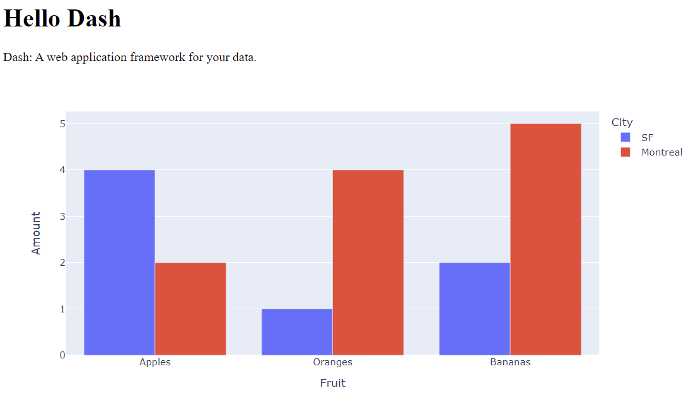
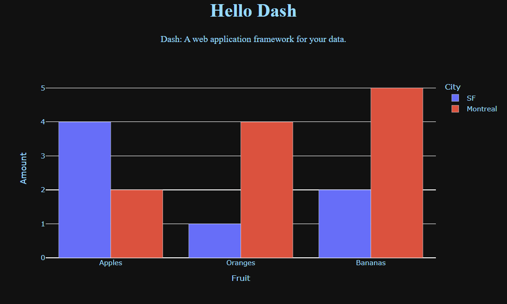
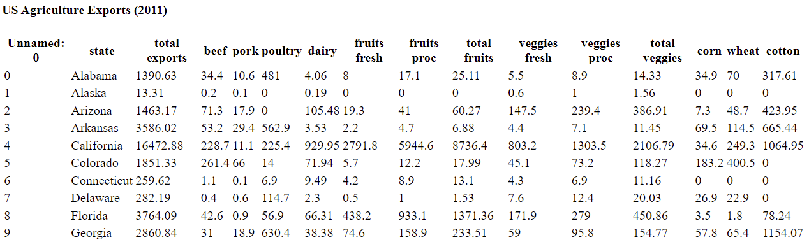
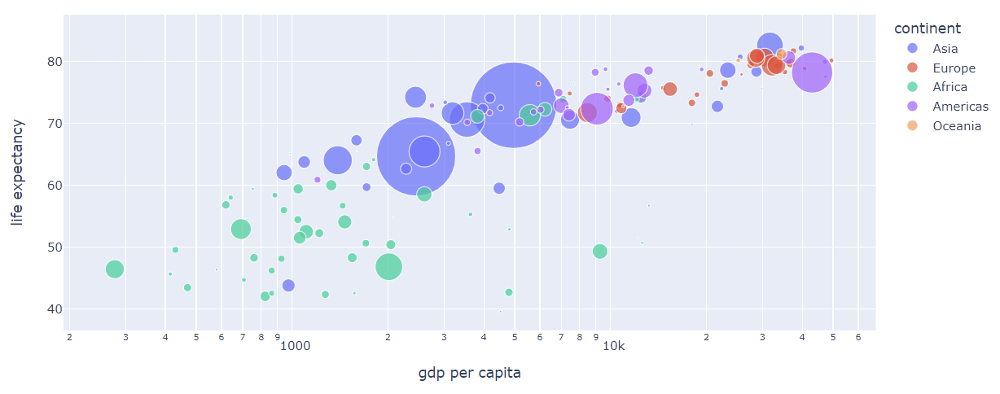
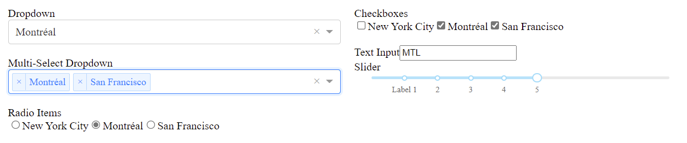

# Dash Layout

- [Dash Layout](#dash-layout)
  - [简介](#简介)
  - [开始第一个修改](#开始第一个修改)
  - [HTML 组件](#html-组件)
  - [可复用组件](#可复用组件)
  - [可视化](#可视化)
  - [Markdown](#markdown)
  - [核心组件](#核心组件)
  - [帮助](#帮助)
  - [总结](#总结)
  - [参考](#参考)

2022-04-24, 19:06
****

## 简介

Dash 应用程序由两部分组成：

1. 应用程序 `layout`，指定程序外观；
2. 程序的交互。

这一章讲 layout 部分。

首先，创建文件 `app.py`，其内部如下：

```py
# Run this app with `python app.py` and
# visit http://127.0.0.1:8050/ in your web browser.

from dash import Dash, html, dcc
import plotly.express as px
import pandas as pd

app = Dash(__name__)

# assume you have a "long-form" data frame
# see https://plotly.com/python/px-arguments/ for more options
df = pd.DataFrame({
    "Fruit": ["Apples", "Oranges", "Bananas", "Apples", "Oranges", "Bananas"],
    "Amount": [4, 1, 2, 2, 4, 5],
    "City": ["SF", "SF", "SF", "Montreal", "Montreal", "Montreal"]
})

fig = px.bar(df, x="Fruit", y="Amount", color="City", barmode="group")

app.layout = html.Div(children=[
    html.H1(children='Hello Dash'),

    html.Div(children='''
        Dash: A web application framework for your data.
    '''),

    dcc.Graph(
        id='example-graph',
        figure=fig
    )
])

if __name__ == '__main__':
    app.run_server(debug=True)
```

运行后，访问 http://127.0.0.1:8050/ 页面可以看到下图效果：



注意：

- `layout` 是由 components 组成的树状结构，如 `html.Div`, `dcc.Graph`；
- Dash HTML 组件模块 `dash.html` 对每个 HTML 标签都有一个对应组件，如 `html.H1(children='Hello Dash')` 生成一个 `<h1>Hello Dash</h1>` HTML 元素；
- 并非所有的组件都是纯 HTML。Dash 核心组件模型 `dash.dcc` 包含由 React.js 库使用 JavaScript, HTML 和 CSS 生成个的更高级交互式组件；
- 每个组件都完全通过关键字属性描述；
- `children` 属性比较特殊。按照管理，它总是第一个属性，可以忽略字段，例如 `html.H1(children='Hello Dash')` 和 `html.H1('Hello Dash')` 等价。它可以是字符串、数字、单个组件或多个组件。
- 你的应用的字体看起来和此处可能不同。样式可以通过 CSS 自定义。

## 开始第一个修改

Dash 包含热重载（hot-reloading），使用 `app.run_server(debug=True)` 运行 app 时默认激活该功能。这意味着，当你修改代码时，Dash 会自动刷新浏览器。

尝试：修改 "Hello Dash" 标题，或者修改 `x` 和 `y` 数据。你会发现浏览器自动刷新。

> 使用 `app.run_server(dev_tools_hot_reload=False)` 关闭热重载功能。

## HTML 组件

Dash HTML 组件 `dash.html` 对每个 HTML 标签都有对应组件类，以及对应的 HTML 参数作为关键字参数。

下面通过修改组件的内联样式来自定义文本。首先创建包含如下代码的 `app.py` 文件：

```py
# Run this app with `python app.py` and
# visit http://127.0.0.1:8050/ in your web browser.

from dash import Dash, dcc, html
import plotly.express as px
import pandas as pd

app = Dash(__name__)

colors = {
    'background': '#111111',
    'text': '#7FDBFF'
}

# assume you have a "long-form" data frame
# see https://plotly.com/python/px-arguments/ for more options
df = pd.DataFrame({
    "Fruit": ["Apples", "Oranges", "Bananas", "Apples", "Oranges", "Bananas"],
    "Amount": [4, 1, 2, 2, 4, 5],
    "City": ["SF", "SF", "SF", "Montreal", "Montreal", "Montreal"]
})

fig = px.bar(df, x="Fruit", y="Amount", color="City", barmode="group")

fig.update_layout(
    plot_bgcolor=colors['background'],
    paper_bgcolor=colors['background'],
    font_color=colors['text']
)

app.layout = html.Div(style={'backgroundColor': colors['background']}, children=[
    html.H1(
        children='Hello Dash',
        style={
            'textAlign': 'center',
            'color': colors['text']
        }
    ),

    html.Div(children='Dash: A web application framework for your data.', style={
        'textAlign': 'center',
        'color': colors['text']
    }),

    dcc.Graph(
        id='example-graph-2',
        figure=fig
    )
])

if __name__ == '__main__':
    app.run_server(debug=True)
```



这里用 `style` 属性修改 `html.Div` 和 `html.H1` 组件的内联样式。

```py
html.H1('Hello Dash', style={'textAlign': 'center', 'color': '#7FDBFF'})
```

上面的代码在 Dash 中渲染为 `<h1 style="text-align: center; color: #7FDBFF">Hello Dash</h1>`。

`dash.html` 和 HTML 属性的重要差别：

1. 在 HTML 中 `style` 属性是由分号分隔的字符串，而在 Dash 中可以用 dict；
2. 在 `style` dict 中，键 是 camelCased，因此 `text-align` 变为 `textAlign`；
3. HTML 的 `class` 属性替换为 Dash 中的 `className`；
4. HTML 标签的 children 使用 `children` 关键字参数指定，且默认为第一个参数。

除此之外，所有可用的 HTML 属性和额标签都可以在 Python 上下文中使用。

## 可复用组件

下面使用 Pandas dataframe 创建 `Table`。如下：

```py
# Run this app with `python app.py` and
# visit http://127.0.0.1:8050/ in your web browser.

from dash import Dash, html
import pandas as pd

df = pd.read_csv('https://gist.githubusercontent.com/chriddyp/c78bf172206ce24f77d6363a2d754b59/raw/c353e8ef842413cae56ae3920b8fd78468aa4cb2/usa-agricultural-exports-2011.csv')


def generate_table(dataframe, max_rows=10):
    return html.Table([
        html.Thead(
            html.Tr([html.Th(col) for col in dataframe.columns])
        ),
        html.Tbody([
            html.Tr([
                html.Td(dataframe.iloc[i][col]) for col in dataframe.columns
            ]) for i in range(min(len(dataframe), max_rows))
        ])
    ])


app = Dash(__name__)

app.layout = html.Div([
    html.H4(children='US Agriculture Exports (2011)'),
    generate_table(df)
])

if __name__ == '__main__':
    app.run_server(debug=True)
```



## 可视化

Dash 的核心组件模块 `dash.dcc` 包含一个 `Graph` 组件。

`Graph` 使用开源的 JavaScript 图形库 plotly.js 绘制交互式数据可视化。plotly.s 支持 35 种以上的图表类型，可渲染为 SVG 和高性能的 WebGL。

`Graph` 组件中的 `figure` 参数和 `plotly.py` 中的 `figure` 参数一样。

下面使用 Pandas dataframe 创建一个散点图：

```py
# Run this app with `python app.py` and
# visit http://127.0.0.1:8050/ in your web browser.

from dash import Dash, dcc, html
import plotly.express as px
import pandas as pd


app = Dash(__name__)

df = pd.read_csv('https://gist.githubusercontent.com/chriddyp/5d1ea79569ed194d432e56108a04d188/raw/a9f9e8076b837d541398e999dcbac2b2826a81f8/gdp-life-exp-2007.csv')

fig = px.scatter(df, x="gdp per capita", y="life expectancy",
                 size="population", color="continent", hover_name="country",
                 log_x=True, size_max=60)

app.layout = html.Div([
    dcc.Graph(
        id='life-exp-vs-gdp',
        figure=fig
    )
])

if __name__ == '__main__':
    app.run_server(debug=True)
```



## Markdown

虽然 Dash 通过 Dash HTML 组件 `dash.html` 开通 HTML 接口，但是编写 HTML 副本还是很无聊。对文本内容，可以使用 Dash 核心模块 `dash.dcc` 的 `Markdown` 组件。如下：

```py
# Run this app with `python app.py` and
# visit http://127.0.0.1:8050/ in your web browser.

from dash import Dash, html, dcc

app = Dash(__name__)

markdown_text = '''
### Dash and Markdown

Dash apps can be written in Markdown.
Dash uses the [CommonMark](http://commonmark.org/)
specification of Markdown.
Check out their [60 Second Markdown Tutorial](http://commonmark.org/help/)
if this is your first introduction to Markdown!
'''

app.layout = html.Div([
    dcc.Markdown(children=markdown_text)
])

if __name__ == '__main__':
    app.run_server(debug=True)
```

> Dash 使用 [CommonMark](https://commonmark.org/) 版本的 Markdown。

## 核心组件

Dash 核心组件 `dash.dcc` 包含一组高级的组件，如下拉列表、图标、markdown block 等。

和其它 Dash 组件一样，Dash 核心组件也是声明式的。每个选项都可以通过关键字参数设置。

下面演示几个核心组件：

```py
# Run this app with `python app.py` and
# visit http://127.0.0.1:8050/ in your web browser.

from dash import Dash, html, dcc

app = Dash(__name__)

app.layout = html.Div([
    html.Div(children=[
        html.Label('Dropdown'),
        dcc.Dropdown(['New York City', 'Montréal', 'San Francisco'], 'Montréal'),

        html.Br(),
        html.Label('Multi-Select Dropdown'),
        dcc.Dropdown(['New York City', 'Montréal', 'San Francisco'],
                     ['Montréal', 'San Francisco'],
                     multi=True),

        html.Br(),
        html.Label('Radio Items'),
        dcc.RadioItems(['New York City', 'Montréal', 'San Francisco'], 'Montréal'),
    ], style={'padding': 10, 'flex': 1}),

    html.Div(children=[
        html.Label('Checkboxes'),
        dcc.Checklist(['New York City', 'Montréal', 'San Francisco'],
                      ['Montréal', 'San Francisco']
        ),

        html.Br(),
        html.Label('Text Input'),
        dcc.Input(value='MTL', type='text'),

        html.Br(),
        html.Label('Slider'),
        dcc.Slider(
            min=0,
            max=9,
            marks={i: f'Label {i}' if i == 1 else str(i) for i in range(1, 6)},
            value=5,
        ),
    ], style={'padding': 10, 'flex': 1})
], style={'display': 'flex', 'flex-direction': 'row'})

if __name__ == '__main__':
    app.run_server(debug=True)
```



## 帮助

Dash 组件是声明式的：这些组件的每个可配置参数都在初始化时使用关键字参数设置。

在 Python 控制台调用 `help` 可以查看帮助信息：

```py
>>> help(dcc.Dropdown)
class Dropdown(dash.development.base_component.Component)
|  A Dropdown component.
|  Dropdown is an interactive dropdown element for selecting one or more
|  items.
|  The values and labels of the dropdown items are specified in the `options`
|  property and the selected item(s) are specified with the `value` property.
|
|  Use a dropdown when you have many options (more than 5) or when you are
|  constrained for space. Otherwise, you can use RadioItems or a Checklist,
|  which have the benefit of showing the users all of the items at once.
|
|  Keyword arguments:
|  - id (string; optional)
|  - className (string; optional)
|  - disabled (boolean; optional): If true, the option is disabled
|  - multi (boolean; optional): If true, the user can select multiple values
|  - options (list; optional)
|  - placeholder (string; optional): The grey, default text shown when no option is selected
|  - value (string | list; optional): The value of the input. If `multi` is false (the default)
|  then value is just a string that corresponds to the values
|  provided in the `options` property. If `multi` is true, then
|  multiple values can be selected at once, and `value` is an
|  array of items with values corresponding to those in the
|  `options` prop.
```

## 总结

Dash 程序的 `layout` 描述应用程序的外观。`layout` 是组件的分层树。

Dash HTML 组件 `dash.html` 为所有 HTML 标签提供了类，为所有 HTML 属性提供了关键字参数。Dash 核心组件 `dash.dcc` 包含高级组件，如控件、图标等。

参考：

- [Dash 核心组件库](https://dash.plotly.com/dash-core-components)
- [Dash HTML 组件库](https://dash.plotly.com/dash-html-components)

## 参考

- https://dash.plotly.com/layout
