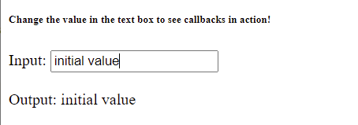
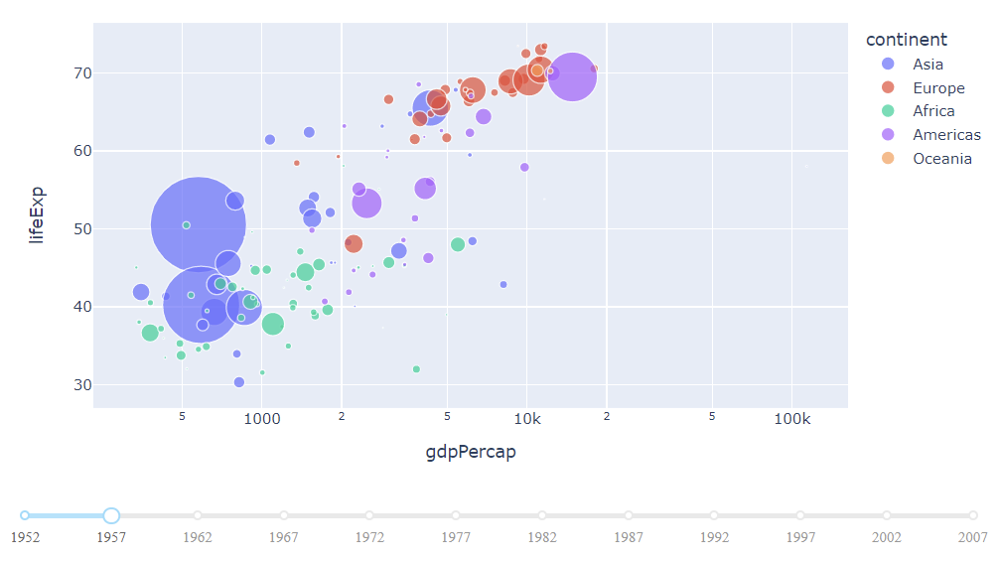
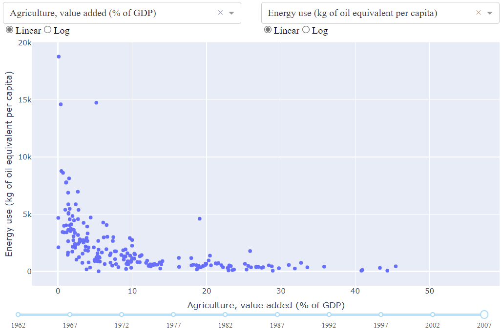
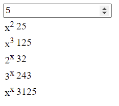

# Dash Callbacks

2022-04-25, 13:18
***

## 简介

在上一章我们学习了定义程序外观的 `app.layout`，它是一个组件的分层树结构。Dash HTML 组件 `dash.html` 模块为所有 HTML 标签提供了对应的类，所有 HTML 属性如 `style`, `className`, `id` 等以关键字参数提供。Dash 核心组件 `dash.dcc` 模型生成更高级别的组件，如控件和图表。

本章介绍使用回调函数（callback），当指定输入组件的属性发生变化时，Dash 就自动调用的函数称为 callback 函数。

## 简单交互 Dash App

```py
from dash import Dash, dcc, html, Input, Output

app = Dash(__name__)

app.layout = html.Div([
    html.H6("Change the value in the text box to see callbacks in action!"),
    html.Div([
        "Input: ",
        dcc.Input(id='my-input', value='initial value', type='text')
    ]),
    html.Br(),
    html.Div(id='my-output'),

])


@app.callback(
    Output(component_id='my-output', component_property='children'),
    Input(component_id='my-input', component_property='value')
)
def update_output_div(input_value):
    return f'Output: {input_value}'


if __name__ == '__main__':
    app.run_server(debug=True)
```



说明：

1. "input" 和 "output" 为 `@app.callback` 装饰器的参数；
2. 在 Dash，程序的输入和输出为特定组件的属性。这里，输入是 ID 为 `"my-input"` 组件的 `value` 属性，输出是 ID 为 `"my-output"` 组件的 `children` 属性；
3. 当 input 属性发生更改，callback 函数自动调用。Dash 将输入属性作为函数参数，用函数返回值更新输出组件；
4. `component_id` 和 `component_property` 关键字是可选的，因为每个对象只有两个参数。后面将省略这两个关键字；
5. 不要混淆 `dash.dependencies.Input` 对象和 `dcc.Input` 对象。前者只在 callback 定义中使用，后者是实际的组件；
6. 在 `layout` 中我们没有为 `my-output` 组件设置 `children` 属性值。当 Dash app 启动时，它会使用输入组件的初始值自动调用所有 callback 函数，从而填充输出组件。在上例中，如果指定 `html.Div(id='my-output', children='Hello world')`，在 app 启动后其值会被覆盖。

有点像 Excel 编程：每当一个单元格的值发生变化，所有依赖该单元格的其它单元格都会自动更新。这称为反应式编程（Reactive Programming）。

每个组件都可以通过关键字参数设置其属性，借助 Dash 的交互性，可以使用 callback 更新这些属性。我们通常更新 HTML 组件的 `children` 属性来显示新的文本，更新 `dcc.Graph` 组件的 `figure` 属性来展示新数据。

## Figure and Slider

```py
from dash import Dash, dcc, html, Input, Output
import plotly.express as px

import pandas as pd

df = pd.read_csv('https://raw.githubusercontent.com/plotly/datasets/master/gapminderDataFiveYear.csv')

app = Dash(__name__)

app.layout = html.Div([
    dcc.Graph(id='graph-with-slider'),
    dcc.Slider(
        df['year'].min(),
        df['year'].max(),
        step=None,
        value=df['year'].min(),
        marks={str(year): str(year) for year in df['year'].unique()},
        id='year-slider'
    )
])


@app.callback(
    Output('graph-with-slider', 'figure'),
    Input('year-slider', 'value'))
def update_figure(selected_year):
    filtered_df = df[df.year == selected_year]

    fig = px.scatter(filtered_df, x="gdpPercap", y="lifeExp",
                     size="pop", color="continent", hover_name="country",
                     log_x=True, size_max=55)

    fig.update_layout(transition_duration=500)

    return fig


if __name__ == '__main__':
    app.run_server(debug=True)
```



在这里，`dcc.Slider` 的 `value` 属性为 app 的输入，而输出是 `dcc.Graph` 的 `figure` 属性。当 `dcc.Slider` 的 `value` 属性更改时，Dash 调用 callback 函数 `update_figure`。该函数根据新的值过滤 dataframe，创建一个新的 `figure` 对象。说明：

1. 使用 pandas 读取文件；
2. 将数据载入内存可能会很耗资源。在 app 开头而不是 callback 函数中载入数据，这样只需要载入一次数据。如果可能，耗时的初始化过程（如下载或查询数据）应该在 app 的全局完成；
3. callback 没有修改原始数据，而是过滤后创建数据副本；
4. 使用 `layout.transition` 打开转场效果。

## Multiple Inputs

在 Dash 中，任何输出都可以有多个输入。下面将五个输入到一个输出。注意 `app.callback` 如何添加多个输入。

```py
from dash import Dash, dcc, html, Input, Output
import plotly.express as px

import pandas as pd

app = Dash(__name__)

df = pd.read_csv('https://plotly.github.io/datasets/country_indicators.csv')

app.layout = html.Div([
    html.Div([

        html.Div([
            dcc.Dropdown(
                df['Indicator Name'].unique(),
                'Fertility rate, total (births per woman)',
                id='xaxis-column'
            ),
            dcc.RadioItems(
                ['Linear', 'Log'],
                'Linear',
                id='xaxis-type',
                inline=True
            )
        ], style={'width': '48%', 'display': 'inline-block'}),

        html.Div([
            dcc.Dropdown(
                df['Indicator Name'].unique(),
                'Life expectancy at birth, total (years)',
                id='yaxis-column'
            ),
            dcc.RadioItems(
                ['Linear', 'Log'],
                'Linear',
                id='yaxis-type',
                inline=True
            )
        ], style={'width': '48%', 'float': 'right', 'display': 'inline-block'})
    ]),

    dcc.Graph(id='indicator-graphic'),

    dcc.Slider(
        df['Year'].min(),
        df['Year'].max(),
        step=None,
        id='year--slider',
        value=df['Year'].max(),
        marks={str(year): str(year) for year in df['Year'].unique()},
    )
])


@app.callback(
    Output('indicator-graphic', 'figure'),
    Input('xaxis-column', 'value'),
    Input('yaxis-column', 'value'),
    Input('xaxis-type', 'value'),
    Input('yaxis-type', 'value'),
    Input('year--slider', 'value'))
def update_graph(xaxis_column_name, yaxis_column_name,
                 xaxis_type, yaxis_type,
                 year_value):
    dff = df[df['Year'] == year_value]

    fig = px.scatter(x=dff[dff['Indicator Name'] == xaxis_column_name]['Value'],
                     y=dff[dff['Indicator Name'] == yaxis_column_name]['Value'],
                     hover_name=dff[dff['Indicator Name'] == yaxis_column_name]['Country Name'])

    fig.update_layout(margin={'l': 40, 'b': 40, 't': 10, 'r': 0}, hovermode='closest')

    fig.update_xaxes(title=xaxis_column_name,
                     type='linear' if xaxis_type == 'Linear' else 'log')

    fig.update_yaxes(title=yaxis_column_name,
                     type='linear' if yaxis_type == 'Linear' else 'log')

    return fig


if __name__ == '__main__':
    app.run_server(debug=True)
```



当 `dcc.Dropdown`, `dcc.Slider` 或 `dcc.RadioItem` 组件的 `value` 属性发生变化，callback 函数执行。

callback 的输入参数为每个输入组件的当前值。

## Mltiple Outputs

将所需要更新的输出列在 `app.callback` 中即可。

```py
from dash import Dash, dcc, html
from dash.dependencies import Input, Output

external_stylesheets = ['https://codepen.io/chriddyp/pen/bWLwgP.css']

app = Dash(__name__, external_stylesheets=external_stylesheets)

app.layout = html.Div([
    dcc.Input(
        id='num-multi',
        type='number',
        value=5
    ),
    html.Table([
        html.Tr([html.Td(['x', html.Sup(2)]), html.Td(id='square')]),
        html.Tr([html.Td(['x', html.Sup(3)]), html.Td(id='cube')]),
        html.Tr([html.Td([2, html.Sup('x')]), html.Td(id='twos')]),
        html.Tr([html.Td([3, html.Sup('x')]), html.Td(id='threes')]),
        html.Tr([html.Td(['x', html.Sup('x')]), html.Td(id='x^x')]),
    ]),
])


@app.callback(
    Output('square', 'children'),
    Output('cube', 'children'),
    Output('twos', 'children'),
    Output('threes', 'children'),
    Output('x^x', 'children'),
    Input('num-multi', 'value'))
def callback_a(x):
    return x**2, x**3, 2**x, 3**x, x**x


if __name__ == '__main__':
    app.run_server(debug=True)
```



一般不建议合并输出：

- 如果输出所依赖的输入不完全相同，则分离输出可以避免不必要的更新；
- 如果所有输出切好具有相同的输入，只是执行的计算不同，则保持 callback 分离可以允许它们并行执行。

## Chained Callbacks


## 参考

- https://dash.plotly.com/basic-callbacks
