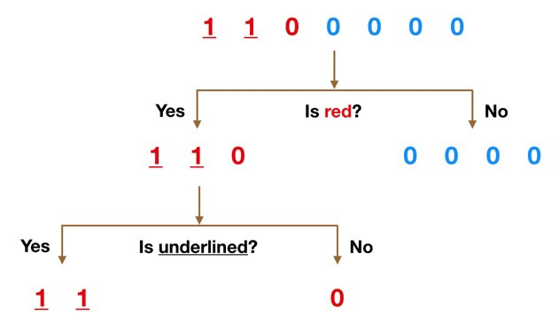

# 随机森林

- [随机森林](#随机森林)
  - [基本概念](#基本概念)
    - [决策树](#决策树)
    - [随机森林](#随机森林-1)
  - [参考](#参考)

2021-03-31, 16:33
***

## 基本概念

目前有大量的分类算法，如逻辑回归、支持向量机、朴素贝叶斯以及决策树。但是在分类器中，随机森林分类器处于顶端。

### 决策树

决策树是随机森林模型的基本组成。假设我们数据集由下图上面的数字组成：

里面有两个 1 和五个 0，我们根据这些数字的特征（颜色、下划线）对它们进行分类。

首先根据颜色，将数字分为两类：红色和蓝色。

蓝色只有一类，红色还可以继续分类。根据下划线对左侧继续分类。这就是决策树了。

### 随机森林

随机森林，由许多决策树组成，这些决策树作为一个整体运行。随机森林中的每颗决策树

## 参考

- https://www.stat.berkeley.edu/~breiman/RandomForests/cc_home.htm