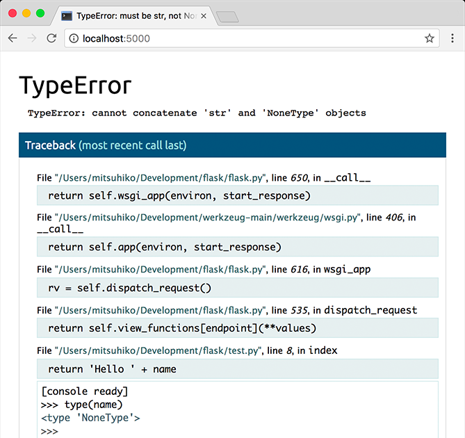

# 快速入门

- [快速入门](#快速入门)
  - [最小程序](#最小程序)
  - [Debug 模式](#debug-模式)
  - [HTML 转义](#html-转义)
  - [Routing](#routing)
    - [Variable Rules](#variable-rules)
    - [Unique URLs / Redirection Behavior](#unique-urls--redirection-behavior)
    - [URL Building](#url-building)
    - [HTTP Methods](#http-methods)
  - [Static Files](#static-files)

## 最小程序

一个大概最小的 Flask 应用如下：

```python
from flask import Flask

app = Flask(__name__)

@app.route("/")
def hello_world():
    return "<p>Hello, World!</p>"
```

代码解释：

1. 首先导入 Flask 类。该类实例就是 WSGI 程序。
2. 创建 Flask 实例。第一个参数是模块或包名称，Flask 根据该名称查找资源，如模板贺静态文件。
3. 使用 `route()` 装饰器告诉 Flask 什么 URL 触发该函数。
4. 函数返回要在用户浏览器显示的消息。默认的内容类型是 HTML，因此字符串中的 HTML 将由浏览器呈现。

将其保存为 `hello.py`。使用 `flask` 命令或 `python -m flask` 运行程序。使用 `--app` 选项告诉 Flask 程序的位置：

```powershell
$ flask --app hello run
 * Serving Flask app 'hello'
 * Running on http://127.0.0.1:5000 (Press CTRL+C to quit)
```

这将启动一个非常简单的内置服务器，该服务器用于测试足够了，但可能不适合用于生产。关于部署，可以参考 [部署到生产](https://flask.palletsprojects.com/en/2.2.x/deploying/)。

现在打开 http://127.0.0.1:5000/ 网页，可以看到 hello world 字符串。

如果已经有其它程序使用了 5000 端口，则启用服务器时会抛出 `OSError: [Errno 98]` 或 `OSError: [WinError 10013]` 错误。可以参考 [Address already in use](https://flask.palletsprojects.com/en/2.2.x/server/#address-already-in-use) 来解决。

> 外部可见服务器：
> 运行上面的服务器，你会发现只能从你自己的计算机上访问，而不能从网络上的其它计算机访问。这是 debug 模式下的默认选项。
> 如果关闭调试，只需在命令行中添加 `--host=0.0.0.0`，就可以使服务器公开可用。

## Debug 模式

`flask run` 命令除了启动开发服务器，如果启用 debug 模式，在代码发生更改时，服务器会自动重载，如果请求过程发生错误，服务器会子啊浏览器中显示交互调试器。



> **[!WARNING]** debugger 允许从浏览器执行任意 Python 代码。它受 pin 保护，但仍然存在安全风险，所以不要在生产环境中运行开发服务器或 debugger。

使用 `--debug` 选项启用 debug 模式。

```powershell
$ flask --app hello --debug run
 * Serving Flask app 'hello'
 * Debug mode: on
 * Running on http://127.0.0.1:5000 (Press CTRL+C to quit)
 * Restarting with stat
 * Debugger is active!
 * Debugger PIN: nnn-nnn-nnn
```

## HTML 转义

返回的 HTML（Flask 默认响应类型），任意用户提供的值必须经过转义，以放置注入攻击。HTML 模板使用 Jinja 渲染，会自动进行转义。

下面手动使用 `escape()`，为了简介，大多数示例都省略了它，但应该知道如何处理不受信任的数据。

```python
from markupsafe import escape

@app.route("/<name>")
def hello(name):
    return f"Hello, {escape(name)}!"
```

如果用户成功将 `<script>alert("bad")</script>` 提交为 name，转义会使其呈现为文本，而不是能在用户浏览器中运行的脚本。

route 中的 `<name>` 会从 URL 捕获值，并将其传递给函数。

## Routing

现代 Web 应用使用有意义的 URL 来帮助用户。有意义的 URL 有利于用户记住。

使用 `route()` 装饰器将函数绑定到 URL。

```python
@app.route('/')
def index():
    return 'Index Page'

@app.route('/hello')
def hello():
    return 'Hello, World'
```

还可以使用动态 URL，使用函数定义规则。

### Variable Rules

可以使用 `<variable_name>` 标记来向 URL 添加变量。函数将 `<variable_name>` 作为关键字参数处理。还可以使用 converter 来指定参数类型，例如 `<converter:variable_name>`。

```python
from markupsafe import escape

@app.route('/user/<username>')
def show_user_profile(username):
    # show the user profile for that user
    return f'User {escape(username)}'

@app.route('/post/<int:post_id>')
def show_post(post_id):
    # show the post with the given id, the id is an integer
    return f'Post {post_id}'

@app.route('/path/<path:subpath>')
def show_subpath(subpath):
    # show the subpath after /path/
    return f'Subpath {escape(subpath)}'
```

Converter 类型：

|类型|说明|
|---|---|
|string|(default) accepts any text without a slash|
|int|accepts positive integers|
|float|accepts positive floating point values|
|path|like string but also accepts slashes|
|uuid|accepts UUID strings|

### Unique URLs / Redirection Behavior

下面两条规则在使用斜线方面有所不同：

```python
@app.route('/projects/')
def projects():
    return 'The project page'

@app.route('/about')
def about():
    return 'The about page'
```

`projects` 的规范化的 URL 末尾有个斜杠。它类似于文件系统的文件夹，如果访问没有尾部 `/` 的 URL `/projects`，Flask 会重定向到规范的 URL `/projects/`。

`about` 的规范 URL 没有尾部 `/`。它类似于文件的路径名。如果访问带 `/` 的 URL `/about/`，会产生 404 "Not Found" 错误。这有助于保持这些资源 URL 的唯一性，从而帮助搜索引擎避免对同一页面多次索引。

### URL Building

使用 `url_for()` 函数构建函数的 URL。它的第一个参数为函数名，后面可以跟任意数量的关键字参数，对应 URL 规则的可变部分。未知变量作为 URL 的查询参数。

使用 URL 反转函数 `url_for()` 而不是硬编码到模板中，有以下几点原因：

1. `url_for()` 通常比硬编码 URL 描述性更强
2. `url_for()` 可以一次性更改 URL，无需记住硬编码的 URL
3. URL 构建会透明处理特殊字符的转义
4. 生成的时绝对路径，避免了浏览器中相对路径的不可以预测行为
5. 如果应用位于 URL 根目录之外，例如在 `/myapplication` 而不是 `/`，`url_for()` 能正确处理。

例如，下面我们使用 `test_request_context()` 来演示 `url_for()`。`test_request_context()` 让 Flask 在使用 Python shell 时也像处理请求一样执行。

```python
from flask import url_for

@app.route('/')
def index():
    return 'index'

@app.route('/login')
def login():
    return 'login'

@app.route('/user/<username>')
def profile(username):
    return f'{username}\'s profile'

with app.test_request_context():
    print(url_for('index'))
    print(url_for('login'))
    print(url_for('login', next='/'))
    print(url_for('profile', username='John Doe'))
```

```txt
/
/login
/login?next=/
/user/John%20Doe
```

### HTTP Methods

Web 应用在访问 URL 时使用不同的 HTTP 方法。使用 Flask 要熟悉 HTTP 方法。route 默认只响应 `GET` 请求。可以使用 `route()` 的 `methods` 参数处理不同 HTTP 方法。

```python
from flask import request

@app.route('/login', methods=['GET', 'POST'])
def login():
    if request.method == 'POST':
        return do_the_login()
    else:
        return show_the_login_form()
```

上面的示例将 route 的所有 methods 放在一个函数中，如果不同 methods 共享数据，这样做非常方便。

也可以将不同 method 定义在不同的函数中。Flask 为每个 HTTP 函数都提供了一个装饰器，如 `get()`, `post()` 等。

```python
@app.get('/login')
def login_get():
    return show_the_login_form()

@app.post('/login')
def login_post():
    return do_the_login()
```

如果存在 `GET`，Flask 会自动添加对 `HEAD` 方法的支持，并根据 HTPP RFC 处理 HEAD 请求。同样，也会自动实现 `OPTIONS`。

## Static Files

动态 Web 应用也需要静态文件，如 CSS 和 JavaScript 文件。