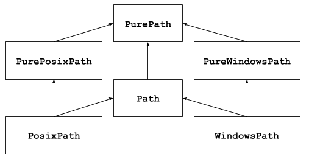

# pathlib

- [pathlib](#pathlib)
  - [简介](#简介)
  - [基本使用](#基本使用)
    - [列出所有子目录](#列出所有子目录)
    - [列出所有源文件](#列出所有源文件)
  - [纯路径操作](#纯路径操作)
    - [实现类](#实现类)
      - [PurePath](#purepath)
      - [PurePosixPath](#pureposixpath)
      - [PureWindowsPath](#purewindowspath)
    - [性质](#性质)
    - [Operators](#operators)
    - [访问](#访问)
  - [Concrete paths](#concrete-paths)
  - [os 中对应工具](#os-中对应工具)
  - [方法和属性](#方法和属性)
    - [PurePath.drive](#purepathdrive)
    - [PurePath.root](#purepathroot)
    - [PurePath.anchor](#purepathanchor)
    - [PurePath.parents](#purepathparents)
    - [Path.glob](#pathglob)
    - [Path.iterdir](#pathiterdir)

2021-05-31, 09:41
***

## 简介

`pathlib` 模块提供了表示操作系统文件路径的类。路径分为两种：

- 纯路径，只提供路径计算，没有 I/O 功能
- 具体路径，继承纯路径，还提供 I/O 操作



其中 `Path` 为基于平台的具体路径，使用最为广泛。

纯路径在有些情况很有用：

- 在 Unix 及其上操作 Windows 路径（反之亦然），在 Unix 上你无法实例化 `WindowsPath`，但是可以实例化 `PureWindowsPath`。
- 不需要访问 OS，只需要操作路径。

## 基本使用

### 列出所有子目录

```py
p = Path('..')
dir_lst = [x for x in p.iterdir() if x.is_dir()]
assert PurePath('../io') in dir_lst
```

### 列出所有源文件

```py
>>> list(p.glob('**/*.py'))
[PosixPath('test_pathlib.py'), PosixPath('setup.py'),
 PosixPath('pathlib.py'), PosixPath('docs/conf.py'),
 PosixPath('build/lib/pathlib.py')]
```

## 纯路径操作

纯路径提供文件路径操作功能。有三种访问这些类的方法。

不管在哪个操作系统，可以实例化下面所有的 `PurePath` 类，因为它们不执行任何系统调用。

### 实现类

#### PurePath

`class pathlib.PurePath(*pathsegments)`

代表文件路径的通用类，实例化该类，根据系统不同返回 `PurePosixPath` 或 `PureWindowsPath`。

`pathsegments` 参数：

- 表示路径的字符串
- 或者是实现 `os.PathLike` 接口的对象
- 或者另一个 path 对象

例如：

```py
p = PurePath('path', 'to', "hell")
assert p == PurePath('path/to/hell')
assert PurePath(Path('path'), 'to/hell') == PurePath('path/to/hell')
```

如果 `pathsegments` 为空，返回当前目录：

```py
>>> PurePath()
PurePosixPath('.')
```

当给出多个绝对路径，使用最后一个：

```py
>>> PurePath('/etc', '/usr', 'lib64')
PurePosixPath('/usr/lib64')
>>> PureWindowsPath('c:/Windows', 'd:bar')
PureWindowsPath('d:bar')
```

不过在 Windows path 中，修改本地根目录不改变前面的驱动器：

```py
>>> PureWindowsPath('c:/Windows', '/Program Files')
PureWindowsPath('c:/Program Files')
```

多余的斜杠和单点被舍弃，但是不改变双点 `..`，因为出现符号链接时修改双点可能改变路径的含义：

```py
>>> PurePath('foo//bar')
PurePosixPath('foo/bar')
>>> PurePath('foo/./bar')
PurePosixPath('foo/bar')
>>> PurePath('foo/../bar')
PurePosixPath('foo/../bar')
```

`PurePath` 实现了 `os.PathLike` 接口。

#### PurePosixPath

`class pathlib.PurePosixPath(*pathsegments)`

`PurePath` 的子类，表示 non-windows 文件系统的路径：

```py
>>> PurePosixPath('/etc')
PurePosixPath('/etc')
```

`pathsegments` 和`PurePath` 类似。

#### PureWindowsPath

`class pathlib.PureWindowsPath(*pathsegments)`

`PurePath` 的子类，表示 Windows 文件系统 path:

```py
>>> PureWindowsPath('c:/Program Files/')
PureWindowsPath('c:/Program Files')
```

### 性质

Paths 为 immutable, hashable。相同实现类的 path 可以对比、排序。这些性质和对应的系统文件路径性质一致。例如：

```py
assert not (PurePosixPath('foo') == PurePosixPath('FOO'))
assert PureWindowsPath('foo') == PureWindowsPath("FOO")
assert PureWindowsPath("FOO") in {PureWindowsPath("foo")}
assert PureWindowsPath("C:") < PureWindowsPath("d:")
```

Windows 系统文件路径不区分大小写。

不同实现的路径比较总是 unequal，则无法排序：

```py
>>> PureWindowsPath('foo') == PurePosixPath('foo')
False
>>> PureWindowsPath('foo') < PurePosixPath('foo')
Traceback (most recent call last):
  File "<stdin>", line 1, in <module>
TypeError: '<' not supported between instances of 'PureWindowsPath' and 'PurePosixPath'
```

### Operators

斜杠运算符可用于创建子路径，和 `os.path.join()` 功能类似：

```py
assert PurePosixPath('/etc') / 'init.d' / 'apache2' == PurePosixPath('/etc/init.d/apache2')
assert '/usr' / PurePath('bin') == PurePath('/usr/bin')
```

path 对象可以用在任何接受 `os.PathLike` 的地方：

```py
>>> import os
>>> p = PurePath('/etc')
>>> os.fspath(p)
'/etc
```

路径的字符串表示为原始文件系统路径（native 形式）：

```py
>>> p = PurePath('/etc')
>>> str(p)
'/etc'
>>> p = PureWindowsPath('c:/Program Files')
>>> str(p)
'c:\\Program Files'
```

同样的，对 path 调用 `bytes` 将原始路径转换为字节对象，由 `os.fsencode()` 编码：

```py
>>> bytes(p)
b'/etc'
```

> 建议只在 Unix 上调用 `bytes`，因为 Windows 中 unicode 形式是文件系统路径的规范表示。

### 访问

通过 `PurePath.parts` 属性访问路径的不同部分。

`PurePath.parts` 是 path 不同部分的 tuple 表示。

```py
>>> p = PurePath('/usr/bin/python3')
>>> p.parts
('/', 'usr', 'bin', 'python3')

>>> p = PureWindowsPath('c:/Program Files/PSF')
>>> p.parts
('c:\\', 'Program Files', 'PSF')
```

## Concrete paths

具体路径（concrete path）是纯路径（pure path）的子类。

## os 中对应工具

下面是 os 函数映射到 PurePath/Path 等效函数列表：

| os and os.path | pathlib |
| --- | --- |
| os.path.abspath() | Path.resolve() |
| os.chmod() | Path.chmod() |
| os.mkdir() | Path.mkdir() |
| os.rename() | Path.rename() |
| os.replace() | Path.replace() |
| os.rmdir() | Path.rmdir() |
| os.remove(), os.unlink() | Path.unlink() |
| os.getcwd() | Path.cwd() |
| os.path.exists() | Path.exists() |
| os.path.expanduser() | Path.expanduser() and Path.home() |
| os.path.isdir() | Path.is_dir() |
| os.path.isfile() | Path.is_file() |
| os.path.islink() | Path.is_symlink() |
| os.stat() | Path.stat(), Path.owner(), Path.group() |
| os.path.isabs() | PurePath.is_absolute() |
| os.path.join() | PurePath.joinpath() |
| os.path.basename() | PurePath.name |
| os.path.dirname() | PurePath.parent |
| os.path.samefile() | Path.samefile() |
| os.path.splitext() | PurePath.suffix |

## 方法和属性

### PurePath.drive

代表驱动器名称的字符串：

```py
>>> PureWindowsPath('c:/Program Files/').drive
'c:'
>>> PureWindowsPath('/Program Files/').drive
''
>>> PurePosixPath('/etc').drive
''
```

UNC 共享也视作驱动：

```py
>>> PureWindowsPath('//host/share/foo.txt').drive
'\\\\host\\share'
```

### PurePath.root

表示根目录的字符串：

```py
>>> PureWindowsPath('c:/Program Files/').root
'\\'
>>> PureWindowsPath('c:Program Files/').root
''
>>> PurePosixPath('/etc').root
'/'
```

UNC shares 也有 root:

```py
>>> PureWindowsPath('//host/share').root
'\\'
```

### PurePath.anchor


drive 和 root 的合并：


```py
>>> PureWindowsPath('c:/Program Files/').anchor
'c:\\'
>>> PureWindowsPath('c:Program Files/').anchor
'c:'
>>> PurePosixPath('/etc').anchor
'/'
>>> PureWindowsPath('//host/share').anchor
'\\\\host\\share\\'
```


### PurePath.parents


### Path.glob


`Path.glob(pattern)`


使用指定的模式在此路径对应的目录中查找匹配的文件。


```py
>>> sorted(Path('.').glob('*.py'))
[PosixPath('pathlib.py'), PosixPath('setup.py'), PosixPath('test_pathlib.py')]
>>> sorted(Path('.').glob('*/*.py'))
[PosixPath('docs/conf.py')]
```


"**" 表示此目录及其及目录，递归查找匹配项：


```py
>>> sorted(Path('.').glob('**/*.py'))
[PosixPath('build/lib/pathlib.py'),
 PosixPath('docs/conf.py'),
 PosixPath('pathlib.py'),
 PosixPath('setup.py'),
 PosixPath('test_pathlib.py')]
```


### Path.iterdir


`Path.iterdir()`


当 path 指向目录，返回目录中所有文件的 path 对象。例如：


```py
>>> p = Path('docs')
>>> for child in p.iterdir(): child
...
PosixPath('docs/conf.py')
PosixPath('docs/_templates')
PosixPath('docs/make.bat')
PosixPath('docs/index.rst')
PosixPath('docs/_build')
PosixPath('docs/_static')
PosixPath('docs/Makefile')
```