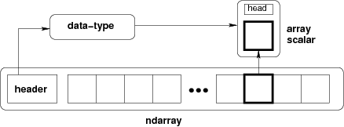

# 数组对象

- [数组对象](#数组对象)
  - [简介](#简介)
  - [数组转换](#数组转换)
  - [参考](#参考)

2021-03-31, 20:43
***

## 简介

NumPy 提供了N-维齐次数组类型 `ndarray`。对数组可以构建索引，例如使用 N 个整数，即 `ndarray` 为索引数组。

所有 `ndarray` 都是同构的，即每个元素占用相同大小的内存，并且以完全相同的方式解析。数组元素类型由单独的类型表示。除了基本类型，如 integers, floats 等，还可以是数据结构。

从数组中提取的元素由 Python 对象表示，该对象是 NumPy 内置的数组标量类型之一。如下所示：

## 数组转换

## 参考

- [Array objects](https://numpy.org/doc/stable/reference/arrays.html)