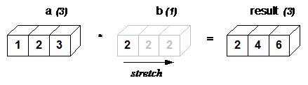
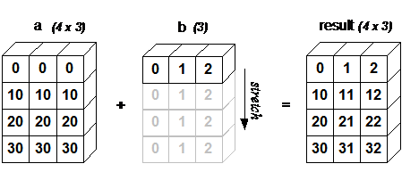
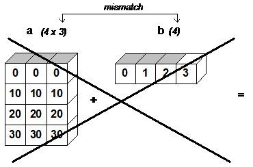
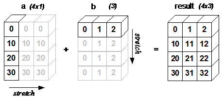

# 广播（broadcasting）

下面讨论一下 numpy 中的广播功能。广播是 numpy 在遇到不同 shape 的数组进行运算时的一种操作。较小的数组按照指定规则在较大的数组上进行广播，从而获得兼容的 shape。广播提供了矢量化数组操作的方法，从而在 C 而不是 Python 中进行循环。无需复制不必要的数据即可完成次操作，并且算法的实现通常十分高效。不过广播也不总是好的，因为广播会导致内存使用效率降低，从而减慢计算速度。

numpy 操作通常是逐个元素（element-wise）进行操作，需要两个数组具有相同的 shape。例如：

- 例 1

```py
>>> from numpy import array
>>> a = array([1.0, 2.0, 3.0])
>>> b = array([2.0, 2.0, 2.0])
>>> a * b
array([ 2.,  4.,  6.])
```

当两个数组 shape 不同时，如果 shape 满足要求，通过广播也能进行运算。例如，将数组和标量进行运算，就是最简单的广播实例：

- 例 2

```py
>>> from numpy import array
>>> a = array([1.0,2.0,3.0])
>>> b = 2.0
>>> a * b
array([ 2.,  4.,  6.])
```

结果和例 1 相同。我们可以认为标量 `b` 在计算时被拉伸为与 `a` shape 相同的数组。如图 1 所示，`b` 中的新元素就是原标量值。这里拉伸只是概念上的，numpy 不会真的复制原标量值，从而使广播操作尽可能地节省内存。因为例 2 中移动内存较小（b 是标量，而不是数组），当数组长度为百万时，在 Windows 2000 上大概比例 1 快 10%。



> 图 1

广播操作条件：**两个数组最后的 axes 相同或者其中一个为 1，就可以进行广播操作。**

如果不满足该条件，则抛出 `ValueError('frames are not aligned')`，表明数组的 shape 不兼容。通过广播创建的数组的 shape 为输入数组每个维度的最大尺寸。

例如，假设有 256x256x3 的 RGB 数组值，如果希望对所有像素值进行缩放，可以将其乘以包含三个值的一维数组：

||||||
|---|---|---|---|---|
|图片|3d array|256x|256x|3|
|Scale|1d array|||3|
|结果|3d array|256x|256x|3|

只有对应 axes 相同或有一个为 1，就可以广播，例如：

||||||
|---|---|---|---|---|
|A|4d array|8x|1x|6x|1|
|B|3d array||7x|1x|5|
|结果|4d array|8x|7x|6x|5|

- 例 3：一维数组和二维数组相加

```py
>>> from numpy import array
>>> a = array([[ 0.0,  0.0,  0.0],
...            [10.0, 10.0, 10.0],
...            [20.0, 20.0, 20.0],
...            [30.0, 30.0, 30.0]])
>>> b = array([1.0, 2.0, 3.0])
>>> a + b
array([[  1.,   2.,   3.],
       [ 11.,  12.,  13.],
       [ 21.,  22.,  23.],
       [ 31.,  32.,  33.]])
```

如图所示，`b` 和 `a` 的每行分别加和。



如果 `b` 比 `a` 的行要长，尺寸不匹配无法广播，就会抛出错误：



使用广播创建两个数组的外部乘积很容易。下面是两个 1-d 数组的外部加法运算：

```py
>>> from numpy import array, newaxis
>>> a = array([0.0, 10.0, 20.0, 30.0])
>>> b = array([1.0, 2.0, 3.0])
>>> a[:,newaxis] + b
array([[  1.,   2.,   3.],
       [ 11.,  12.,  13.],
       [ 21.,  22.,  23.],
       [ 31.,  32.,  33.]])
```

这里 `newaxis` 索引运算符在 `a` 插入一个新的轴，使其成为二维的 4x1 数组。下图说明了两个数组的拉伸形式，从而输出 4x3 数组：



## 参考

- [Array Broadcasting in Numpy](https://numpy.org/doc/stable/user/theory.broadcasting.html)
