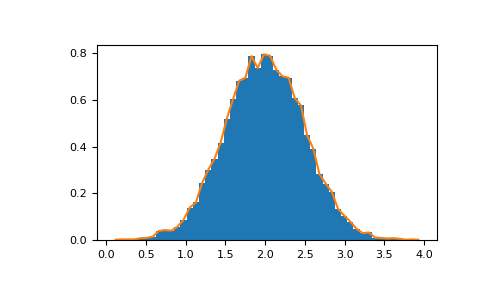

# 快速入门

- [快速入门](#快速入门)
  - [基础](#基础)
    - [示例](#示例)
    - [创建数组](#创建数组)
    - [打印数组](#打印数组)
    - [基本操作](#基本操作)
    - [通用函数](#通用函数)
    - [索引、切片和迭代](#索引切片和迭代)
  - [Shape 操作](#shape-操作)
    - [改变数组 shape](#改变数组-shape)
    - [堆叠数组](#堆叠数组)
    - [拆分数组](#拆分数组)
  - [复制和视图](#复制和视图)
    - [完全不复制](#完全不复制)
    - [视图或浅复制](#视图或浅复制)
    - [深复制](#深复制)
    - [函数和方法概述](#函数和方法概述)
  - [广播规则](#广播规则)
  - [高级索引](#高级索引)
    - [索引数组索引](#索引数组索引)
    - [布尔数组索引](#布尔数组索引)
    - [ix\_() 函数](#ix_-函数)
  - [技巧](#技巧)
    - [自动 reshape](#自动-reshape)
    - [向量堆叠](#向量堆叠)
    - [Histogram](#histogram)
  - [参考](#参考)

Last updated: 2023-01-03, 13:00
***

## 基础

NumPy 的主要对象是齐次多维数组。存储相同类型的元素，通过非负整数元祖索引。NumPy 数组的维度称为 *axes*。

例如，3D 空间中点的坐标数组 `[1, 2, 1]` 包含一个 *axis*。该 *axis* 包含 3 个元素，所以其长度为 3。下方的数组包含 2 个 `axes`。第一个长度为 2，第二个长度为 3，即 $2\times 3$ 数组：

```python
[[ 1., 0., 0.],
 [ 0., 1., 2.]]
```

> 多维数组，按照从外到内的方式进行编号。

NumPy 数组类为 `ndarray`，别名 `array`。不过 `numpy.array` 和标准 Python 库 `array.array` 不同，该库只能处理一维数组，而且功能较少。

`ndarray` 对象的重要属性如下：

|属性|说明|
|---|---|
|ndarray.ndim|维度数|
|ndarray.shape|数组 shape|
|ndarray.size|总元素个数。等于 shape 元素乘积|
|ndarray.dtype|元素类型，可以使用标准 Python 类型，也可以使用 NumPy 类型|
|ndarray.itemsize|元素大小 bytes。例如 `float64` 为 8 字节|
|ndarray.data|包含实际元素的缓冲|

### 示例

```python
>>> import numpy as np
>>> a = np.arange(15).reshape(3,5)
>>> a
array([[ 0,  1,  2,  3,  4],
       [ 5,  6,  7,  8,  9],
       [10, 11, 12, 13, 14]])
>>> a.shape
(3, 5)
>>> a.ndim
2
>>> a.dtype.name
'int32'
>>> a.itemsize
4
>>> a.size
15
>>> type(a)
<class 'numpy.ndarray'>
>>> b = np.array([6, 7, 8])
>>> b
array([6, 7, 8])
>>> type(b)
<class 'numpy.ndarray'>
```

### 创建数组

创建数组的方式有多种。

- 使用 `array` 函数从 Python 列表或元组创建。数组类型会自动通过元素类型推断

```python
>>> a = np.array([2, 3, 4])
>>> a
array([2, 3, 4])
>>> a.dtype
dtype('int32')
>>> b = np.array([1.2, 3.5, 5.1])
>>> b.dtype
dtype('float64')
```

- 使用 `array` 函数的一个常见错误，是忘了使用序列类型

```python
>>> a = np.array(1, 2, 3, 4) # 不对
Traceback (most recent call last):
  File "<pyshell#17>", line 1, in <module>
    a = np.array(1, 2, 3, 4)
TypeError: array() takes from 1 to 2 positional arguments but 4 were given
>>> a = np.array([1, 2, 3, 4]) # 正确方式
```

- 对嵌套序列，`array` 将其转换为多维数组

```python
>>> b = np.array([(1.5, 2, 3), (4, 5, 6)])
>>> b
array([[1.5, 2. , 3. ],
       [4. , 5. , 6. ]])
```

- 在创建数组时，可以指定类型

```python
>>> c = np.array([[1, 2], [3, 4]], dtype=complex)
>>> c
array([[1.+0.j, 2.+0.j],
       [3.+0.j, 4.+0.j]])
```

在使用数组时，一般先确定数组大小，然后才确定元素值。因此，NumPy 提供了几个函数用来创建指定大小的数组，以最大限度减少增减数组大小的操作（昂贵操作）。

- 函数 `zeros` 创建元素全为 0 的数组；
- 函数 `ones` 创建元素全为 1 的数组；
- 函数 `empty` 创建初始内容随机的数组，元素具体值取决于内存状态；

创建数组的默认类型为 `float64`，可以通过 `dtype` 参数指定其它类型。

```python
>>> np.zeros((3, 4))
array([[0., 0., 0., 0.],
       [0., 0., 0., 0.],
       [0., 0., 0., 0.]])
>>> np.ones((2, 3, 4), dtype=np.int16)
array([[[1, 1, 1, 1],
        [1, 1, 1, 1],
        [1, 1, 1, 1]],

       [[1, 1, 1, 1],
        [1, 1, 1, 1],
        [1, 1, 1, 1]]], dtype=int16)
>>> np.empty((2, 3))
array([[1.5, 2. , 3. ], # 元素值可能不同
       [4. , 5. , 6. ]])
```

- NumPy 提供了 `arange` 函数创建数值序列，该函数和 Python 的内置函数 `range` 功能类似，但是返回数组。

```python
>>> np.arange(10, 30, 5)
array([10, 15, 20, 25])
>>> np.arange(0, 2, 0.3) # 浮点数也可以
array([0. , 0.3, 0.6, 0.9, 1.2, 1.5, 1.8])
```

当使用浮点参数时，由于精度问题 `arange` 函数生成的数组包含元素个数就不确定。因此推荐使用 `linspace` 生成浮点数组：

```py
>>> from numpy import pi
>>> np.linspace(0, 2, 9) # 0 到 2 之间生成 9 个数
array([0.  , 0.25, 0.5 , 0.75, 1.  , 1.25, 1.5 , 1.75, 2.  ])
>>> x = np.linspace(0, 2 * pi, 100)
>>> f = np.sin(x)
```

### 打印数组

打印数组时，NumPy 以类似嵌套列表的方式显示数组：

- 最后一个 axis 从左到右打印；
- 导数第二个 axis 从上到下打印；
- 余下也是从上到下打印，切片之间以空行分隔。

一维数组单行显示，二维以矩阵显示，三维数组则以矩阵列表显示：

```python
>>> a = np.arange(6) # 1d 数组
>>> print(a)
[0 1 2 3 4 5]
>>> b = np.arange(12).reshape(4, 3) # 2d 数组
>>> print(b)
[[ 0  1  2]
 [ 3  4  5]
 [ 6  7  8]
 [ 9 10 11]]
>>> c = np.arange(24).reshape(2, 3, 4) # 3d 数组
>>> print(c)
[[[ 0  1  2  3]
  [ 4  5  6  7]
  [ 8  9 10 11]]

 [[12 13 14 15]
  [16 17 18 19]
  [20 21 22 23]]]
```

- 如果数组太大，NumPy 会自动跳过数组中间部分，只打印几个角

```python
>>> print(np.arange(10000)) # 1D 数组，打印前后各 3 个
[   0    1    2 ... 9997 9998 9999]
>>> print(np.arange(10000).reshape(100, 100)) # 二维数组，打印每个角 3x3 个
[[   0    1    2 ...   97   98   99]
 [ 100  101  102 ...  197  198  199]
 [ 200  201  202 ...  297  298  299]
 ...
 [9700 9701 9702 ... 9797 9798 9799]
 [9800 9801 9802 ... 9897 9898 9899]
 [9900 9901 9902 ... 9997 9998 9999]]
```

- 使用 `set_printoptions` 设置打印选项，可以强制 NumPy 打印整个数组

```py
>>> np.set_printoptions(threshold=sys.maxsize)  # sys module should be imported
```

### 基本操作

- 数学运算逐元素进行。计算结果以新数组返回

```python
>>> a = np.array([20, 30, 40, 50])
>>> b = np.arange(4)
>>> b
array([0, 1, 2, 3])
>>> c = a - b
>>> c
array([20, 29, 38, 47])
>>> b**2
array([0, 1, 4, 9])
>>> 10 * np.sin(a)
array([ 9.12945251, -9.88031624,  7.4511316 , -2.62374854])
>>> a < 35
array([ True,  True, False, False])
```

- 和矩阵运算不同，NumPy 中乘积运算符 `*` 是逐元素乘积。而矩阵乘用 `@` 运算符或 `dot` 函数

```py
>>> A = np.array([[1, 1], [0, 1]])
>>> B = np.array([[2, 0], [3, 4]])
>>> A * B # 逐元素乘
array([[2, 0],
       [0, 4]])
>>> A @ B # 矩阵乘
array([[5, 4],
       [3, 4]])
>>> A.dot(B) # 矩阵乘
array([[5, 4],
       [3, 4]])
```

- 部分运算符 `+=`, `*=` 原位操作，不创建新数组，而是修改原数组

```python
>>> rg = np.random.default_rng(1) # 创建随机数生成器实例
>>> a = np.ones((2, 3), dtype=int)
>>> b = rg.random((2, 3))
>>> a *= 3
>>> a
array([[3, 3, 3],
       [3, 3, 3]])
>>> b += a
>>> b
array([[3.51182162, 3.9504637 , 3.14415961],
       [3.94864945, 3.31183145, 3.42332645]])
>>> a += b # b 无法自动转换为 integer 类型
Traceback (most recent call last):
  File "<pyshell#62>", line 1, in <module>
    a += b
numpy.core._exceptions._UFuncOutputCastingError: Cannot cast ufunc 'add' output from dtype('float64') to dtype('int32') with casting rule 'same_kind'
```

- 当操作不同类型的数组时，所得数组类型和更精确的数组类型一致

```python
>>> a = np.ones(3, dtype=np.int32)
>>> b = np.linspace(0, pi, 3)
>>> b.dtype.name
'float64'
>>> c = a + b
>>> c
array([1.        , 2.57079633, 4.14159265])
>>> c.dtype.name
'float64'
>>> d = np.exp(c * 1j)
>>> d
array([ 0.54030231+0.84147098j, -0.84147098+0.54030231j,
       -0.54030231-0.84147098j])
>>> d.dtype.name
'complex128'
```

- 许多一元运算，如计算数组中所有元素的和，包含在 `ndarray` 类的方法中

```python
>>> a = rg.random((2, 3))
>>> a
array([[0.32973172, 0.7884287 , 0.30319483],
       [0.45349789, 0.1340417 , 0.40311299]])
>>> a.sum()
2.412007822394087
>>> a.min()
0.13404169724716475
>>> a.max()
0.7884287034284043
```

- 这些操作默认应用于数组的所有元素，无论其 shape 是何样式。但是通过指定 `axis` 参数，可以将操作应用到指定轴

```python
>>> b = np.arange(12).reshape(3, 4)
>>> b
array([[ 0,  1,  2,  3],
       [ 4,  5,  6,  7],
       [ 8,  9, 10, 11]])
>>> b.sum(axis=0) # 每列加和
array([12, 15, 18, 21])
>>> b.min(axis=1) # 每行的最小值
array([0, 4, 8])
>>> b.cumsum(axis=1) # 每行的累计和
array([[ 0,  1,  3,  6],
       [ 4,  9, 15, 22],
       [ 8, 17, 27, 38]])
```

### 通用函数

NumPy 提供了我们熟悉的各种数学函数，如 sin, cos, exp 等，这些函数称为通用函数（universal functions, ufunc）。在 NumPy 中，这些函数逐元素执行，返回相同 shape 的数组：

```python
>>> B = np.arange(3)
>>> B
array([0, 1, 2])
>>> np.exp(B)
array([1.        , 2.71828183, 7.3890561 ])
>>> np.sqrt(B)
array([0.        , 1.        , 1.41421356])
>>> C = np.array([2., -1., 4.])
>>> np.add(B, C)
array([2., 0., 6.])
```

### 索引、切片和迭代

- NumPy 一维数组可以和 Python 序列一样索引、切片和迭代

```python
>>> a = np.arange(10)**3
>>> a
array([  0,   1,   8,  27,  64, 125, 216, 343, 512, 729], dtype=int32)
>>> a[2]
8
>>> a[2:5]
array([ 8, 27, 64], dtype=int32)
>>> # 等价于 a[0:6:2] = 1000
>>> a[:6:2] = 1000
>>> a
array([1000,    1, 1000,   27, 1000,  125,  216,  343,  512,  729],
      dtype=int32)
>>> a[::-1] # 逆序
array([ 729,  512,  343,  216,  125, 1000,   27, 1000,    1, 1000],
      dtype=int32)
>>> for i in a:
...     print(i**(1 / 3.))
... 
...     
9.999999999999998
1.0
9.999999999999998
3.0
9.999999999999998
5.0
5.999999999999999
6.999999999999999
7.999999999999999
8.999999999999998
```

- 多维数组在每个 axis 都可以有一个索引。这些索引以元组的形式指定

```python
>>> def f(x, y):
...     return 10 * x + y
... 
>>> b = np.fromfunction(f, (5, 4), dtype=int)
>>> b
array([[ 0,  1,  2,  3],
       [10, 11, 12, 13],
       [20, 21, 22, 23],
       [30, 31, 32, 33],
       [40, 41, 42, 43]])
>>> b[2, 3]
23
>>> 
>>> b[0:5, 1] # 每行的第 2 列
array([ 1, 11, 21, 31, 41])
>>> b[:, 1] # 同上
array([ 1, 11, 21, 31, 41])
>>> b[1:3, :] # 第 2,3 行的所有列
array([[10, 11, 12, 13],
       [20, 21, 22, 23]])
```

- 当提供的索引少于 `axis` 数，缺失索引默认为完整切片

```py
>>> b[-1] # 最后一行，等价于 b[-1, :]
array([40, 41, 42, 43])
```

表达式 `b[i]` 被解析为 `i` 后面跟着多个 `:`，以补全 axes。也可以用 `b[i, ...]` 表示。

这三个点号 `...` 表示补全冒号以生成完整的索引元组。例如，如果 `x` 是包含 5 个 axes 的数组，则：

- `x[1, 2, ...]` 等价于 `x[1, 2, :, :, :]`
- `x[..., 3]` 等价于 `x[;, :, :, :, 3]`
- `x[4, ..., 5, :]` 等价于 `x[4, :, :, 5, :]`

```python
>>> c = np.array([[[0, 1, 2], # 3D 数组
...                [10, 12, 13]],
...               [[100, 101, 102],
...                [110, 112, 113]]])
...              
>>> c.shape
(2, 2, 3)
>>> c[1, ...] # 等价于 c[1, :, :] 或 c[1]
array([[100, 101, 102],
       [110, 112, 113]])
>>> c[..., 2] # 等价于c[:, :, 2]
array([[  2,  13],
       [102, 113]])
```

- 迭代多维数组是对第一个 axis 进行迭代

```py
>>> for row in b:
...     print(row)
...              
[0 1 2 3]
[10 11 12 13]
[20 21 22 23]
[30 31 32 33]
[40 41 42 43]
```

- 如果想对每个元素依次迭代，可以使用 `flat` 属性，返回逐元素迭代器

```python
>>> for element in b.flat:
...     print(element)
...
0
1
2
3
10
11
12
13
20
21
22
23
30
31
32
33
40
41
42
43
```

## Shape 操作

### 改变数组 shape

- shape 是数组沿着各个 axis 的元素个数

```python
>>> a = np.floor(10 * rg.random((3, 4)))
>>> a
array([[0., 2., 6., 9.],
       [6., 1., 0., 1.],
       [0., 0., 1., 2.]])
>>> a.shape
(3, 4)
```

- 改变数组 shape 的方法有多种。以下三个函数返回修改后的数组，不改变原数组：

```python
>>> a.ravel() # 拉平为一维数组
array([0., 2., 6., 9., 6., 1., 0., 1., 0., 0., 1., 2.])
>>> a.reshape(6, 2) # reshape 为 6 行 2 列
array([[0., 2.],
       [6., 9.],
       [6., 1.],
       [0., 1.],
       [0., 0.],
       [1., 2.]])
>>> a.T # 转置
array([[0., 6., 0.],
       [2., 1., 0.],
       [6., 0., 1.],
       [9., 1., 2.]])
>>> a.T.shape
(4, 3)
>>> a.shape
(3, 4)
```

使用 `ravel` 生成数组的元素顺序为 C-样式，即最右边的元素改变最快，所以元素 `a[0, 0]` 后面的元素为 `a[0, 1]` 而不是 `a[1, 0]`。

不过 `ravel` 和 `reshape` 都有一个可选参数，可以将其设置为 FORTRAIN-样式，此时左侧索引变化最快。

- `reshape` 函数返回一个新的数组，而 `ndarray.resize` 方法则修改原数组

```python
>>> a
array([[0., 2., 6., 9.],
       [6., 1., 0., 1.],
       [0., 0., 1., 2.]])
>>> a.resize((2, 6))
>>> a
array([[0., 2., 6., 9., 6., 1.],
       [0., 1., 0., 0., 1., 2.]])
```

- 在 reshape 操作中，如果某个 axis 指定为 -1，表示自动计算其值

```python
>>> a.reshape(3, -1)
array([[0., 2., 6., 9.],
       [6., 1., 0., 1.],
       [0., 0., 1., 2.]])
```

### 堆叠数组

- 可以沿不同 axes 将多个数组堆叠在一起

```python
>>> a = np.floor(10 * rg.random((2, 2)))
>>> a
array([[9., 3.],
       [1., 8.]])
>>> b = np.floor(10 * rg.random((2, 2)))
>>> b
array([[8., 1.],
       [3., 2.]])
>>> np.vstack((a, b))
array([[9., 3.],
       [1., 8.],
       [8., 1.],
       [3., 2.]])
>>> np.hstack((a, b))
array([[9., 3., 8., 1.],
       [1., 8., 3., 2.]])
```

- `column_stack` 将 1D 数组作为 column 组装为 2D 数组

对 2D 数组来说，`column_stack` 功能与 `hstack` 一样。

```python
>>> from numpy import newaxis
>>> np.column_stack((a, b)) # 2D 数组
array([[9., 3., 8., 1.],
       [1., 8., 3., 2.]])
>>> a = np.array([4., 2.])
>>> b = np.array([3., 8.])
>>> np.column_stack((a, b)) # 返回 2D 数组
array([[4., 3.],
       [2., 8.]])
>>> np.hstack((a, b)) # 结果不同
array([4., 2., 3., 8.])
>>> a[:, newaxis]
array([[4.],
       [2.]])
>>> np.column_stack((a[:, newaxis], b[:, newaxis]))
array([[4., 3.],
       [2., 8.]])
>>> np.hstack((a[:, newaxis], b[:, newaxis])) # 结果相同
array([[4., 3.],
       [2., 8.]])
```

- 对任意输入数组，`row_stack` 与 `vstack` 等价。实际上，`row_stack` 是 `vstack` 的别名

```python
>>> np.column_stack is np.hstack
False
>>> np.row_stack is np.vstack
True
```

通常，对二维以上的数组，`hstack` 沿第二个 axes 拼接，`vstack` 则沿第一个 axes 拼接，`concatenate` 有一个可选参数，可以指定拼接的 axis。

> **NOTE** 在复杂情况，`r_` 和 `c_` 对沿一个轴堆叠数字来创建数组很有用。它们支持 `:` 范围切片

```python
>>> np.r_[1:4, 0, 4]
array([1, 2, 3, 0, 4])
```

当将数组作为参数，`r_` 和 `c_` 的默认行为与 `vstack` 和 `hstack` 类似，但是它们支持一个可选参数，用于指定要拼接的轴。

### 拆分数组

使用 `hsplit` 可以沿着数组的水平拆分数组，可以指定拆分出多少个数组，也可以指定拆分的 column 位置：

```python
>>> a = np.floor(10 * rg.random((2, 12)))
>>> a
array([[3., 5., 9., 9., 5., 4., 2., 8., 4., 0., 7., 9.],
       [0., 1., 8., 4., 3., 3., 8., 2., 4., 2., 7., 6.]])
>>> np.hsplit(a, 3) # 拆分为 3 个数组
[array([[3., 5., 9., 9.],
       [0., 1., 8., 4.]]), array([[5., 4., 2., 8.],
       [3., 3., 8., 2.]]), array([[4., 0., 7., 9.],
       [4., 2., 7., 6.]])]
>>> np.hsplit(a, (3, 4)) # 在第3,4列后面拆分
[array([[3., 5., 9.],
       [0., 1., 8.]]), array([[9.],
       [4.]]), array([[5., 4., 2., 8., 4., 0., 7., 9.],
       [3., 3., 8., 2., 4., 2., 7., 6.]])]
```

`vsplit` 沿垂直轴拆分，`array_split` 可以指定沿哪个轴进行拆分。

## 复制和视图

在处理数据时，数组的数据有时被复制到新数组，有时不复制。共有三种情况。

### 完全不复制

- 简单赋值不会复制对象及其数据

```python
>>> a = np.array([[ 0,  1,  2,  3],
...               [ 4,  5,  6,  7],
...               [ 8,  9, 10, 11]])
>>> b = a # 没有创建新对象
>>> b is a # a 和 b 相同 ndarray 对象的两个名称
True
```

- Python 通过引用传递参数，所以函数调用不会复制

```python
>>> def f(x):
...     print(id(x))
... 
>>> id(a)
2323553479120
>>> f(a)
2323553479120
```

### 视图或浅复制

- 不同数组对象可以共享相同的数据，`view` 方法创建一个共享数据的数组对象

```python
>>> c = a.view()
>>> c is a
False
>>> c.base is a # c 是 a 数据的一个视图
True
>>> c.flags.owndata
False
>>> c = c.reshape((2, 6)) # a 的 shape 不变
>>> a.shape
(3, 4)
>>> c[0, 4] = 1234 # a 的数据随之更改
>>> a
array([[   0,    1,    2,    3],
       [1234,    5,    6,    7],
       [   8,    9,   10,   11]])
```

- 数组切片返回视图

```python
>>> s = a[:, 1:3]
>>> s[:] = 10 # s[:] 是 s 的视图
>>> a
array([[   0,   10,   10,    3],
       [1234,   10,   10,    7],
       [   8,   10,   10,   11]])
```

### 深复制

`copy` 生成数组及其数据的完整副本。

```python
>>> d = a.copy() # 创建新的数组对象和新的数据
>>> d is a
False
>>> d.base is a # d 和 a 不共享数据
False
>>> d[0, 0] = 9999
>>> a
array([[   0,   10,   10,    3],
       [1234,   10,   10,    7],
       [   8,   10,   10,   11]])
```

在切片后如果不再需要原数据，则可以调用 `copy`。例如，假设 `a` 是一个巨大的中间结果，而最终结果 b 只包含 a 的一小部分，则使用切片构造 `b` 时应该进行深复制：

```python
>>> a = np.arange(int(1e8))
>>> b = a[:100].copy()
>>> del a # 释放 a 的内存
```

如果使用 `b = a[:100]`，则 `b` 引用了 `a`，即使调用 `del a`，`a` 也会一直在内存中。

### 函数和方法概述

下面是按类别排列的一些常用 NumPy 函数和方法。完整列表可参考[例程](https://numpy.org/doc/stable/reference/routines.html)。

**创建数组**

arange, array, copy, empty, empty_like, eye, fromfile, fromfunction, identity, linspace, logspace, mgrid, ogrid, ones, ones_like, r_, zeros, zeros_like

**转换**

ndarray.astype, atleast_1d, atleast_2d, atleast_3d, mat

**处理**

array_split, column_stack, concatenate, diagonal, dsplit, dstack, hsplit, hstack, ndarray.item, newaxis, ravel, repeat, reshape, resize, squeeze, swapaxes, take, transpose, vsplit, vstack

**查询**

all, any, nonzero, where

**排序**

argmax, argmin, argsort, max, min, ptp, searchsorted, sort

**操作**

choose, compress, cumprod, cumsum, inner, ndarray.fill, imag, prod, put, putmask, real, sum

**基础统计**

cov, mean, std, var

**基础线性代数**

cross, dot, outer, linalg.svd, vdot

## 广播规则

广播用于 shape 不完全相同的输入数组的处理。广播规则：

1. 规则一：如果输入数组的维数不同，则在较小的数组的 shape 重复加 1，直到所有数组具有相同的维数。
2. 规则二：沿特定维度大小为 1 的数组，假设其大小与该维度最大的数组一样，只是所有元素值相同。

应用广播规则后，所有数组的大小必须匹配。详情可参考[广播](https://numpy.org/doc/stable/user/basics.broadcasting.html)。

## 高级索引

NumPy 支持整数索引、切片，整数数组索引以及布尔数组索引。

### 索引数组索引

```python
>>> a = np.arange(12)**2 # 前12个整数的平方
>>> i = np.array([1, 1, 3, 8, 5])
>>> a[i] # 整数数组作为索引
array([ 1,  1,  9, 64, 25])
>>> j = np.array([[3, 4], [9, 7]]) # 二维数组索引
>>> a[j]
array([[ 9, 16],
       [81, 49]])
```

- 当数组 `a` 是多维数组时，单个索引数组索引 `a` 的第一个维度。下面通过调色板将标签图像转换为彩色图像来展示该行为：

```python
>>> palette = np.array([[0, 0, 0],         # black
...                     [255, 0, 0],       # red
...                     [0, 255, 0],       # green
...                     [0, 0, 255],       # blue
...                     [255, 255, 255]])  # white
>>> image = np.array([[0, 1, 2, 0],  # 每个值对应调色板中的一种颜色
...                   [0, 3, 4, 0]])
>>> palette[image]  # the (2, 4, 3) color image
array([[[  0,   0,   0],
        [255,   0,   0],
        [  0, 255,   0],
        [  0,   0,   0]],

       [[  0,   0,   0],
        [  0,   0, 255],
        [255, 255, 255],
        [  0,   0,   0]]])
```

- 可以为多个维度提供索引，每个维度的索引数组的 shape 需要相同。

```python
>>> a = np.arange(12).reshape(3, 4)
>>> a
array([[ 0,  1,  2,  3],
       [ 4,  5,  6,  7],
       [ 8,  9, 10, 11]])
>>> i = np.array([[0, 1],  # indices for the first dim of `a`
...               [1, 2]])
>>> j = np.array([[2, 1],  # indices for the second dim
...               [3, 3]])
>>> a[i, j]  # i and j must have equal shape
array([[ 2,  5],
       [ 7, 11]])
>>> a[i, 2]
array([[ 2,  6],
       [ 6, 10]])
>>> a[:, j]
array([[[ 2,  1],
        [ 3,  3]],

       [[ 6,  5],
        [ 7,  7]],

       [[10,  9],
        [11, 11]]])
```

- 在 Python 中，`arr[i, j]` 与 `arr[(i, j)]` 等价，因此可以将 `i` 和 `j` 放到一个 `tuple` 中，然后用 `tuple` 进行索引。

```python
>>> l = (i, j)
>>> a[l] # 等价于 a[i, j]
array([[ 2,  5],
       [ 7, 11]])
```

- 不能将 `i` 和 `j` 放入数组，数组会被看作 `a` 的第一个维度的索引

```python
>>> s = np.array([i, j])
>>> a[s]
Traceback (most recent call last):
  File "<pyshell#19>", line 1, in <module>
    a[s]
IndexError: index 3 is out of bounds for axis 0 with size 3
>>> a[tuple(s)] # 等价于 a[i, j]
array([[ 2,  5],
       [ 7, 11]])
```

- 数组索引常用于查找时间序列的最大值

```python
>>> time = np.linspace(20, 145, 5)  # time scale
>>> data = np.sin(np.arange(20)).reshape(5, 4) # 4 time-dependent series
>>> time
array([ 20.  ,  51.25,  82.5 , 113.75, 145.  ])
>>> data
array([[ 0.        ,  0.84147098,  0.90929743,  0.14112001],
       [-0.7568025 , -0.95892427, -0.2794155 ,  0.6569866 ],
       [ 0.98935825,  0.41211849, -0.54402111, -0.99999021],
       [-0.53657292,  0.42016704,  0.99060736,  0.65028784],
       [-0.28790332, -0.96139749, -0.75098725,  0.14987721]])
>>> ind = data.argmax(axis=0) # 每个 series 最大值的索引
>>> ind
array([2, 0, 3, 1], dtype=int64)
>>> time_max = time[ind]
>>> data_max = data[ind, range(data.shape[1])]
>>> time_max
array([ 82.5 ,  20.  , 113.75,  51.25])
>>> data_max
array([0.98935825, 0.84147098, 0.99060736, 0.6569866 ])
>>> np.all(data_max == data.max(axis=0))
True
```

- 可以将数组索引用作要赋值的目标

```python
>>> a = np.arange(5)
>>> a
array([0, 1, 2, 3, 4])
>>> a[[1, 3, 4]] = 0
>>> a
array([0, 0, 2, 0, 0])
```

- 当索引列表包含重复项，赋值会重复多次，保留最后一个值

```python
>>> a = np.arange(5)
>>> a[[0, 0, 2]] = [1, 2, 3]
>>> a
array([2, 1, 3, 3, 4])
```

- 如果使用 `+=`，可能结果不如预期

```python
>>> a = np.arange(5)
>>> a[[0, 0, 2]] += 1
>>> a
array([1, 1, 3, 3, 4])
```

索引 `0` 在列表中出现两次，但是第 0 个元素只增加一次。这是因为 `a += 1` 等价于 `a = a + 1`。

### 布尔数组索引

当用整数索引数组作为索引时，提供的是要选择的索引列表。而用布尔数组作为索引时，则显式选择数组中哪些项，不选择哪些。

使用布尔索引最自然的方法，是使用与原始数组 shape 相同的布尔数组：

```python
>>> a = np.arange(12).reshape(3, 4)
>>> b = a > 4
>>> b # b 是与 a shape 相同的布尔数组
array([[False, False, False, False],
       [False,  True,  True,  True],
       [ True,  True,  True,  True]])
>>> a[b] # 包含选择元素的 1D 数组
array([ 5,  6,  7,  8,  9, 10, 11])
```

此属性在赋值中非常有用：

```python
>>> a[b] = 0 # 将 a 中大于 4 的 元素设置为 0
>>> a
array([[0, 1, 2, 3],
       [4, 0, 0, 0],
       [0, 0, 0, 0]])
```

- 布尔索引的第二种方式与整数索引类似：对数组的每个维度，给出一个 1D 布尔数组，选择所需切片

```python
>>> a = np.arange(12).reshape(3, 4)
>>> b1 = np.array([False, True, True])         # first dim selection
>>> b2 = np.array([True, False, True, False])  # second dim selection
>>> a[b1, :]                                   # selecting rows
array([[ 4,  5,  6,  7],
       [ 8,  9, 10, 11]])
>>> a[b1]                                      # same thing
array([[ 4,  5,  6,  7],
       [ 8,  9, 10, 11]])
>>> a[:, b2]                                   # selecting columns
array([[ 0,  2],
       [ 4,  6],
       [ 8, 10]])
>>> a[b1, b2]                                  # a weird thing to do
array([ 4, 10])
```

> **NOTE** 1D 布尔数组的长度与切片的维度要一致。上例中，`b1` 长度为 3，对应 `a` 行数，`b2` 长度为 4，对应 `a` 的列数。

### ix_() 函数

`ix_` 函数用来组合不同向量，获得 n 元组。例如，如果想计算向量 a, b, c 所有三元组的 a+b*c：

```python
>>> a = np.array([2, 3, 4, 5])
>>> b = np.array([8, 5, 4])
>>> c = np.array([5, 4, 6, 8, 3])
>>> ax, bx, cx = np.ix_(a, b, c)
>>> ax
array([[[2]],

       [[3]],

       [[4]],

       [[5]]])
>>> bx
array([[[8],
        [5],
        [4]]])
>>> cx
array([[[5, 4, 6, 8, 3]]])
>>> result = ax + bx*cx
>>> result.shape
(4, 3, 5)
>>> result
array([[[42, 34, 50, 66, 26],
        [27, 22, 32, 42, 17],
        [22, 18, 26, 34, 14]],

       [[43, 35, 51, 67, 27],
        [28, 23, 33, 43, 18],
        [23, 19, 27, 35, 15]],

       [[44, 36, 52, 68, 28],
        [29, 24, 34, 44, 19],
        [24, 20, 28, 36, 16]],

       [[45, 37, 53, 69, 29],
        [30, 25, 35, 45, 20],
        [25, 21, 29, 37, 17]]])
>>> result[3, 2, 4]
17
a[3] + b[2] * c[4]
17
```

也可以按如下方式实现 reduce:

```python
>>> def ufunc_reduce(ufct, *vectors):
...    vs = np.ix_(*vectors)
...    r = ufct.identity
...    for v in vs:
...        r = ufct(r, v)
...    return r
```

使用：

```python
>>> ufunc_reduce(np.add, a, b, c)
array([[[15, 14, 16, 18, 13],
        [12, 11, 13, 15, 10],
        [11, 10, 12, 14,  9]],

       [[16, 15, 17, 19, 14],
        [13, 12, 14, 16, 11],
        [12, 11, 13, 15, 10]],

       [[17, 16, 18, 20, 15],
        [14, 13, 15, 17, 12],
        [13, 12, 14, 16, 11]],

       [[18, 17, 19, 21, 16],
        [15, 14, 16, 18, 13],
        [14, 13, 15, 17, 12]]])
```

与普通 `ufunc.reduce` 相比，此版本的 reduce 利用了广播规则，从而避免创建参数数组。

## 技巧

### 自动 reshape

修改数组维度，可以忽略其中一个大小，NumPy 会自动推导：

```python
>>> a = np.arange(30)
>>> b = a.reshape((2, -1, 3)) # -1 表示自动计算该维度大小
>>> b.shape
(2, 5, 3)
>>> b
array([[[ 0,  1,  2],
        [ 3,  4,  5],
        [ 6,  7,  8],
        [ 9, 10, 11],
        [12, 13, 14]],

       [[15, 16, 17],
        [18, 19, 20],
        [21, 22, 23],
        [24, 25, 26],
        [27, 28, 29]]])
```

### 向量堆叠

NumPy 提供 `column_stack`, `dstack`, `hstack` 和 `vstack` 等函数来拼接数组。例如：

```python
>>> x = np.arange(0, 10, 2)
>>> y = np.arange(5)
>>> m = np.vstack([x, y])
>>> m
array([[0, 2, 4, 6, 8],
       [0, 1, 2, 3, 4]])
>>> xy = np.hstack([x, y])
>>> xy
array([0, 2, 4, 6, 8, 0, 1, 2, 3, 4])
```

当维度超过 2，这些函数背后的逻辑可能看着会有点奇怪。

### Histogram

`histogram` 函数应用于数组，生成一堆向量：数组的直方图和 bin edges 向量。注意：matplotlib 构建直方图的函数 `hist` 与 NumPy 的不同。主要区别在于 `pylab.hist` 自动绘制直方图，而 `numpy.histogram` 只生成数据：

```python
>>> import numpy as np
>>> rg = np.random.default_rng(1)
>>> import matplotlib.pyplot as plt
>>> # 生成 10000 个标准差 0.5，均值 2 的正态分布随机数
>>> mu, sigma = 2, 0.5
>>> v = rg.normal(mu, sigma, 10000)
>>> # 用 50 个 bin 绘制直方图
>>> plt.hist(v, bins=50, density=True)       # matplotlib version (plot)
(array([...]), array([...]), <BarContainer object of 50 artists>)
>>> (n, bins) = np.histogram(v, bins=50, density=True)  # NumPy version (no plot)
```



对 Matplotlib >= 3.4，也可以用 `plt.stairs(n, bins)`。

## 参考

- https://numpy.org/doc/stable/user/quickstart.html
