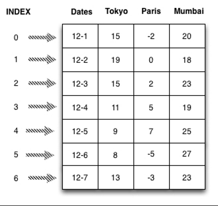
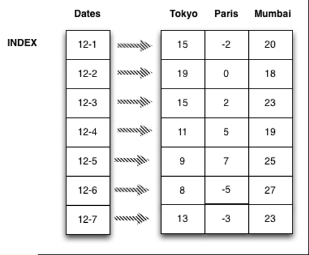
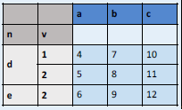

# 数据结构

- [数据结构](#%e6%95%b0%e6%8d%ae%e7%bb%93%e6%9e%84)
  - [简介](#%e7%ae%80%e4%bb%8b)
  - [`Series`](#series)
    - [`Series`操作总结](#series%e6%93%8d%e4%bd%9c%e6%80%bb%e7%bb%93)
    - [创建 `Series`](#%e5%88%9b%e5%bb%ba-series)
      - [通过ndarray创建](#%e9%80%9a%e8%bf%87ndarray%e5%88%9b%e5%bb%ba)
    - [创建 Series 时指定 index](#%e5%88%9b%e5%bb%ba-series-%e6%97%b6%e6%8c%87%e5%ae%9a-index)
    - [为 Series 数据和 index 指定名称](#%e4%b8%ba-series-%e6%95%b0%e6%8d%ae%e5%92%8c-index-%e6%8c%87%e5%ae%9a%e5%90%8d%e7%a7%b0)
    - [通过 dict 创建](#%e9%80%9a%e8%bf%87-dict-%e5%88%9b%e5%bb%ba)
  - [`Series` 和 `ndarray` 类似](#series-%e5%92%8c-ndarray-%e7%b1%bb%e4%bc%bc)
- [`DataFrame`](#dataframe)
  - [`DataFrame`操作总结](#dataframe%e6%93%8d%e4%bd%9c%e6%80%bb%e7%bb%93)
  - [创建 `DataFrame`](#%e5%88%9b%e5%bb%ba-dataframe)
  - [通过 `Series` dict 创建](#%e9%80%9a%e8%bf%87-series-dict-%e5%88%9b%e5%bb%ba)
  - [创建 `DataFrame` 时提供 index:](#%e5%88%9b%e5%bb%ba-dataframe-%e6%97%b6%e6%8f%90%e4%be%9b-index)
  - [创建时同时提供 index 和 columns](#%e5%88%9b%e5%bb%ba%e6%97%b6%e5%90%8c%e6%97%b6%e6%8f%90%e4%be%9b-index-%e5%92%8c-columns)
  - [通过 `ndarray` 或 list 的 `dict` 创建](#%e9%80%9a%e8%bf%87-ndarray-%e6%88%96-list-%e7%9a%84-dict-%e5%88%9b%e5%bb%ba)
  - [创建时提供 index](#%e5%88%9b%e5%bb%ba%e6%97%b6%e6%8f%90%e4%be%9b-index)
  - [通过 `ndarray` 创建](#%e9%80%9a%e8%bf%87-ndarray-%e5%88%9b%e5%bb%ba)
  - [查询 - position](#%e6%9f%a5%e8%af%a2---position)

## 简介

Pandas 包含三种类型数据：

- `Series`
- `DataFrame`
- `Panel`

分别对应一维、二维、三维数据。

它们在创建后，均可以动态修改数值，即是 value mutable。`Series`在创建后，长度不再改变。

## `Series`

Pandas 中 Series 为一维标记数组 (labeled array)。其基本特征为：

- 可以保存任意数据类型(integers, strings, floating point numbers, python object, etc.)
- 一个 `Series` 的数据必须为同种类型

`Series` 为 `ndarray` 的子类，所以 `ndarray` 包含的方法，`Series` 也可以调用。

`Series` 结构示意图：


### `Series`操作总结

| 操作               | 说明                                                                        |
| ------------------ | --------------------------------------------------------------------------- |
| s[0]               | 获得第一个值                                                                |
| s[0]=100           | 使用 offset 为 s复制                                                        |
| s.index            | 获得 Series 的 index 信息                                                   |
| s[:3]              | 获得 Series 的前三个值                                                      |
| s['a']             | 获得 Series 和 a (index label)对应的值，如果s中不存在该label，抛出 KeyError |
| 'e' in s           | s 中是否包含 'e' (index label)                                              |
| s.get('f')         | 获得和'f'对应的值，如果不存在在 index label，返回 None.                     |
| s.get('f', np.nan) | 获得和 'f' 对应的值，如果不存在，返回 np.nan.                               |
| s[s>s.median()]    | 返回大于 s 中值的所有值                                                     |
| s.iloc[:3]         | 返回前三个值                                                                |
| s.iloc[:3]=0       | 前三个设置为0                                                               |
| s.iloc[3]          | 返回第4个值                                                                 |
| s.iloc[start:end]  | 切片，即使超过范围也没事儿                                                  |
| s.sort_index()     | 按照 index label 进行排序，返回排序后的 Series，原Series不变                |

### 创建 `Series`

基本语法：

```py
pd.Series(data, index=index)
```

data 接受数据类型有：

- list
- array
- dict

`index` 是轴标签，即，对每行数据进行标记，如果不指定，默认为数字标号。

#### 通过ndarray创建

如果 `data` 类型为 `ndarray`，`index` 的长度必须和 `data` 相同。如果不指定 index，会自动创建一个 `[0,...,len(data)-1]`。

使用 `ndarray` 也可以创建 `Series`，将数组替换为 ndarray，操作完全相同。

例：通过数组创建 Series
```py
import pandas as pd
s1 = pd.Series([33, 19, 14, 89, 11, -5, 9])
```
此时没有指定 index, 所以默认为索引，输出 s1：
```
0    33
1    19
2    14
3    89
4    11
5    -5
6     9
dtype: int64
```

所以，此时可以将 `Series` 看做 index -> values 的 `dict`:


- 查看 `s1` 的类型：
```py
type(s1)
```
为
```py
pandas.core.series.Series
```

- 查看 `Series` 值：
```
s1.values
```
为
```py
array([33, 19, 14, 89, 11, -5,  9], dtype=int64)
```

- 查看 `Series` 值类型：
```py
type(s1.values)
```
为
```py
numpy.ndarray
```

- 查看 Series 的 index
```py
s1.index
```
为
```py
RangeIndex(start=0, stop=7, step=1)
```

### 创建 Series 时指定 index
```py
data1=[33,19,14,89,11,-5,9]
index1=['Mon','Tue','Wed','Thu','Fri','Sat','Sun']

s2=pd.Series(data1,index=index1)
```
`s2` 结构：


- 查看 index
```py
s2.index
```
输出：
```py
Index(['Mon', 'Tue', 'Wed', 'Thu', 'Fri', 'Sat', 'Sun'], dtype='object')
```

### 为 Series 数据和 index 指定名称
```
s2.name="DailyTemperatures"
s2.index.name="weekday"
```
In:
```
s2
```
Out:
```
weekday
Mon    33
Tue    19
Wed    14
Thu    89
Fri    11
Sat    -5
Sun     9
Name: Daily Temperatures, dtype: int64
```

### 通过 dict 创建
通过 `dict` 创建，如果未指定 `index`, 则 `dict` 的 `key` 自动转换为 index；如果指定了 `index`，则以index 作为键值从 dict 取值创建 Series，如果 dict 中没有对应的键值，则以 NaN 作为结果。

- 通过 dict 创建 Series
```py
dict1={'Mon':33,'Tue':19,'Wed':15,'Thu':89,'Fri':11,'Sat':-5,'Sun':9}
s4=pd.Series(dict1)
```
对应的 Series:
```
Fri    11
Mon    33
Sat    -5
Sun     9
Thu    89
Tue    19
Wed    15
dtype: int64
```

## `Series` 和 `ndarray` 类似
- 例：演示 Series 类似于 ndarray 的操作
```py
s=pd.Series(np.random.randn(5),index=['a','b','c','d','e'])s
```
Out:
```
a   -1.184990
b   -0.404359
c    0.636425
d   -0.750244
e    0.957961
dtype: float64
```

- 乘法
```
s*2
```
Out:
```
a   -2.369981
b   -0.808718
c    1.272850
d   -1.500488
e    1.915921
dtype: float64
```

- np 函数操作
```
np.exp(s)
```
Out:
```
a    0.305749
b    0.667405
c    1.889713
d    0.472251
e    2.606376
dtype: float64
```

- 使用 index label切片
```
s['b':'d']
```
Out
```
b   -0.404359
c    0.636425
d   -0.750244
dtype: float64
```

- 使用 index pos 获得特定位置的值：

| 操作               | 说明                                                                        |
| ------------------ | --------------------------------------------------------------------------- |
| s[0]               | 获得第一个值                                                                |
| s[0]=100           | 使用 offset 为 s复制                                                        |
| s.index            | 获得 Series 的 index 信息                                                   |
| s[:3]              | 获得 Series 的前三个值                                                      |
| s['a']             | 获得 Series 和 a (index label)对应的值，如果s中不存在该label，抛出 KeyError |
| 'e' in s           | s 中是否包含 'e' (index label)                                              |
| s.get('f')         | 获得和'f'对应的值，如果不存在在 index label，返回 None.                     |
| s.get('f', np.nan) | 获得和 'f' 对应的值，如果不存在，返回 np.nan.                               |
| s[s>s.median()]    | 返回大于 s 中值的所有值                                                     |
	

# `DataFrame`
`DataFrame` 在 pandas 中是二维带标签数组，你可以将其看做 Excel 表格、SQL表格或值类型为 `Series` 的字典。`DataFrame` 不同列的数据类型可以不同，在Pandas 中使用最为广泛。另外：
- 每列的数据类型相同
- 每行包含索引 0…n

如下所示：



如果将 Dates 设置为 index:



## `DataFrame`操作总结

**索引操作**

| 操作                          | 语法            | 返回类型    |
| ----------------------------- | --------------- | ----------- |
| 选择列                        | `df[colName]`   | `Series`    |
| 通过标签选择行                | `df.loc[label]` | `Series`    |
| 通过索引选择行                | `df.iloc[loc]`  | `Series`    |
| Slice rows                    | `df[5:10]`      | `DataFrame` |
| Select rows by boolean vector | `df[bool_vec]`  | `DataFrame` |

其他操作
| 操作                                  | 说明                                                                                                                                                                                    |
| ------------------------------------- | --------------------------------------------------------------------------------------------------------------------------------------------------------------------------------------- |
| df.head(n=5)                          | 获得开头的 n 行数据，默认为5                                                                                                                                                            |
| df.tail(n=5)                          | 获得末尾的 n 行数据，默认为5                                                                                                                                                            |
| df.iloc[:3]                           | 前三行                                                                                                                                                                                  |
| df.iloc[1:5, 2:4]                     | [1, 5)行，[2, 4)列, 0-based                                                                                                                                                             |
| df.iloc[[1, 3, 5], [1, 3]]            | 选择 1, 3, 5行，1, 3, 列                                                                                                                                                                |
| df.iloc[1:3, :]                       | 选择[1,3)行，所有列                                                                                                                                                                     |
| df.iloc[:, 1:3]                       | 选择所有行，[1,3)列                                                                                                                                                                     |
| df.iloc[1, 1]                         | 第二行第二个                                                                                                                                                                            |
| df.iloc[1]                            | 第二行                                                                                                                                                                                  |
| df.sort_index(axis=0, ascending=True) | 按照行的 index label 进行排序，返回排序后的DataFrame, 原始数据不变.axis 指定排序用行还是列，默认采用每一行的index label，axis=1采用列的 index label.ascending, 默认升序，可以设置为降序 |
| df.sort_values(by="")                 |                                                                                                                                                                                         |


## 创建 `DataFrame`

**构造函数**
```py
DataFrame(data, index=, columns= )
```

DataFrame 接受多种类型的输入数据：
- 1D `ndarray`、lists、dicts 或 `Series`  的 dict
- 2D `numpy.ndarray`
- `Series`
- 其它 `DataFrame`

除了数据，创建 `DataFrame` 时还可以设置 index (行标签)和 columns (列标签)。如果创建时提供了 index / columns，则为了保证标签对应，不符合要求的数据被舍弃。

> 如果输入数据为 `dict` 类型，且没有指定 `columns`，则 `DataFrame` 的列根据 dict 的插入顺序排序。

## 通过 `Series` dict 创建
输出的 indexes 为不同 `Series` index的并集，例：
```py
dict1 = {'one': pd.Series([1., 2., 3.], index=['a', 'b', 'c']),
         'two': pd.Series([1., 2., 3., 4.], index=['a', 'b', 'c', 'd'])}
df = pd.DataFrame(dict1)
print(df)
```
对应数据为：
|     | one | two |
| --- | --- | --- |
| a   | 1.0 | 1.0 |
| b   | 2.0 | 2.0 |
| c   | 3.0 | 3.0 |
| d   | NaN | 4.0 |

其中 columns 为自动创建，row index 为两个 `Series`的并集。`one` 的缺失值由 `NaN` 填充。

## 创建 `DataFrame` 时提供 index:
```py
df = pd.DataFrame(dict1, index=['d', 'b', 'a'])
```
对应数据为：
|     | one | two |
| --- | --- | --- |
| d   | NaN | 4.0 |
| b   | 2.0 | 2.0 |
| a   | 1.0 | 1.0 |

即，将 index 对应的 row 对应的数据提取出来创建 `DataFrame`.

## 创建时同时提供 index 和 columns
```py
df = pd.DataFrame(dict1, index=['d', 'b', 'a'], columns=['two', 'three'])
```
两者对数据进行筛选，获得如下结果：
|     | two | three |
| --- | --- | ----- |
| d   | 4.0 | NaN   |
| b   | 2.0 | NaN   |
| a   | 1.0 | NaN   |

获取 index 和 columns 信息：
```py
df.index
df.columns
```


## 通过 `ndarray` 或 list 的 `dict` 创建
`ndarray` s的长度必须相同，如果提供 index，index的长度也必须和数组相同。如果不提供 index，则默认 index 为 `range(n)`，n为数组长度。
```py
d = {'one': [1., 2., 3., 4.],
     'two': [4., 3., 2., 1.]}
df = pd.DataFrame(d)
```
数据如下：
|     | one | two |
| --- | --- | --- |
| 0   | 1.0 | 4.0 |
| 1   | 2.0 | 3.0 |
| 2   | 3.0 | 2.0 |
| 3   | 4.0 | 1.0 |

## 创建时提供 index
```py
df = pd.DataFrame(d, index=['a', 'b', 'c', 'd'])
```
数据如下：
|     | one | two |
| --- | --- | --- |
| a   | 1.0 | 4.0 |
| b   | 2.0 | 3.0 |
| c   | 3.0 | 2.0 |
| d   | 4.0 | 1.0 |

以如下的表格为例：第一列为索引
|       | a   | b   | c   |
| ----- | --- | --- | --- |
| **1** | 4   | 7   | 10  |
| **2** | 5   | 8   | 11  |
| **3** | 6   | 9   | 12  |

指定每行的数据
```py
df = pd.DataFrame(
        [[4, 7, 10],
        [5, 8, 11],
        [6, 9, 12]],
        index=[1, 2, 3],
        columns=['a', 'b', 'c'])
```
包含多种索引
```py
df = pd.DataFrame(
        {"a" : [4 ,5, 6],
        "b" : [7, 8, 9],
        "c" : [10, 11, 12]},
        index = pd.MultiIndex.from_tuples(
                [('d',1),('d',2),('e',2)],
                        names=['n','v'])))
```



## 通过 `ndarray` 创建
```py
import numpy as np
import pandas as pd

data = np.array([['', 'Col1', 'Col2'],
                 ['Row1', 1, 2],
                 ['Row2', 3, 4]])
print(data[1:])
# 使用二维 ndarray 创建 DataFrame.
# data 为第1行、第1列开始；index 是从第一个1开始的第1列；columns 是第0行从1开始的所有值
df = pd.DataFrame(data=data[1:, 1:],
                  index=data[1:, 0],
                  columns=data[0, 1:])
print(df)
```

## 查询 - position
Pandas 提供了基于索引的操作方法。

以 `.iloc` 属性开始，接收如下输入：
- 整数
- 整数列表，如 [4, 3, 0]
- 整数类型切片对象，如 1:7
- boolean 数组
- `callable`

