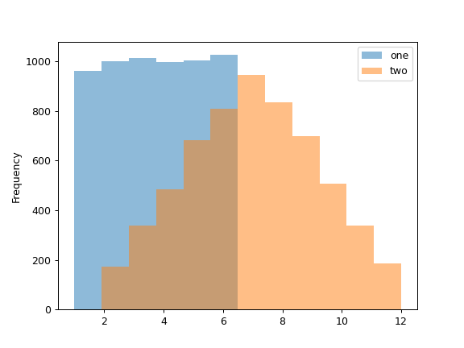
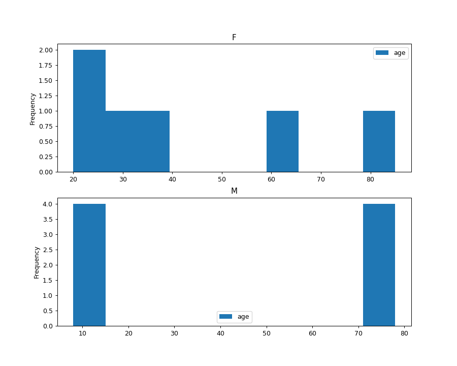

# DataFrame

- [DataFrame](#dataframe)
  - [总结](#总结)
  - [copy](#copy)
  - [drop](#drop)
  - [dropna](#dropna)
  - [isna](#isna)
  - [plot](#plot)
  - [plot.hist](#plothist)
  - [sum](#sum)
  - [参考](#参考)

2023-05-04
@author Jiawei Mao
***

## 总结

|操作|函数|
|---|---|
|删除行|[drop](#drop)|
|删除列|[drop](#drop)|

## copy

Last updated: 2022-06-21, 16:02

```python
DataFrame.copy(deep=True)
```

复制对象的索引和数据。

- 当 `deep=True` 时（默认），使用调用对象的数据和索引创建一个新的对象。对拷贝数据或索引的修改不影响原对象。
- 当 `deep=False` 时，也创建一个新的对象，但不复制调用的数据或索引，只复制对数据和索引的引用。对原始数据的任何修改都会反映到浅拷贝中，反之亦然。

|参数|类型|说明|
|---|---|---|
|`deep`|bool, default True|是否深拷贝，包括数据和索引。`deep=False` 不复制索引和数据|

返回 `copy`，`Series` 或 `DataFrame`，类型与调用对象匹配。

> [!NOTE]
> `deep=True` 时，会复制数据，但不会递归复制 Python 对象，只复制对象的引用。这与标准库的 *copy.deepcopy* 递归复制对象数据不用。
> 当 `deep=True` 时复制 `Index` 对象，出于性能考虑，不复制底层的 numpy 数组。因为 `Index` 是不可变对象，因此可以安全的共享底层数据，不需要拷贝。

- `Series` 复制

```python
>>> import pandas as pd
>>> s = pd.Series([1, 2], index=["a", "b"])
>>> s
a    1
b    2
dtype: int64
>>> s_copy = s.copy()
>>> s_copy
a    1
b    2
dtype: int64
```

- 浅拷贝 vs. 深拷贝

```python
>>> s = pd.Series([1, 2], index=["a", "b"])
>>> deep = s.copy()
>>> shallow = s.copy(deep=False)
```

- 浅拷贝与原对象共享数据和索引

```python
>>> s is shallow
False
>>> s.values is shallow.values and s.index is shallow.index
True
```

- 深拷贝拥有自己的数据和索引副本

```python
>>> s is deep
False
>>> s.values is deep.values or s.index is deep.index
False
```

- 更新浅拷贝数据影响原对象，深拷贝不影响

```python
>>> s[0] = 3
>>> shallow[1] = 4
>>> s
a    3
b    4
dtype: int64
>>> shallow
a    3
b    4
dtype: int64
>>> deep
a    1
b    2
dtype: int64
```

- 复制包含 Python 对象的对象时，深拷贝复制数据，但不会递归复制，更新嵌套数据会影响原对象

```python
>>> s = pd.Series([[1, 2], [3, 4]])
>>> deep = s.copy()
>>> s[0][0] = 10
>>> s
0    [10, 2]
1     [3, 4]
dtype: object
>>> deep
0    [10, 2]
1     [3, 4]
dtype: object
```

## drop

Last updated: 2022-06-13, 13:26

```python
DataFrame.drop(labels=None, axis=0, index=None, columns=None, level=None, inplace=False, errors='raise')
```

从行或列中删除指定标签。

通过标签名称和对应轴、列名称或索引等删除行或列。当使用 MultiIndex 时，不同 level 的标签可以通过指定 level 删除。

**返回**：如果 `inplace=True`，返回删除后的 `DataFrame`；否则返回 None。

|参数|类型|说明|
|---|---|---|
|`labels`|single label or list-like|待删除的索引或 column 标签。tuple 作单个 label 处理|
|`axis`|{0 or ‘index’, 1 or ‘columns’}, default 0|指定删除行还是列|
|`index`|single label or list-like| 删除 index 专用，`index=labels` 等价于 `(labels, axis=0)`|
|`columns`|single label or list-like|删除列专用，`columns=labels` 等价于 `(labels, axis=1)`|
|`level`|int or level name, optional|MultiIndex 中指定删除 label 对应的 level|
|`inplace`|bool, default False|False，返回 copy；True，表示原位操作，返回 None|
|`errors`|{‘ignore’, ‘raise’}, default ‘raise’|'ignore' 表示抑制错误，只删除现有标签|

- 删除 'B', 'C' 两列

删除列时推荐使用 `columns` 参数，比使用 `(labels, axis=1)` 便捷。

```py
>>> df = pd.DataFrame(np.arange(12).reshape(3, 4),
                  columns=['A', 'B', 'C', 'D'])
>>> df
   A  B   C   D
0  0  1   2   3
1  4  5   6   7
2  8  9  10  11
>>> df.drop(['B', 'C'], axis=1) # 等价于 drop(columns=['B', 'C'])
   A   D
0  0   3
1  4   7
2  8  11
```

- 使用索引删除行

```py
>>> df
   A  B   C   D
0  0  1   2   3
1  4  5   6   7
2  8  9  10  11
>>> df.drop([0,1]) # axis 默认为0，即默认删除行
   A  B   C   D
2  8  9  10  11
```

- MultiIndex 删除操作

```py
>>> midx = pd.MultiIndex(levels=[['lama', 'cow', 'falcon'],
                             ['speed', 'weight', 'length']],
                     codes=[[0, 0, 0, 1, 1, 1, 2, 2, 2],
                            [0, 1, 2, 0, 1, 2, 0, 1, 2]])
>>> df = pd.DataFrame(index=midx, columns=['big', 'small'],
                  data=[[45, 30], [200, 100], [1.5, 1], [30, 20],
                        [250, 150], [1.5, 0.8], [320, 250],
                        [1, 0.8], [0.3, 0.2]])
>>> df
                 big  small
lama   speed    45.0   30.0
       weight  200.0  100.0
       length    1.5    1.0
cow    speed    30.0   20.0
       weight  250.0  150.0
       length    1.5    0.8
falcon speed   320.0  250.0
       weight    1.0    0.8
       length    0.3    0.2
```

- 删除特定组合的 MultiIndex

删除 `falcon` 和 `weight` 行。

```py
>>> df.drop(index=('falcon', 'weight'))
                big     small
lama    speed   45.0    30.0
        weight  200.0   100.0
        length  1.5     1.0
cow     speed   30.0    20.0
        weight  250.0   150.0
        length  1.5     0.8
falcon  speed   320.0   250.0
        length  0.3     0.2
```

- 删除特定的行和列

删除 `cow` 行和 `small` 列。

```py
>>> df.drop(index='cow', columns='small')
                 big
lama   speed    45.0
       weight  200.0
       length    1.5
falcon speed   320.0
       weight    1.0
       length    0.3
```

- 删除 level=1 中对应的 `length` 行

```py
>>> df.drop(index='length', level=1)
                 big  small
lama   speed    45.0   30.0
       weight  200.0  100.0
cow    speed    30.0   20.0
       weight  250.0  150.0
falcon speed   320.0  250.0
       weight    1.0    0.8
```

## dropna

```python
DataFrame.dropna(axis=0, how='any', thresh=None, subset=None, inplace=False)
```

删除缺失值。


## isna

Last updated: 2022-06-21, 16:44

```python
DataFrame.isna()
```

检测缺失值。

返回一个相同大小的 boolean 对象，指示对应位置的值是否为 NA。NA 值，如 `None`, `numpy.Nan`，映射为 `True`，其它值映射为 `False`。空字符串 `''` 或 `numpy.inf` 不判定为 NA 值，除非设置 `pandas.options.mode.use_inf_as_na = True`。

返回：`DataFrame`，原 `DataFrame` 中每个元素的 bool 掩码，指示该元素是否为 NA 值。

- 显示 DataFrame 中哪些是 NA

```python
>>> df = pd.DataFrame(dict(age=[5, 6, np.NaN],
                   born=[pd.NaT, pd.Timestamp('1939-05-27'),
                         pd.Timestamp('1940-04-25')],
                   name=['Alfred', 'Batman', ''],
                   toy=[None, 'Batmobile', 'Joker']))
>>> df
   age       born    name        toy
0  5.0        NaT  Alfred       None
1  6.0 1939-05-27  Batman  Batmobile
2  NaN 1940-04-25              Joker
>>> df.isna()
     age   born   name    toy
0  False   True  False   True
1  False  False  False  False
2   True  False  False  False
```

- 显示 Series 中哪些是 NA

```python
>>> ser = pd.Series([5, 6, np.NaN])
>>> ser
0    5.0
1    6.0
2    NaN
dtype: float64
>>> ser.isna()
0    False
1    False
2     True
dtype: bool
```

## plot

```py
DataFrame.plot(*args, **kwargs)
```

使用 `Series` 或 `DataFrame` 绘图。

使用 `plotting.backend` 选择指定的后端绘图，默认为 matplotlib。

|参数|类型|说明|
|---|---|---|
|

## plot.hist

Last updated: 2022-06-13, 14:28

```py
Series.plot.hist(by=None, bins=10, **kwargs)
```

使用 DataFrame 的 column 数据绘制直方图。

直方图是数据分布的表示。该函数将数据分为多个 `bins`，并将所有 bins 绘制到一个 `matplotlib.axes.Axes`。

**返回**：直方图对象，`matplotlib.AxesSubplot`。

|参数|类型|说明|
|---|---|---|
|`by`|str or sequence, optional|DataFrame 中要分组的 column|
|`bins`|int, default 10|直方图的 bin 数|
|`**kwargs`||[DataFrame.plot()](https://pandas.pydata.org/docs/reference/api/pandas.DataFrame.plot.html) 中额外的关键字参数|

- 绘制两个直方图

掷骰子 6000 次，每个点数出现次数的期望值为 1000。但是掷骰子两次，并将点数加和，分布会大不相同。下面用直方图描述该分布。

```py
>>> df = pd.DataFrame(
...     np.random.randint(1, 7, 6000),
...     columns = ['one'])
>>> df['two'] = df['one'] + np.random.randint(1, 7, 6000)
>>> ax = df.plot.hist(bins=12, alpha=0.5)
```



- 使用 `by` 参数绘制分组直方图

使用 `gender` 列分组。

```py
>>> age_list = [8, 10, 12, 14, 72, 74, 76, 78, 20, 25, 30, 35, 60, 85]
>>> df = pd.DataFrame({"gender": list("MMMMMMMMFFFFFF"), "age": age_list})
>>> ax = df.plot.hist(column=["age"], by="gender", figsize=(10, 8))
```



## sum

```python
DataFrame.sum(axis=None, skipna=True, level=None, numeric_only=None, min_count=0, **kwargs)
```


## 参考

- https://pandas.pydata.org/docs/reference/frame.html
