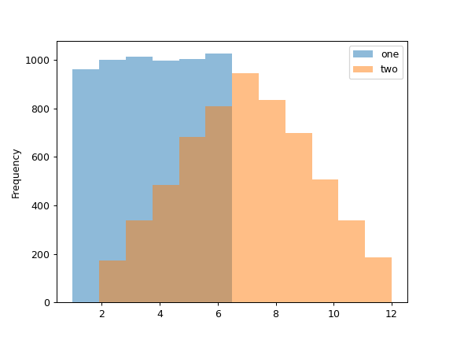
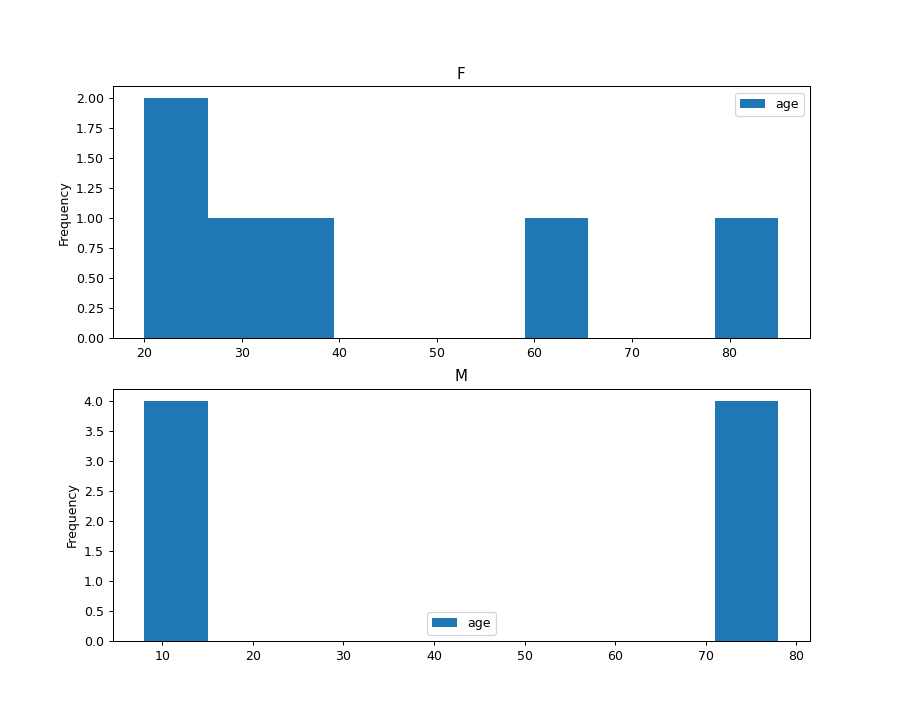

# Series

## 绘图

### hist

Last updated: 2022-06-13, 14:28

```py
Series.plot.hist(by=None, bins=10, **kwargs)
```

绘制直方图。

直方图是数据分布的表示。该函数将数据分为多个 `bins`，并将所有 bins 绘制到一个 `matplotlib.axes.Axes`。

**返回**：直方图对象，`matplotlib.AxesSubplot`。

|参数|类型|说明|
|---|---|---|
|`by`|str or sequence, optional|DataFrame 中要分组的 column|
|`bins`|int, default 10|直方图的 bin 数|
|`**kwargs`||[DataFrame.plot()](https://pandas.pydata.org/docs/reference/api/pandas.DataFrame.plot.html) 中额外的关键字参数|

- 绘制两个直方图

掷骰子 6000 次，每个点数出现次数的期望值为 1000。但是掷骰子两次，并将点数加和，分布会大不相同。下面用直方图描述该分布。

```py
>>> df = pd.DataFrame(
...     np.random.randint(1, 7, 6000),
...     columns = ['one'])
>>> df['two'] = df['one'] + np.random.randint(1, 7, 6000)
>>> ax = df.plot.hist(bins=12, alpha=0.5)
```



- 使用 `by` 参数绘制分组直方图

使用 `gender` 列分组。

```py
>>> age_list = [8, 10, 12, 14, 72, 74, 76, 78, 20, 25, 30, 35, 60, 85]
>>> df = pd.DataFrame({"gender": list("MMMMMMMMFFFFFF"), "age": age_list})
>>> ax = df.plot.hist(column=["age"], by="gender", figsize=(10, 8))
```


