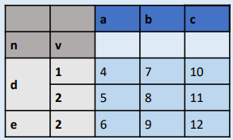
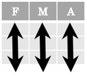
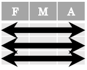
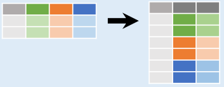
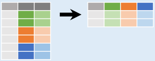
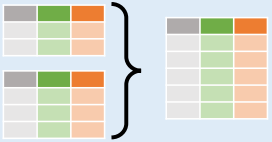
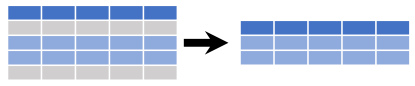

# Pandas 备忘清单

- [Pandas 备忘清单](#pandas-备忘清单)
  - [创建 DataFrames](#创建-dataframes)
  - [方法链](#方法链)
  - [整理数据](#整理数据)
  - [重整数据](#重整数据)
  - [子集操作（行）](#子集操作行)

## 创建 DataFrames

||a|b|c|
|---|----|---|---|
|1|4|7|10|
|2|5|8|11|
|3|6|9|12|

- 指定每列数据

```py
df = pd.DataFrame(
    {"a" : [4 ,5, 6], 
     "b" : [7, 8, 9], 
     "c" : [10, 11, 12]}, 
    index = [1, 2, 3])
```

- 指定每行数据

```py
df = pd.DataFrame(
    [[4, 7, 10],
     [5, 8, 11],
     [6, 9, 12]], 
    index=[1, 2, 3], 
    columns=['a', 'b', 'c'])
```

- 创建多索引DataFrame



```py
df = pd.DataFrame(
    {"a" : [4 ,5, 6], 
     "b" : [7, 8, 9], 
     "c" : [10, 11, 12]}, 
index = pd.MultiIndex.from_tuples(
    [('d',1),('d',2),('e',2)],
        names=['n','v']))
```


## 方法链

许多 pandas 方法返回 `DataFrame`，因此可以继续调用方法：

```py
df = (pd.melt(df)
        .rename(columns={
            'variable' : 'var', 
            'value' : 'val'})
        .query('val >= 200')
     )
```

## 整理数据

整齐的数据具有如下特征：

- 每个变量保存在一列



- 每条记录保存在一行




## 重整数据

- `pd.melt(df)` 将列汇总为行：



-  `df.pivot(columns='var', values='val')` 将行转换为列



- `pd.concat([df1, df2])` 按行合并



- `pd.concat([df1, df2], axis=1)` 按列合并


|方法|功能|
|---|---|
|`df.sort_values('mpg')`|根据某一列的值对行进行排序（从低到高）|
|`df.sort_values('mpg', ascending=False)`|按某一些的值对行排序（从高到低）|
|`df.rename(columns = {'y': 'year'})`|重命名列|
|`df.sort_index()`|排序索引|
|`df.reset_index()`|重置索引为行号，将索引移到 columns|
|`df.drop(columns=['Length', 'Height'])`|从 `DataFrame` 删除列|

## 子集操作（行）



|方法|功能|
|---|---|
|`df[df.Length > 7]`|提取满足指定逻辑条件的行|
|`df.drop_duplicates()`|删除重复行|
|`df.head(n)`|选择前 n 行|
|`df.tail(n)`|选择后 n 行|
|`df.sample(frac=0.5)`|随机选择指定比例的行|
|`df.iloc[10:20]`|根据位置选择行|
|`df.nlargest(n, 'value')`|选择并排序前 n 条|
|`df.nsmallest(n, 'value')`|选择并排序后 n 条|

**逻辑操作**

|逻辑操作|含义|
|---|---|
|<|小于|
|>|大于|
|==|等于|
|<=|小于等于|
|>=|大于等于|
|!=|不等于|
|`df.column.isin(value)`|
