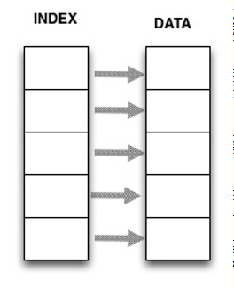
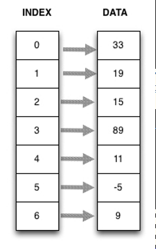
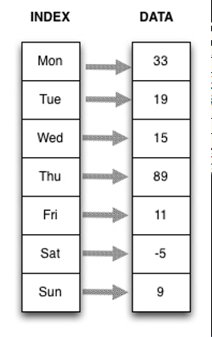

# Series

- [Series](#series)
  - [简介](#%e7%ae%80%e4%bb%8b)
  - [Series 属性](#series-%e5%b1%9e%e6%80%a7)
  - [`Series`操作](#series%e6%93%8d%e4%bd%9c)
    - [apply](#apply)
  - [创建 `Series`](#%e5%88%9b%e5%bb%ba-series)
    - [通过ndarray创建](#%e9%80%9a%e8%bf%87ndarray%e5%88%9b%e5%bb%ba)
    - [创建 Series 时指定 index](#%e5%88%9b%e5%bb%ba-series-%e6%97%b6%e6%8c%87%e5%ae%9a-index)
    - [为 Series 数据和 index 指定名称](#%e4%b8%ba-series-%e6%95%b0%e6%8d%ae%e5%92%8c-index-%e6%8c%87%e5%ae%9a%e5%90%8d%e7%a7%b0)
    - [通过 dict 创建](#%e9%80%9a%e8%bf%87-dict-%e5%88%9b%e5%bb%ba)
    - [`Series` 和 `ndarray` 类似](#series-%e5%92%8c-ndarray-%e7%b1%bb%e4%bc%bc)
  - [索引、选择](#%e7%b4%a2%e5%bc%95%e9%80%89%e6%8b%a9)
    - [reindex](#reindex)
    - [reset_index](#resetindex)
  - [描述统计](#%e6%8f%8f%e8%bf%b0%e7%bb%9f%e8%ae%a1)
    - [Series.value_counts](#seriesvaluecounts)

## 简介

Pandas 中 Series 为一维标记数组 (labeled array)。其基本特征为：

- 可以保存任意数据类型(integers, strings, floating point numbers, python object, etc.)
- 一个 `Series` 的数据必须为同种类型

`Series` 为 `ndarray` 的子类，所以 `ndarray` 包含的方法，`Series` 也可以调用。

`Series` 结构示意图：



## Series 属性

| 属性 | 说明     |
| ---- | -------- |
| size | 数据个数 |

## `Series`操作

| 操作               | 说明                                                                        |
| ------------------ | --------------------------------------------------------------------------- |
| s[0]               | 获得第一个值                                                                |
| s[0]=100           | 使用 offset 为 s复制                                                        |
| s.index            | 获得 Series 的 index 信息                                                   |
| s[:3]              | 获得 Series 的前三个值                                                      |
| s['a']             | 获得 Series 和 a (index label)对应的值，如果s中不存在该label，抛出 KeyError |
| 'e' in s           | s 中是否包含 'e' (index label)                                              |
| s.get('f')         | 获得和'f'对应的值，如果不存在在 index label，返回 None.                     |
| s.get('f', np.nan) | 获得和 'f' 对应的值，如果不存在，返回 np.nan.                               |
| s[s>s.median()]    | 返回大于 s 中值的所有值                                                     |
| s.iloc[:3]         | 返回前三个值                                                                |
| s.iloc[:3]=0       | 前三个设置为0                                                               |
| s.iloc[3]          | 返回第4个值                                                                 |
| s.iloc[start:end]  | 切片，即使超过范围也没事儿                                                  |
| s.sort_index()     | 按照 index label 进行排序，返回排序后的 Series，原Series不变                |

### apply

`Series.apply(self, func, convert_dtype=True,args=(), **kwds)`

对 `Series` 的值应用指定函数。

可以是 ufunc（应用于整个 `Series` 的 NumPy 函数），也可以是应用于单个值的 Python 函数。

| 参数           | 类型                 | 说明                                                                 |
| -------------- | -------------------- | -------------------------------------------------------------------- |
| func           | function             | 应用的 Python 函数或 NumPy ufunc 函数                                |
| convert_dtype: | bool, default `True` | 根据函数返回值尝试找到合适的数据类型。如果为 `False`，`dtype=object` |
| args           | tuple                | 在 `Series` 值后面传递给函数的位置参数                               |
| **kwds         |                      | 传递给函数的额外参数                                                 |

返回值：`Series` 或 `DataFrame`

如果函数返回类型为 `Series`，则返回值为 `DataFrame` 类型。

例如：

```py
def test_apply():
    s = pd.Series([20, 21, 12], index=['London', 'New York', 'Helsinki'])

    def square(x):
        return x ** 2

    s1 = s.apply(square)
    np.array_equal(s.values, np.array([20, 21, 12]))
    np.array_equal(s1.values, np.array([400, 441, 144]))
```

- 采用匿名函数

```py
def test_apply_lambda():
    s = pd.Series([20, 21, 12], index=['London', 'New York', 'Helsinki'])
    s1 = s.apply(lambda x: x ** 2)
    np.array_equal(s1.values, np.array([400, 441, 144]))
```

- 采用多个参数

```py
def test_apply_args():
    def subtract_custom_value(x, custom_value):
        return x - custom_value

    s = pd.Series([20, 21, 12])
    s1 = s.apply(subtract_custom_value, args=(5,))
    np.array_equal(s1.values, np.array([15, 16, 7]))
```

- 采用关键字参数

```py
def test_apply_keyword():
    def add_custom_values(x, **kwargs):
        for month in kwargs:
            x += kwargs[month]
        return x

    s = pd.Series([20, 21, 12])
    s1 = s.apply(add_custom_values, june=30, july=20, august=25)
    np.array_equal(s1.values, np.array([95, 96, 87]))
```

- 采用 Numpy 库函数

```py
def test_apply_numpy_func():
    s = pd.Series([20, 21, 12])
    s1 = s.apply(np.log)
```

## 创建 `Series`

基本语法：

```py
pd.Series(data, index=index)
```

data 接受数据类型有：

- list
- array
- dict

`index` 是轴标签，即，对每行数据进行标记，如果不指定，默认为数字标号。

### 通过ndarray创建

如果 `data` 类型为 `ndarray`，`index` 的长度必须和 `data` 相同。如果不指定 index，会自动创建一个 `[0,...,len(data)-1]`。

使用 `ndarray` 也可以创建 `Series`，将数组替换为 ndarray，操作完全相同。

- 例：通过数组创建 Series

```py
import pandas as pd
s1 = pd.Series([33, 19, 14, 89, 11, -5, 9])
```

此时没有指定 index, 所以默认为索引，输出 s1：

```cmd
0    33
1    19
2    14
3    89
4    11
5    -5
6     9
dtype: int64
```

所以，此时可以将 `Series` 看做 index -> values 的 `dict`:



- 查看 `s1` 的类型：

```py
type(s1)
```

为

```py
pandas.core.series.Series
```

- 查看 `Series` 值：

```cmd
s1.values
```

为

```py
array([33, 19, 14, 89, 11, -5,  9], dtype=int64)
```

- 查看 `Series` 值类型：

```py
type(s1.values)
```

Out:

```py
numpy.ndarray
```

- 查看 Series 的 index

```py
s1.index
```

Out:

```py
RangeIndex(start=0, stop=7, step=1)
```

### 创建 Series 时指定 index

```py
data1=[33,19,14,89,11,-5,9]
index1=['Mon','Tue','Wed','Thu','Fri','Sat','Sun']

s2=pd.Series(data1,index=index1)
```

`s2` 结构：



- 查看 index
```py
s2.index
```
输出：
```py
Index(['Mon', 'Tue', 'Wed', 'Thu', 'Fri', 'Sat', 'Sun'], dtype='object')
```

### 为 Series 数据和 index 指定名称

```py
s2.name="DailyTemperatures"
s2.index.name="weekday"
```
In:
```
s2
```
Out:
```
weekday
Mon    33
Tue    19
Wed    14
Thu    89
Fri    11
Sat    -5
Sun     9
Name: Daily Temperatures, dtype: int64
```

### 通过 dict 创建

通过 `dict` 创建，如果未指定 `index`, 则 `dict` 的 `key` 自动转换为 index；如果指定了 `index`，则以index 作为键值从 dict 取值创建 Series，如果 dict 中没有对应的键值，则以 NaN 作为结果。

- 通过 dict 创建 Series
```py
dict1={'Mon':33,'Tue':19,'Wed':15,'Thu':89,'Fri':11,'Sat':-5,'Sun':9}
s4=pd.Series(dict1)
```
对应的 Series:
```
Fri    11
Mon    33
Sat    -5
Sun     9
Thu    89
Tue    19
Wed    15
dtype: int64
```

### `Series` 和 `ndarray` 类似

- 例：演示 Series 类似于 ndarray 的操作

```py
s=pd.Series(np.random.randn(5),index=['a','b','c','d','e'])s
```

Out:

```cmd
a   -1.184990
b   -0.404359
c    0.636425
d   -0.750244
e    0.957961
dtype: float64
```

- 乘法

```py
s*2
```

Out:
```
a   -2.369981
b   -0.808718
c    1.272850
d   -1.500488
e    1.915921
dtype: float64
```

- np 函数操作
```
np.exp(s)
```
Out:
```
a    0.305749
b    0.667405
c    1.889713
d    0.472251
e    2.606376
dtype: float64
```

- 使用 index label切片
```
s['b':'d']
```
Out
```
b   -0.404359
c    0.636425
d   -0.750244
dtype: float64
```

- 使用 index pos 获得特定位置的值：

| 操作               | 说明                                                                        |
| ------------------ | --------------------------------------------------------------------------- |
| s[0]               | 获得第一个值                                                                |
| s[0]=100           | 使用 offset 为 s复制                                                        |
| s.index            | 获得 Series 的 index 信息                                                   |
| s[:3]              | 获得 Series 的前三个值                                                      |
| s['a']             | 获得 Series 和 a (index label)对应的值，如果s中不存在该label，抛出 KeyError |
| 'e' in s           | s 中是否包含 'e' (index label)                                              |
| s.get('f')         | 获得和'f'对应的值，如果不存在在 index label，返回 None.                     |
| s.get('f', np.nan) | 获得和 'f' 对应的值，如果不存在，返回 np.nan.                               |
| s[s>s.median()]    | 返回大于 s 中值的所有值                                                     |

## 索引、选择

### reindex

### reset_index

`Series.reset_index(self, level=None, drop=False, name=None, inplace=False)`

创建重置 index的 Series 或 DataFrame。

当需要将 index 添加为 column 时很有用，或者去除无意义的 index，将其重置为默认值。

1. level: int, str, tuple, or list, default optional

对 `MultiIndex`的 `Series`，只移除指定 level 的 index。默认移除所有 levels.

2. drop: bool, default False

如果为 true，直接舍弃 index，而不添加为 column。

3. name: object, optional

原 Series 值对应column 名称，默认为`self.name`。如果 `drop` 为 True，则不添加新列，所以返回值为 `Series`，就不需要该参数，直接忽略。

4. inplace: bool, default False

修改原 `Series`，而不创建新对象。

**返回**：Series 或 DataFrame

- 如果 `drop` 为 False (默认值)，返回 DataFrame。新添加的 column 为 DataFrame 的第一列，随后是原 `Series` 的值。
- 如果 `drop` 为 True，返回 Series。
- 如果 `inplace=True`，不返回值。

例如：

```py
>>> s = pd.Series([1, 2, 3, 4], name='foo',
              index=pd.Index(['a', 'b', 'c', 'd'], name='idx'))
```

- `drop` 默认为 false，即默认返回 DataFrame，新的 column 名称为 index 中 `Index` 的 `name` 字段，原 Series 的 column 名称为 Series 的 `name` 字段。

```py
>>> s.reset_index()
  idx  foo
0   a    1
1   b    2
2   c    3
3   d    4
```

- 使用 `name` 参数修改原 `Series` 值的 column 名称：

```py
>>> s.reset_index(name='values')
  idx  values
0   a       1
1   b       2
2   c       3
3   d       4
```

- 将 `drop` 设置为 True，获得新的 Series

```py
>>> s.reset_index(drop=True)
0    1
1    2
2    3
3    4
Name: foo, dtype: int64
```

- 将 `replace` 设置为 True，不返回值，修改原 Series

```py
>>> s.reset_index(inplace=True, drop=True)
>>> s
0    1
1    2
2    3
3    4
Name: foo, dtype: int64
```

对包含多层 index 的 `Series` 对象，`level` 参数很有用

```py
>>> arrays = [np.array(['bar', 'bar', 'baz', 'baz']),
          np.array(['one', 'two', 'one', 'two'])]
>>> s2 = pd.Series(range(4), name='foo',
    index=pd.MultiIndex.from_arrays(arrays, names=['a', 'b']))
```

- 移除指定 level 的 index

```py
>>> s2.reset_index(level='a')
       a  foo
b
one  bar    0
two  bar    1
one  baz    2
two  baz    3
```

- 如果不指定 level，移除所有 index

```py
>>> s2.reset_index()
     a    b  foo
0  bar  one    0
1  bar  two    1
2  baz  one    2
3  baz  two    3
```

## 描述统计

### Series.value_counts

`Series.value_counts(self, normalize=False, sort=True, ascending=False, bins=None, dropna=True)`

返回包含 unique values 数目的 Series.

返回的对象按降序排列，从而保证第一个元素是出现最多的。默认排除 NA 值。

例如：

```py
>>> index = pd.Index([3, 1, 2, 3, 4, np.nan])
>>> index.value_counts()
3.0    2
4.0    1
2.0    1
1.0    1
dtype: int64
```

- normalize

若将 `normalize` 设置为 True，用总和归一化所有值：

```py
>>> s = pd.Series([3, 1, 2, 3, 4, np.nan])
>>> s.value_counts(normalize=True)
3.0    0.4
4.0    0.2
2.0    0.2
1.0    0.2
dtype: float64
```

- bins

