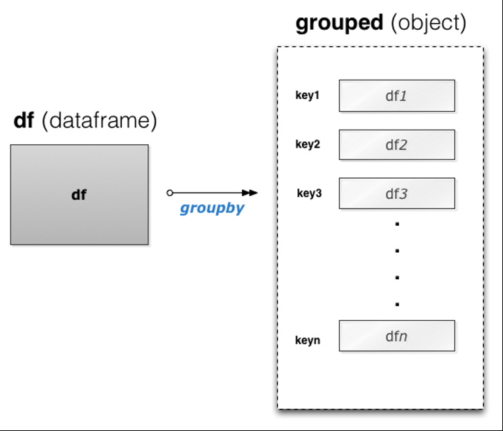
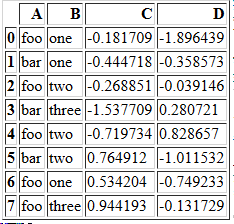
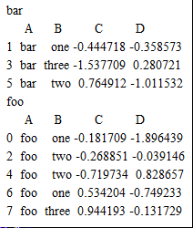
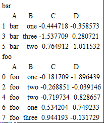
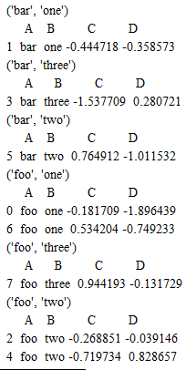
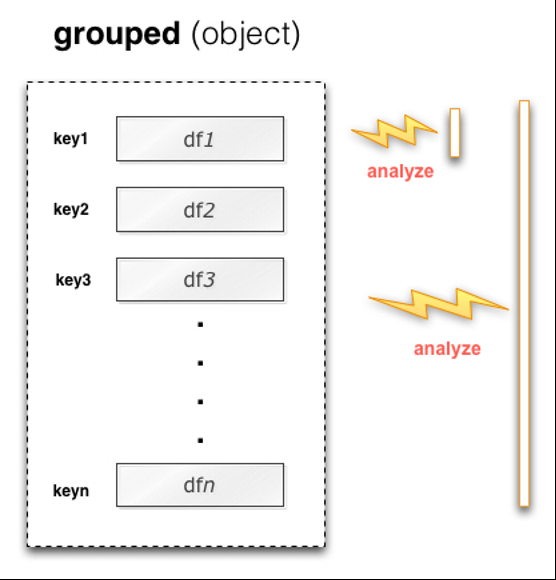
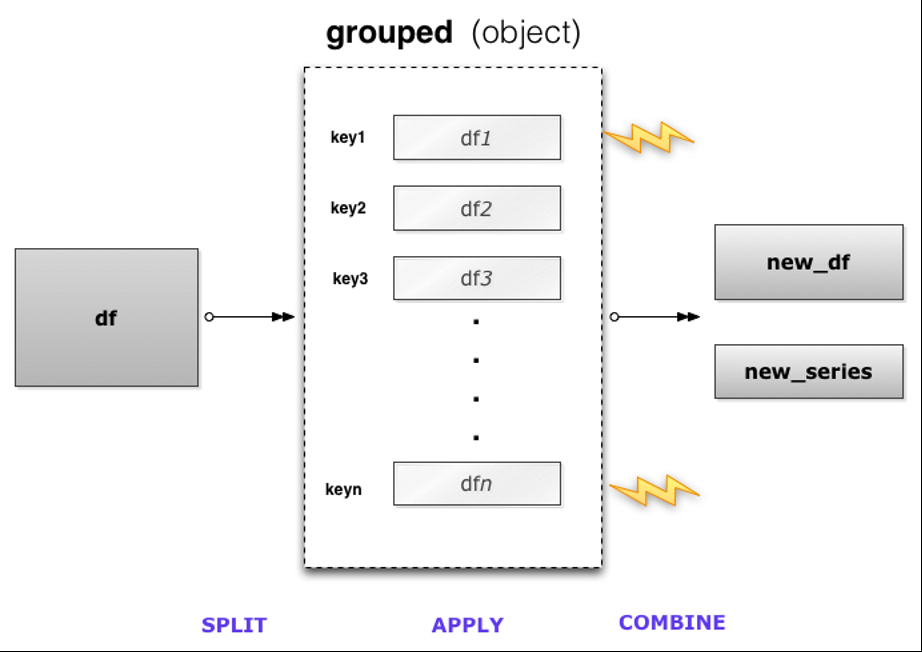

# Group By

- [Group By](#group-by)
  - [简介](#%e7%ae%80%e4%bb%8b)
  - [分组](#%e5%88%86%e7%bb%84)
    - [根据 column label 分组](#%e6%a0%b9%e6%8d%ae-column-label-%e5%88%86%e7%bb%84)
    - [通过函数定义分组](#%e9%80%9a%e8%bf%87%e5%87%bd%e6%95%b0%e5%ae%9a%e4%b9%89%e5%88%86%e7%bb%84)
    - [GroupBy sorting](#groupby-sorting)
  - [查看 groups 数据](#%e6%9f%a5%e7%9c%8b-groups-%e6%95%b0%e6%8d%ae)
  - [选择分组](#%e9%80%89%e6%8b%a9%e5%88%86%e7%bb%84)
  - [应用函数（applying）](#%e5%ba%94%e7%94%a8%e5%87%bd%e6%95%b0applying)
    - [聚合（aggregate）](#%e8%81%9a%e5%90%88aggregate)
  - [合并（combining）](#%e5%90%88%e5%b9%b6combining)
  - [Filtration](#filtration)

## 简介

pandas 的 `GroupBy` 功能可以方便地对数据进行分组、操作、转换和聚合；分组运算，也称为 "split-apply-combine" 操作，包括下面步骤的一个或多个：

- Splitting
- Applying
- Combining

| 操作              | 功能                         |
| ----------------- | ---------------------------- |
| 分组（Splitting） | 根据规则将数据分组           |
| 操作（Applying）  | 对各个分组应用特定函数       |
| 合并（Combining） | 将操作结果合并成一个数据结构 |

其中分组（split）步骤最简单。

GroupBy 功能和 SQL 十分相似，如：

```sql
SELECT Column1, Column2, mean(Column3), sum(Column4)
FROM SomeTable
GROUP BY Column1, Column2
```

pandas 使得这类操作更加自然且易于表达。

## 分组

pandas 对象可以根据任何一维数据进行拆分。可以将分组看作将标签映射到分组名称的操作。示意图如下：



split 功能由 `obj.groupby()` 方法实现。

```py
groupby(by=None, axis=0, level=None, as_index=True, sort=True, group_keys=True, squeeze=False, **kwargs)
```

`groupby` 方法返回一个 `DataFrameGroupBy` 对象。创建方式如下：

```py
df = pd.DataFrame([('bird', 'Falconiformes', 389.0),
                    ('bird', 'Psittaciformes', 24.0),
                    ('mammal', 'Carnivora', 80.2),
                    ('mammal', 'Primates', np.nan),
                    ('mammal', 'Carnivora', 58)],
                  index=['falcon', 'parrot', 'lion', 'monkey', 'leopard'],
                  columns=('class', 'order', 'max_speed'))
grouped = df.groupby('class')
```

`groupby` 根据指定映射规则将一个 `DataFrame` 分成多个 `DataFrame`，定义映射关系的方法有：

- 函数，根据特定 axis label 计算
- 选择的 axis 长度相同的 NumPy array
- A dict or `Series`, 提供 `label -> group name` 的映射
- 对 `DataFrame` 对象，可以使用特定的 column name，例如 df.groupby('A')，即 df.groupby(df['A'])，使用'A' 列进行分组

> 将字符串作为 `groupby` 参数时，因为 `column label` 和 `index label`都可能包含该字符串，出现重复时，会抛出 `ValueError`。

### 根据 column label 分组

例如：

```py
df = pd.DataFrame({'A': ['foo', 'bar', 'foo', 'bar', 'foo', 'bar', 'foo', 'foo'],
                   'B': ['one', 'one', 'two', 'three', 'two', 'two', 'one', 'three'],
                   'C': np.random.randn(8),
                   'D': np.random.randn(8)})
```

Out:



- 根据A列分组：

```py
grouped = df.groupby('A')
for name, group in grouped:
    print(name)
    print(group)
```

Out:



说明：A 列只有两类值，'foo' 和 'bar'，所以结果分为了两组。

- 例2：根据多列进行分组

```py
for name, group in df.groupby(['A', 'B']):
    print(name)
    print(group)
```

同时使用A列和B列进行分组，结果如下：


### 通过函数定义分组

定义函数：

```py
def get_letter_type(letter):
    if letter.lower() in 'aeiou':
        return 'vowel'
    else:
        return 'consonant'
```

分组：

```py
grouped = df.groupby(get_letter_type, axis=1)
```

### GroupBy sorting

## 查看 groups 数据

`groupby` 返回值可以看做包含 `groupName`, `group` 的字典。

- 例：查看分组数据

```py
for name, group in grouped:
    print(name)
    print(group)
```

Out:



如果根据多个键值进行分组，返回的 group name 为 tuple。

- 例：查看多键值分组数据

```py
for name, group in df.groupby(['A', 'B']):
    print(name)
    print(group)
```

Out:



## 选择分组

使用 `get_group()` 方法可以选择一个分组，例如：

```py
df = pd.DataFrame({'A': ['foo', 'bar', 'foo', 'bar',
                          'foo', 'bar', 'foo', 'foo'],
                    'B': ['one', 'one', 'two', 'three',
                          'two', 'two', 'one', 'three'],
                    'C': np.random.randn(8),
                    'D': np.random.randn(8)})
grouped = df.groupby('A')
group = grouped.get_group('bar')
```

获得 "bar" 分组，即 1,3,5行：

```cmd
     A      B         C         D
1  bar    one  0.254161  1.511763
3  bar  three  0.215897 -0.990582
5  bar    two -0.077118  1.211526
```

对根据多列进行分组的情况：

```py
df.groupby(['A', 'B']).get_group(('bar', 'one'))
```

结果：

```cmd
     A    B         C         D
1  bar  one  0.254161  1.511763
```


## 应用函数（applying）
applying, 对分组数据执行特定运算函数。



Applying 涉及到如下操作

| 操作           | 说明                                                                                       |
| -------------- | ------------------------------------------------------------------------------------------ |
| Aggregation    | 对分组数据进行统计运算，如加和或均值；计算 group sizes / counts                    |
| Transformation | 对特定分组进行运算，例如：标准化数据 (zscore)；根据分组数据特征填充 NAs值                  |
| Filtration     | 根据规则舍弃部分分组，例如：舍弃数据太少的分组；根据分组数据的特征，如加和、均值等过滤分组 |

### 聚合（aggregate）

| 函数       | 功能       |
| ---------- | ---------- |
| mean()     | 均值       |
| sum()      | 总和       |
| size()     | 分组大小   |
| count()    | 分组数目   |
| std()      | 标准偏差   |
| var()      | 方差       |
| sem()      | 均值标准差 |
| describe() | 描述统计   |
| first()    | 第一个值   |
| last()     | 末尾值     |
| nth()      | 第 n 个中  |
| min()      | 最小值     |
| max()      | 最大值     |


## 合并（combining）

combining, 将结果合并为一个数据结构




## Filtration

`filter` 方法返回原数据集的子集。加入我们只想要总和大于2的分组：

