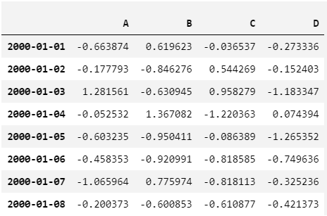
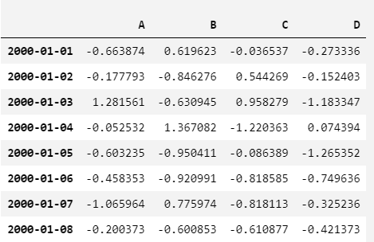
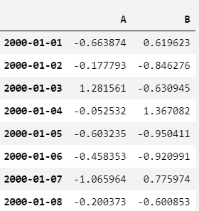
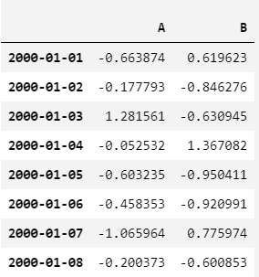
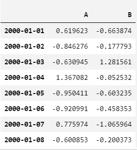
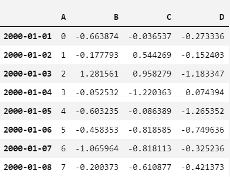

# Indexing and selecting data

- [Indexing and selecting data](#indexing-and-selecting-data)
  - [简介](#%e7%ae%80%e4%bb%8b)
  - [索引的选择](#%e7%b4%a2%e5%bc%95%e7%9a%84%e9%80%89%e6%8b%a9)
    - [.loc](#loc)
    - [.iloc](#iloc)
  - [索引基础](#%e7%b4%a2%e5%bc%95%e5%9f%ba%e7%a1%80)
    - [额外说明](#%e9%a2%9d%e5%a4%96%e8%af%b4%e6%98%8e)
  - [按属性访问](#%e6%8c%89%e5%b1%9e%e6%80%a7%e8%ae%bf%e9%97%ae)
  - [按标签选择](#%e6%8c%89%e6%a0%87%e7%ad%be%e9%80%89%e6%8b%a9)
  - [Boolean indexing](#boolean-indexing)
    - [布尔：或](#%e5%b8%83%e5%b0%94%e6%88%96)
    - [布尔：非](#%e5%b8%83%e5%b0%94%e9%9d%9e)
    - [使用布尔向量](#%e4%bd%bf%e7%94%a8%e5%b8%83%e5%b0%94%e5%90%91%e9%87%8f)
    - [List 推导和 map](#list-%e6%8e%a8%e5%af%bc%e5%92%8c-map)

## 简介

pandas 对象的轴标签（axis labeling）信息有许多用途：

- 作为数据标签，方便数据分析、可视化和交互。
- 辅助数据对齐。
- 方便直观地获取和设置数据集的子集。

下面讨论最后一条，即切片以及获取、设置 pandas 数据集。重点放在 `Series` 和 `DataFrame` 上。

> Python 和 NumPy 索引运算符 `[]` 及属性运算符 `.` 提供了快速访问 pandas 数据结构的功能。如果你已经知道如何处理 Python 字典和 NumPy 数组，下面实际要学的东西不多。不过，由于预先不知道要访问的数据类型，直接使用标准运算符存在一些优化限制。对于生产代码，建议使用本章中优化过的 pandas 数据访问方法。

## 索引的选择

pandas 目前支持三种多轴（multi-axis）索引：

- `.loc`
- `.iloc`
- `[]`

这三种多轴索引都可以使用 `callable` 函数作为索引。

使用多轴选择方法获取值的语法如下（这里以 `.loc` 为例，对 `.iloc` 语法一样）

| 对象类型  | 索引                                  |
| --------- | ------------------------------------- |
| Series    | `s.loc[indexer]`                      |
| DataFrame | `df.loc[row_indexer, column_indexer]` |

所有的轴索引默认为 null 切片 `:`，即**未指定的索引默认为 `:`**，例如 `p.loc['a']` 等价于 `p.loc['a', :, :]`

### .loc

`.loc` 主要基于标签，但也可以和布尔数组一起使用。

当对应项找不到时，`.loc` 抛出 `KeyError`。

`.loc` 允许的输入：

- 单个标签，如 `5` 或 `a`（这里的 `5` 是按照索引标签解析，而不是索引位置）
- 标签列表或数组，如 `['a', 'b', 'c']`
- 切片标签如 `'a':'f'` （和 Python 不同，这里起点和终点都包含在结果中）
- 布尔数组
- 包含单个参数（调用的 `Series` 或 `DataFrame`）的`callable` 函数，该函数返回上面索引形式的一种。

### .iloc

`.iloc` 主要基于整数位置（0 到 length-1），但也能和布尔数组一起使用。

索引超出范围，`.iloc` 抛出 `IndexError`，但是在切片时允许索引越界，这和 Python 及 NumPy 切片一致。

允许的输入：

- 整数，如 `5`
- 整数数组或列表，如 `[4, 3, 0]`
- 整数切片索引，如 `1:7`
- 布尔数组
- 包含单个参数（调用该方法的 `Series` 或 `DataFrame`）的 `callable` 函数，该函数返回上面索引形式的一种。

## 索引基础

`[]` 索引（即 `__getitem__`）主要用于低维切片。下面是pandas 对象使用 `[]` 索引返回的对象：

| 类型        | 选择             | 返回类型              |
| ----------- | ---------------- | --------------------- |
| `Series`    | `series[label]`  | scalar value          |
| `DataFrame` | `frame[colname]` | 对应col名称的`Series` |

下面用一个简单的时间序列数据集解释该索引功能：

```py
dates = pd.date_range('1/1/2000', periods=8)
df = pd.DataFrame(np.random.default_rng().standard_normal(size=(8, 4)),
                  index=dates, columns=['A', 'B', 'C', 'D'])
df
```

Out:



- 使用 `[]` 索引

```py
s = df['A'] # 选择 A 列 `Series` 对象
s[dates[5]] # 选择 index=5 的 date 对应的值
```

Out:

```cmd
-0.4583529612763085
```

- `[]` 接受 columns 列表

如果 `DataFrame` 不包含指定 column，抛出异常。使用该方式还能给多个 column 赋值。

例如，选择 B, A 两列，将其赋值为 A, B,达到交换 A, B 两列的目的：

```py
df[['B', 'A']] = df[['A', 'B']]
df
```

Out:



该方法对于原地交换部分列十分有用。

### 额外说明

`.loc` 和 `.iloc` 方法在设置 `Series` 和 `DataFrame` 时会对齐所有 axes。

由于列对齐先于赋值，所有无法修改 `df`。例如：

```py
df[['A', 'B']]
```

Out:



```py
df.loc[:, ['B', 'A']] = df[['A', 'B']]
df[['A', 'B']]
```

Out:



可以发现 A,B 并没有交换值，交换列的正确方式是采用原始值赋值。

```py
df.loc[:, ['B', 'A']] = df[['A', 'B']].to_numpy()
df[['A', 'B']]
```

Out:



## 按属性访问

访问 `Series` 的 index，或 `DataFrame` 的 column可以直接采用属性方式。

- 例如：访问 Series 的 index='b'

```py
sa = pd.Series([1, 2, 3], index=list('abc'))
sa.b
```

Out:

```cmd
2
```

- 访问 `DataFrame` 的 'A' 列：

```py
dfa = df.copy()
dfa.A
```

Out:

```cmd
2000-01-01    0.619623
2000-01-02   -0.846276
2000-01-03   -0.630945
2000-01-04    1.367082
2000-01-05   -0.950411
2000-01-06   -0.920991
2000-01-07    0.775974
2000-01-08   -0.600853
Freq: D, Name: A, dtype: float64
```

- Series 属性赋值

```py
sa.a = 5
sa
```

Out:

```cmd
a    5
b    2
c    3
dtype: int64
```

- DataFrame 属性赋值

```py
dfa.A = list(range(len(dfa.index))) # A 原来的值被覆盖
dfa
```

Out:



## 按标签选择


## Boolean indexing

布尔向量常用来过滤数据。操作符有:

- `|`, `or`
- `&`, `and`
- `~`, `not`

这些操作必须用括号进行分组，因为默认情况下 `df['A'] > 2 & df['B'] < 3` 会按照 `df['A'] > (2 & df['B']) < 3`，而并非预想的 `(df['A > 2) & (df['B'] < 3)`。

- 使用布尔向量索引 `Series` 和 `ndarray` 完全相同

```py
s = pd.Series(range(-3, 4))
s1 = s[s > 0]
s1
```

out:

```cmd
4    1
5    2
6    3
dtype: int64
```

### 布尔：或

```py
s[(s < -1) | (s > 0.5)]
```

Out:

```cmd
0   -3
1   -2
4    1
5    2
6    3
dtype: int64
```

### 布尔：非

```py
s[~(s < 0)]
```

Out:

```cmd
3    0
4    1
5    2
6    3
dtype: int64
```

### 使用布尔向量

可以使用和 `DataFrame` 索引等长（即和 DataFrame 行数相同）的布尔向量选择 rows，例如，使用 DataFrame 的某一列构建的布尔向量：

```py
import pandas as pd

df = pd.DataFrame({'A': [1, 2, 3],
                   'B': [7, 8, 9]})
print(df[df.A > 1])
```

Out:

```cmd
   A  B
1  2  8
2  3  9
```

### List 推导和 map

`Series` 的 List 推导 (List comprehensions) 和 `map` 方法可以生成更复杂的规则，例如：

```py
import pandas as pd
import numpy as np

df = pd.DataFrame({'a': ['one', 'one', 'two', 'three', 'two', 'one', 'six'],
                   'b': ['x', 'y', 'y', 'x', 'y', 'x', 'x'],
                   'c': np.random.randn(7)})
```

现在只想要其中的 'two' 和 'three'：

```py
criterion = df['a'].map(lambda x: x.startswith('t'))
df[criterion]
```

Out:

```cmd
       a  b         c
2    two  y -1.103758
3  three  x  0.201518
4    two  y -1.033607
```

- 用 List 实现相同功能（更慢）

```py
df[[x.startswith('t') for x in df['a']]]
```

Out:

```cmd
       a  b         c
2    two  y -0.545678
3  three  x  1.323958
4    two  y -1.561873
```

- 多重规则

```py
df[criterion & (df['b'] == 'x')]
```

Out:

```cmd
       a  b         c
3  three  x  0.378387
```

将 boolean vector 和选择方法 `Selection by Label`, `Selection by Position` 以及 `Advanced Indexing` 结合使用，可以实现多 axis 选择。

例如：

```py
df.loc[criterion & (df['b'] == 'x'), 'b': 'c']
```

输出：

```cmd
   b         c
3  x  0.155084
```
