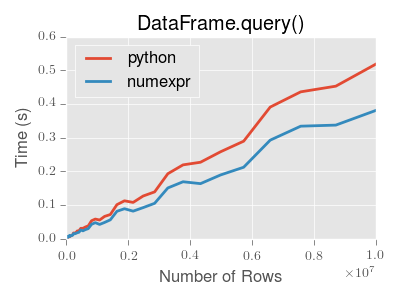

# query

- [query](#query)
  - [简介](#%e7%ae%80%e4%bb%8b)
  - [使用命名 index](#%e4%bd%bf%e7%94%a8%e5%91%bd%e5%90%8d-index)
  - [直接使用 index](#%e7%9b%b4%e6%8e%a5%e4%bd%bf%e7%94%a8-index)
  - [index 和 column 名称重复](#index-%e5%92%8c-column-%e5%90%8d%e7%a7%b0%e9%87%8d%e5%a4%8d)
  - [MultiIndex query](#multiindex-query)
    - [无名称索引](#%e6%97%a0%e5%90%8d%e7%a7%b0%e7%b4%a2%e5%bc%95)
  - [query() 实例](#query-%e5%ae%9e%e4%be%8b)
  - [python vs pandas 语法对比](#python-vs-pandas-%e8%af%ad%e6%b3%95%e5%af%b9%e6%af%94)
  - [`in` and `not in`](#in-and-not-in)
  - [`list` 中 `==` 运算符的特殊用法](#list-%e4%b8%ad--%e8%bf%90%e7%ae%97%e7%ac%a6%e7%9a%84%e7%89%b9%e6%ae%8a%e7%94%a8%e6%b3%95)
  - [Boolean 运算](#boolean-%e8%bf%90%e7%ae%97)
  - [`query()` 性能](#query-%e6%80%a7%e8%83%bd)

2020-04-25, 10:51
*** *

## 简介

`DataFrame` 的 `query()` 方法通过表达式选择数据。

可以选择 frame 中 b 列值在 a 列和 c 列之间的数据。例如：

```py
In [198]: n = 10

In [199]: df = pd.DataFrame(np.random.rand(n, 3), columns=list('abc'))

In [200]: df
Out[200]:
          a         b         c
0  0.438921  0.118680  0.863670
1  0.138138  0.577363  0.686602
2  0.595307  0.564592  0.520630
3  0.913052  0.926075  0.616184
4  0.078718  0.854477  0.898725
5  0.076404  0.523211  0.591538
6  0.792342  0.216974  0.564056
7  0.397890  0.454131  0.915716
8  0.074315  0.437913  0.019794
9  0.559209  0.502065  0.026437

# python 语法
In [201]: df[(df['a'] < df['b']) & (df['b'] < df['c'])]
Out[201]:
          a         b         c
1  0.138138  0.577363  0.686602
4  0.078718  0.854477  0.898725
5  0.076404  0.523211  0.591538
7  0.397890  0.454131  0.915716

# query 语法
In [202]: df.query('(a < b) & (b < c)')
Out[202]:
          a         b         c
1  0.138138  0.577363  0.686602
4  0.078718  0.854477  0.898725
5  0.076404  0.523211  0.591538
7  0.397890  0.454131  0.915716
```

## 使用命名 index

表达式中也可以命名 index:

```py
In [203]: df = pd.DataFrame(np.random.randint(n / 2, size=(n, 2)), columns=list('bc'))

In [204]: df.index.name = 'a'

In [205]: df
Out[205]:
   b  c
a
0  0  4
1  0  1
2  3  4
3  4  3
4  1  4
5  0  3
6  0  1
7  3  4
8  2  3
9  1  1

In [206]: df.query('a < b and b < c')
Out[206]:
   b  c
a
2  3  4
```

## 直接使用 index

也可以直接在 query 表达式中用 `index` 表示索引：

```py
In [207]: df = pd.DataFrame(np.random.randint(n, size=(n, 2)), columns=list('bc'))

In [208]: df
Out[208]:
   b  c
0  3  1
1  3  0
2  5  6
3  5  2
4  7  4
5  0  1
6  2  5
7  0  1
8  6  0
9  7  9

In [209]: df.query('index < b < c')
Out[209]:
   b  c
2  5  6
```

## index 和 column 名称重复

如果 index 和 column 名称重复，则优先使用 column 名称。例如：

```py
In [210]: df = pd.DataFrame({'a': np.random.randint(5, size=5)})

In [211]: df.index.name = 'a'

In [212]: df.query('a > 2')  # uses the column 'a', not the index
Out[212]:
   a
a
1  3
3  3
```

对这种情况，依然可以在表达式中使用 `index` 表示索引：

```py
In [213]: df.query('index > 2')
Out[213]:
   a
a
3  3
4  2
```

> 如果有个 column 名称为 index，此时可以使用 `ilevel_0` 表示索引，不过对这种情况，考虑将 column 重命名更合适。

## MultiIndex query

对 `DataFrame` 的 `MultiIndex`，可以当做 columns 一样查询：

```py
In [214]: n = 10

In [215]: colors = np.random.choice(['red', 'green'], size=n)

In [216]: foods = np.random.choice(['eggs', 'ham'], size=n)

In [217]: colors
Out[217]:
array(['red', 'red', 'red', 'green', 'green', 'green', 'green', 'green',
       'green', 'green'], dtype='<U5')

In [218]: foods
Out[218]:
array(['ham', 'ham', 'eggs', 'eggs', 'eggs', 'ham', 'ham', 'eggs', 'eggs',
       'eggs'], dtype='<U4')

In [219]: index = pd.MultiIndex.from_arrays([colors, foods], names=['color', 'food'])

In [220]: df = pd.DataFrame(np.random.randn(n, 2), index=index)

In [221]: df
Out[221]:
                   0         1
color food
red   ham   0.194889 -0.381994
      ham   0.318587  2.089075
      eggs -0.728293 -0.090255
green eggs -0.748199  1.318931
      eggs -2.029766  0.792652
      ham   0.461007 -0.542749
      ham  -0.305384 -0.479195
      eggs  0.095031 -0.270099
      eggs -0.707140 -0.773882
      eggs  0.229453  0.304418

In [222]: df.query('color == "red"')
Out[222]:
                   0         1
color food
red   ham   0.194889 -0.381994
      ham   0.318587  2.089075
      eggs -0.728293 -0.090255
```

### 无名称索引

如果 `MultiIndex` 没有命名，可以使用特殊名称：

```py
In [223]: df.index.names = [None, None]

In [224]: df
Out[224]:
                   0         1
red   ham   0.194889 -0.381994
      ham   0.318587  2.089075
      eggs -0.728293 -0.090255
green eggs -0.748199  1.318931
      eggs -2.029766  0.792652
      ham   0.461007 -0.542749
      ham  -0.305384 -0.479195
      eggs  0.095031 -0.270099
      eggs -0.707140 -0.773882
      eggs  0.229453  0.304418

In [225]: df.query('ilevel_0 == "red"')
Out[225]:
                 0         1
red ham   0.194889 -0.381994
    ham   0.318587  2.089075
    eggs -0.728293 -0.090255
```

约定命名为 `ilevel_0`，表示 `index` 的 0th level 索引。

## query() 实例

使用 `query()` 的一个实例是，假设多个 `DataFrame` column 名称（或者 index levels/names）有交集，则可以将相同的查询表达式传递给这些 `DataFrame`:

```py
df = pd.DataFrame({"a": [2, 3, 6, 2, 7],
                    "b": [7, 6, 1, 1, 4],
                    "c": [1, 7, 9, 4, 4]})

df2 = pd.DataFrame({"a": [3, 3, 1],
                    "b": [2, 9, 3],
                    "c": [6, 9, 3]})

expr = '0 <= a <= c <= 5'
d = map(lambda frame: frame.query(expr), [df, df2])
lst = list(d)
assert lst[0] == pd.DataFrame({'a': [2], 'b': [1], "c": [4]})
assert lst[1] == pd.DataFrame({'a': [1], 'b': [3], 'c': [3]})
```

## python vs pandas 语法对比

类似 numpy 的语法：

```py
In [232]: df = pd.DataFrame(np.random.randint(n, size=(n, 3)), columns=list('abc'))

In [233]: df
Out[233]:
   a  b  c
0  7  8  9
1  1  0  7
2  2  7  2
3  6  2  2
4  2  6  3
5  3  8  2
6  1  7  2
7  5  1  5
8  9  8  0
9  1  5  0

In [234]: df.query('(a < b) & (b < c)')
Out[234]:
   a  b  c
0  7  8  9

In [235]: df[(df['a'] < df['b']) & (df['b'] < df['c'])]
Out[235]:
   a  b  c
0  7  8  9
```

移除括号后，语法看上去更简洁：

```py
In [236]: df.query('a < b & b < c')
Out[236]:
   a  b  c
0  7  8  9
```

还可以直接使用 `and`:

```py
In [237]: df.query('a < b and b < c')
Out[237]:
   a  b  c
0  7  8  9
```

或者：

```py
In [238]: df.query('a < b < c')
Out[238]:
   a  b  c
0  7  8  9
```

## `in` and `not in`

`query()` 还支持 Python 的 `in` 和 `not in` 运算符，提供了 `Series` 或 `DataFrame` 的 `isin` 方法的简洁形式：

```py
# get all rows where columns "a" and "b" have overlapping values
In [239]: df = pd.DataFrame({'a': list('aabbccddeeff'), 'b': list('aaaabbbbcccc'),
   .....:                    'c': np.random.randint(5, size=12),
   .....:                    'd': np.random.randint(9, size=12)})
   .....:

In [240]: df
Out[240]:
    a  b  c  d
0   a  a  2  6
1   a  a  4  7
2   b  a  1  6
3   b  a  2  1
4   c  b  3  6
5   c  b  0  2
6   d  b  3  3
7   d  b  2  1
8   e  c  4  3
9   e  c  2  0
10  f  c  0  6
11  f  c  1  2

In [241]: df.query('a in b') # b 中包含 a, b, c，所以结果为 a 中所有 a,b,c 项
Out[241]:
   a  b  c  d
0  a  a  2  6
1  a  a  4  7
2  b  a  1  6
3  b  a  2  1
4  c  b  3  6
5  c  b  0  2

# 纯 Python 方式
In [242]: df[df['a'].isin(df['b'])]
Out[242]:
   a  b  c  d
0  a  a  2  6
1  a  a  4  7
2  b  a  1  6
3  b  a  2  1
4  c  b  3  6
5  c  b  0  2

In [243]: df.query('a not in b')
Out[243]:
    a  b  c  d
6   d  b  3  3
7   d  b  2  1
8   e  c  4  3
9   e  c  2  0
10  f  c  0  6
11  f  c  1  2

# pure Python
In [244]: df[~df['a'].isin(df['b'])]
Out[244]:
    a  b  c  d
6   d  b  3  3
7   d  b  2  1
8   e  c  4  3
9   e  c  2  0
10  f  c  0  6
11  f  c  1  2
```

还可以将 `in`, `not in` 和其它表达式结合使用：

```py
# rows where cols a and b have overlapping values
# and col c's values are less than col d's
In [245]: df.query('a in b and c < d')
Out[245]:
   a  b  c  d
0  a  a  2  6
1  a  a  4  7
2  b  a  1  6
4  c  b  3  6
5  c  b  0  2

# pure Python
In [246]: df[df['b'].isin(df['a']) & (df['c'] < df['d'])]
Out[246]:
    a  b  c  d
0   a  a  2  6
1   a  a  4  7
2   b  a  1  6
4   c  b  3  6
5   c  b  0  2
10  f  c  0  6
11  f  c  1  2
```

> 由于 `numexpr` 没有 `in` 操作，所以 `in` 和 `not in` 为 Python 操作。例如，表达式：
>
> ```py
> df.query('a in b + c + d')
> ```
>
> `(b + c + d)` 由 `numexpr` 计算，`in` 操作由纯 Python 计算。即能用 `numexpr` 计算的采用 `numexpr`，否则用纯 Python。

## `list` 中 `==` 运算符的特殊用法

使用 `==` 或 `!=` 对比 `list` 值，效果和 `in`, `not in` 类似：

```py
In [247]: df.query('b == ["a", "b", "c"]')
Out[247]:
    a  b  c  d
0   a  a  2  6
1   a  a  4  7
2   b  a  1  6
3   b  a  2  1
4   c  b  3  6
5   c  b  0  2
6   d  b  3  3
7   d  b  2  1
8   e  c  4  3
9   e  c  2  0
10  f  c  0  6
11  f  c  1  2

# pure Python
In [248]: df[df['b'].isin(["a", "b", "c"])]
Out[248]:
    a  b  c  d
0   a  a  2  6
1   a  a  4  7
2   b  a  1  6
3   b  a  2  1
4   c  b  3  6
5   c  b  0  2
6   d  b  3  3
7   d  b  2  1
8   e  c  4  3
9   e  c  2  0
10  f  c  0  6
11  f  c  1  2

In [249]: df.query('c == [1, 2]')
Out[249]:
    a  b  c  d
0   a  a  2  6
2   b  a  1  6
3   b  a  2  1
7   d  b  2  1
9   e  c  2  0
11  f  c  1  2

In [250]: df.query('c != [1, 2]')
Out[250]:
    a  b  c  d
1   a  a  4  7
4   c  b  3  6
5   c  b  0  2
6   d  b  3  3
8   e  c  4  3
10  f  c  0  6

# using in/not in
In [251]: df.query('[1, 2] in c')
Out[251]:
    a  b  c  d
0   a  a  2  6
2   b  a  1  6
3   b  a  2  1
7   d  b  2  1
9   e  c  2  0
11  f  c  1  2

In [252]: df.query('[1, 2] not in c')
Out[252]:
    a  b  c  d
1   a  a  4  7
4   c  b  3  6
5   c  b  0  2
6   d  b  3  3
8   e  c  4  3
10  f  c  0  6

# pure Python
In [253]: df[df['c'].isin([1, 2])]
Out[253]:
    a  b  c  d
0   a  a  2  6
2   b  a  1  6
3   b  a  2  1
7   d  b  2  1
9   e  c  2  0
11  f  c  1  2
```

## Boolean 运算

使用 `not` 或 `~` 可以对布尔表达式取反：

```py
In [254]: df = pd.DataFrame(np.random.rand(n, 3), columns=list('abc'))

In [255]: df['bools'] = np.random.rand(len(df)) > 0.5

In [256]: df.query('~bools')
Out[256]:
          a         b         c  bools
2  0.697753  0.212799  0.329209  False
7  0.275396  0.691034  0.826619  False
8  0.190649  0.558748  0.262467  False

In [257]: df.query('not bools')
Out[257]:
          a         b         c  bools
2  0.697753  0.212799  0.329209  False
7  0.275396  0.691034  0.826619  False
8  0.190649  0.558748  0.262467  False

In [258]: df.query('not bools') == df[~df['bools']]
Out[258]:
      a     b     c  bools
2  True  True  True   True
7  True  True  True   True
8  True  True  True   True
```

也可以使用任意复杂的表达式：

```py
# short query syntax
In [259]: shorter = df.query('a < b < c and (not bools) or bools > 2')

# equivalent in pure Python
In [260]: longer = df[(df['a'] < df['b'])
   .....:             & (df['b'] < df['c'])
   .....:             & (~df['bools'])
   .....:             | (df['bools'] > 2)]
   .....:

In [261]: shorter
Out[261]:
          a         b         c  bools
7  0.275396  0.691034  0.826619  False

In [262]: longer
Out[262]:
          a         b         c  bools
7  0.275396  0.691034  0.826619  False

In [263]: shorter == longer
Out[263]:
      a     b     c  bools
7  True  True  True   True
```

## `query()` 性能

对大型的 frame，`DataFrame.query()` 性能比 Python 略快：


