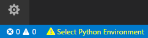
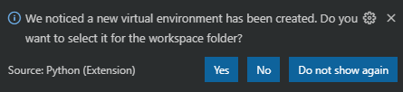

# 简介

- [简介](#%e7%ae%80%e4%bb%8b)
- [配置](#%e9%85%8d%e7%bd%ae)
- [选择 Python 解释器](#%e9%80%89%e6%8b%a9-python-%e8%a7%a3%e9%87%8a%e5%99%a8)
- [包的安装和使用](#%e5%8c%85%e7%9a%84%e5%ae%89%e8%a3%85%e5%92%8c%e4%bd%bf%e7%94%a8)
  - [创建虚拟环境](#%e5%88%9b%e5%bb%ba%e8%99%9a%e6%8b%9f%e7%8e%af%e5%a2%83)
    - [安装特定版本的包](#%e5%ae%89%e8%a3%85%e7%89%b9%e5%ae%9a%e7%89%88%e6%9c%ac%e7%9a%84%e5%8c%85)
- [Debug](#debug)

VS Code 支持 Python，各种扩展程序使得 VS Code 成为一个高效而简单的 Python IDE。

下面按照如下流程介绍如何在 VS Code 中使用 Python：
- 为 VSCode 安装 Python 扩展
- 安装 Python 3
- 编写、运行、调试 Python "Hello World" 程序
- 安装 packages
- 编写绘图脚本


# 配置
除了 VS Code，还需要安装：
- Python 扩展
- Python 3

# 选择 Python 解释器
Python 是一种解释型语言，要运行 Python 代码、获得 IntelliSense 支持，必须告诉 VS Code 使用哪个解释器。

使用 `Python: Select Interpreter` 命令检索并选择合适的解释器。

或者使用状态栏的 **Select Python Environment** 选项选择解释器。




# 包的安装和使用
在 Python，工具包一般通过 [PyPI](https://pypi.org/) 安装。

## 创建虚拟环境
一般不建议将工具包安装在 global 解释器环境，使用 project-specific 包含 global 解释器副本的虚拟环境。这样，安装的工具包都在当前项目中，这样可以很好的避免包冲突的问题。

创建虚拟环境的方式：
Windows
```
py -3 -m venv .venv
```
创建成功后，会出现弹窗，提示选择虚拟环境为解释器：




安装包流程：
1. 通过 **Terminal: Create New Integrated Terminal** (``Ctrl+Shift+` ``) 打开终端


2. 

```py
# Don't use with Anaconda distributions because they include matplotlib already.

# macOS
python3 -m pip install matplotlib

# Windows (may require elevation)
python -m pip install matplotlib

# Linux (Debian)
apt-get install python3-tk
python3 -m pip install matplotlib
```
### 安装特定版本的包
```py
pip install --force-reinstall pytest==5.0.1
```

# Debug

不同图标的含义：
- continue (F5)
- step over (F10)
- step into (F11)
- step out (Shift+F11)
- restart (Ctrl+Shift+F5)
- stop (Shift+F5)


