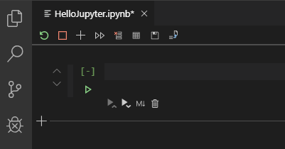
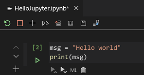
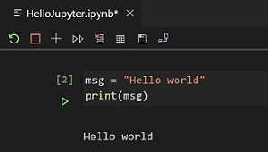
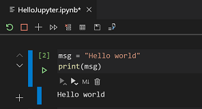
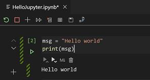
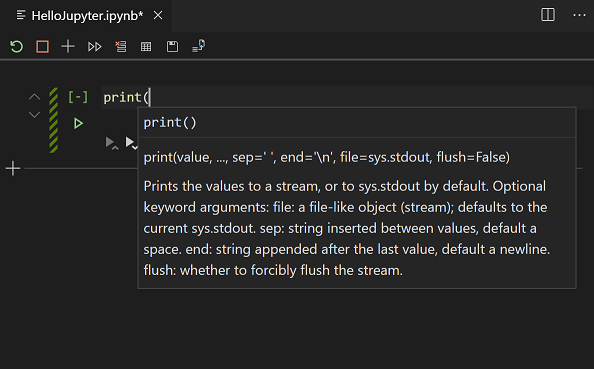
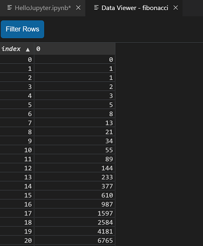

# Jupyter

- [Jupyter](#jupyter)
  - [简介](#%e7%ae%80%e4%bb%8b)
  - [配置环境](#%e9%85%8d%e7%bd%ae%e7%8e%af%e5%a2%83)
  - [创建及打开](#%e5%88%9b%e5%bb%ba%e5%8f%8a%e6%89%93%e5%bc%80)
  - [保存](#%e4%bf%9d%e5%ad%98)
  - [Code cell](#code-cell)
    - [创建 code cell](#%e5%88%9b%e5%bb%ba-code-cell)
    - [Code cell modes](#code-cell-modes)
    - [添加 cell](#%e6%b7%bb%e5%8a%a0-cell)
    - [选择 cell](#%e9%80%89%e6%8b%a9-cell)
    - [运行单个 cell](#%e8%bf%90%e8%a1%8c%e5%8d%95%e4%b8%aa-cell)
    - [运行多个 cell](#%e8%bf%90%e8%a1%8c%e5%a4%9a%e4%b8%aa-cell)
    - [移动 cell](#%e7%a7%bb%e5%8a%a8-cell)
    - [删除 cell](#%e5%88%a0%e9%99%a4-cell)
    - [code 和 Markdown 切换](#code-%e5%92%8c-markdown-%e5%88%87%e6%8d%a2)
    - [清除输出或重启 kernel](#%e6%b8%85%e9%99%a4%e8%be%93%e5%87%ba%e6%88%96%e9%87%8d%e5%90%af-kernel)
    - [行号](#%e8%a1%8c%e5%8f%b7)
  - [IntelliSense support](#intellisense-support)
  - [变量视图和数据视图](#%e5%8f%98%e9%87%8f%e8%a7%86%e5%9b%be%e5%92%8c%e6%95%b0%e6%8d%ae%e8%a7%86%e5%9b%be)
  - [Plot viewer](#plot-viewer)
  - [Debug Jupyter Notebook](#debug-jupyter-notebook)
  - [连接远程服务器](#%e8%bf%9e%e6%8e%a5%e8%bf%9c%e7%a8%8b%e6%9c%8d%e5%8a%a1%e5%99%a8)

## 简介

Jupyter （原来叫 IPython）是一个开源项目，用于在笔记本上组合展示可执行 Python 源码和 Markdown 文本。

下面演示如何在 VS Code 中使用 Jupyter，包括：

- 创建、打开和保存 Jupyter Notebooks
- 定义 Jupyter 单元格
- 在 Variable explorer 和 data viewer 中查看、检查和过滤变量
- 连接远程 Jupyter 服务器
- 调试 Jupyter notebook
- 导出 Jupyter notebook

## 配置环境

要使用 Jupyter，需要在 VS Code 中激活 Anaconda 或其它安装了 Jupyter 的 Python 环境。通过 `Python:Select Interpreter` 命令选择环境。

配置好环境后，就可以在 VS Code 中创建、打开 Jupyter Notebook，连接远程的 Jupyter 服务器运行 code cells，以及将 Jupyter Notebook 导出为 Python 文件。

安装 Jupyter:

```cmd
pip install jupyter
```

> 如果弹出 command not found 错误，可以尝试关闭 VS Code，然后以管理员身份运行。

验证是否安装成功，在CMD中运行：

```cmd
jupyter notebook
```

如果成功，会打开 notebook。

## 创建及打开

通过 `Python: Create Blank New Jupyter Notebook` 创建 notebook，或者创建后缀为 `.ipynb` 的文件。打开文件后，Notebook Editor 可用于编辑和运行代码单元。



对已有的 Jupyter Notebook，可以双击在 Notebook Editor 中打开，或者使用 `Python: Open in Notebook Editor` 命令。

创建 Notebook 后，可以通过点击左侧的绿色三角运行 cell，结果会直接在下面输出。


## 保存

使用快捷键 `Ctrl+S` 或者保存按钮保存 Jupyter Notebook：


> 目前无法使用 `File>Save` 菜单保存

## Code cell

在 Notebook Editor 中创建、编辑和运行 code cell 都很容易。

### 创建 code cell

新创建的 Notebook 默认有一个空的 code cell，直接在其中添加代码即可：



### Code cell modes

code cell 可以有三种状态：未选中、命令模式和编辑模式。

cell 的当前状态可以根据左侧的竖线判断。如果没有竖线，其状态是未选中。如下：



未选择的 cell 不能编辑，不过将鼠标悬停其上可以显示特定该类型单元格的选项。这些选项一般出现在 cell 的下方和左侧。同时在左侧显示一个空的竖线。


如果是选中状态，则可以是命令模式或可编辑模式。

当 cell 处于命令模式，可以对其操作并可以使用键盘命令。当 cell 处于编辑模式，可以修改其内容。

在命令模式，左侧的竖线是实心的，表示其被选中：



而在编辑模式，左侧竖线是斜线：



使用 `Esc` 从编辑模式转换到命令模式。使用 `Enter` 从命令转换为编辑模式。

### 添加 cell

添加 cell 的地方有多个，如下所示：


说明：

- 使用工具栏中加号按钮，在当前选择 cell 下方插入 cell；
- 使用顶端的加号，在顶部加入 cell；
- 使用底部加号，在最后加入 cell；
- cell 的工具栏中加号，直接在 cell 的下方插入 cell。

### 选择 cell

可以使用鼠标、上下箭头和 `J (up)`, `K (down)` 选择 cell。在使用键盘时，cell必须是处于命令模式。

### 运行单个 cell

在 cell 所下方有一个绿色的按钮，点击即运行：


也可以使用快捷键运行:

- `Ctrl+Enter`运行当前选择的 cell;
- `Shift+Enter` 运行当前选择的 cell，并在下方插入一个 cell，光标下移；
- `Alt+Enter` 运行当前选择的 cell，并在下方插入一个 cell，光标不动。

### 运行多个 cell

可以使用工具栏的双箭头按钮运行 Notebook 的所有 cell。或者使用 cell 的工具栏运行其上或其下的所有 cell。


### 移动 cell

通过左侧的移动按钮移动 cell:


### 删除 cell

使用 cell 工具栏的删除按钮，或者在命令模式下使用快捷键 `dd`:


### code 和 Markdown 切换

code cell 默认是 code 模式，点击下方的 Markdown 图标切换模式：


也可以使用快捷键切换，在命令模式下的 cell， `M` 对应 Markdown，`Y` 对应 code.

### 清除输出或重启 kernel

通过工具栏清空所有输出，或重启 kernel:


### 行号

使用快捷键 `L` 可以开启或关闭 code cell 中的行号。

## IntelliSense support

Python Jupyter Notebook Editor 完整支持 IntelliSense，包括代码完成、成员列表、方法快速信息和参数提示。



## 变量视图和数据视图

在 Notebook Editor 中，可以查看、检查以及过滤当前 book 中的变量。点击上方工具栏的 **Variables** 按钮可以查看当前变量列表。点击不同列的标题，可以按照该列进行排序，变量列表会随着单元格运行自动更新。


要获得变量的额外信息，可以双击变量行，或者点击末尾的 **Show variable in data viewer** 按钮。



> 变量视图默认启用，可以通过 "Python > Data Science: Show Jupyter Variable Explorer" 关闭。

## Plot viewer

VS Code 图形查看工具用于查看 jupyter 输出的图，包括：

- 图的缩放
- 移动
- 导出 PDF、SVG 和 PNG 功能

在 Notebook 中，双击绘图打开 viewer，或者点击左上角的按钮：


## Debug Jupyter Notebook

要 debug Notebook，需要先将其导出为 Python 文件。导出 Python 文件后，可以使用 Visual Studio Code 调试器进行调试。

1. 转换为 Python 文件


2. 保存 .py 文件后，启用 debugger

可以使用如下选项：

- 对整个 book运行 **Python: Debug Current File in Python Interactive Window** 命令
- 对单个 cell，使用Cell 上方的  **Debug Cell**功能。

## 连接远程服务器

通过连接远程 Jupyter 服务器，可以将 Jupyter Notebook 中计算密集型的代码放到其它计算机上。连接后，代码单元将在远程服务器运行。

连接远程服务器方法：

1. 运行 `Python: Specify Jupyter server URI` 命令。
2. 出现弹窗后，贴入服务器的 URI 地址，包括主机地址和 `?token=` 后的认证信息。如下所示：


