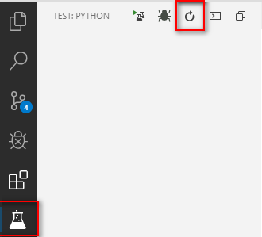
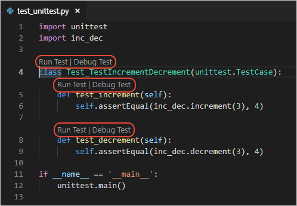
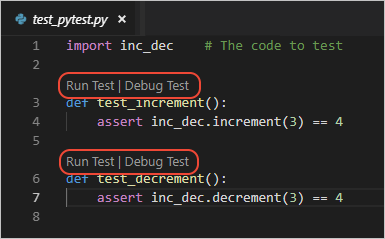

# Testing

- [Testing](#testing)
  - [简介](#%e7%ae%80%e4%bb%8b)
  - [单元测试背景知识](#%e5%8d%95%e5%85%83%e6%b5%8b%e8%af%95%e8%83%8c%e6%99%af%e7%9f%a5%e8%af%86)
  - [一个具体例子](#%e4%b8%80%e4%b8%aa%e5%85%b7%e4%bd%93%e4%be%8b%e5%ad%90)
  - [启用测试框架](#%e5%90%af%e7%94%a8%e6%b5%8b%e8%af%95%e6%a1%86%e6%9e%b6)
  - [识别测试](#%e8%af%86%e5%88%ab%e6%b5%8b%e8%af%95)
  - [配置](#%e9%85%8d%e7%bd%ae)
    - [通用配置](#%e9%80%9a%e7%94%a8%e9%85%8d%e7%bd%ae)
    - [unittest 配置](#unittest-%e9%85%8d%e7%bd%ae)
    - [pytest 配置](#pytest-%e9%85%8d%e7%bd%ae)

## 简介

Python 插件支持 Python 内置的 unittest 框架和 pytest，也支持 pytest.Nose 框架，不过该框架目前处于维护状态。

启用测试框架后，通过 **Python: Discover Tests** 命令根据当前框架的命名规则扫描项目中的测试文件。扫描完成后，VS Code 提供了一系列运行和调试测试的方法。VS Code 在 **Python Test Log** 展示测试输出。对 pytest，失败的测试在 **Problems** 面板中显示。

## 单元测试背景知识

单元（unit）是待测试的特定代码片段，包括函数或类。然后单元测试（unit tests）是另外代码片段，对单元在不同输入和边缘情况进行测试，确保程序的准确性。

例如，有一个函数用于验证用户输入的账号格式：

```py
def validate_account_number_format(account_string):
    # Return false if invalid, true if valid
    # ...
```

单元测试只关心单元的签名-参数以及返回值，不关心其具体实现，所以上面没有展示函数的具体实现。上面的函数接受字符串参数，返回 bool 值。

要彻底测试该函数，你需要对所有可能的输入进行测试：有效的字符串，错误的字符串，无效字符，太短或太长的字符串，空白字符串，空参数，包含HTML的字符串等等。

然后对每个输入定义其期望的返回值，对格式正确的输入字符串返回 true，其它的则返回 false。

接下来针对所有的参数和返回值定义侧似乎，基本上都是简单的函数调用和返回值检查，例如：

```py
# Import the code to be tested
import validator

# Import the test framework (this is a hypothetical module)
import test_framework

# This is a generalized example, not specific to a test framework
class Test_TestAccountValidator(test_framework.TestBaseClass):
    def test_validator_valid_string():
        # The exact assertion call depends on the framework as well
        assert(validate_account_number_format("1234567890"), true)

    # ...

    def test_validator_blank_string():
        # The exact assertion call depends on the framework as well
        assert(validate_account_number_format(""), false)

    # ...

    def test_validator_sql_injection():
        # The exact assertion call depends on the framework as well
        assert(validate_account_number_format("drop database master"), false)

    # ... tests for all other cases
```

代码的具体结构取决于使用的测试框架。

## 一个具体例子

Python 测试是放在单独文件中的 Python 类。每个测试框架对测试文件和类都有特定的命名规则。编写完测试后，启用测试框架，VS Code 找到这些测试并提供运行和调试测试的功能。

下面

## 启用测试框架

Python 测试框架默认禁用，可以通过 **Python: Configure Tests** 启用。

也可以在配置文件中添加设置，例如启用 `pytest`:

```json
"python.testing.pytestEnabled": true
```

> NOTE： 一次只启用一个单元测试框架。

## 识别测试

VS Code 根据当前启用的测试框架规则识别测试。可以通过 `Python: Discover Tests` 命令查找测试，也可以通过测试界面中的查找按钮查找测试：



在默认设置 `defaultSettings.json` 可以看到自动查找测试默认启用，在保存测试文件后，测试查找自动执行。

```json
// Enable auto run test discovery when saving a test file.
"python.testing.autoTestDiscoverOnSaveEnabled": true,
```

测试查找功能根据测试框架定义的规则查找测试，该规则可以通过 "Test configuration settings" 设置。默认规则为：

- `python.testing.unittestArgs`: 在顶层的项目目录中查找名称包含 "test" 的 `.py` 文件。所有的测试文件必须是能导入的模块或包。该规则可以通过 `-p` 选项进行配置，目录可以通过 `-t` 选项进行设置。
- `python.testing.pytestArgs`: 查找所有以 "test_"开头或以 "_test"结尾的 `.py` 文件，对当前目录和子目录。

> 偶尔无法检测到子目录的测试，是因为这些测试文件无法导入，可以在子目录中创建 `__init__.py` 空文件。

如果识别测试成功，状态栏显示 **Run Test**:


如果识别失败（例如没有安装测试框架），可以在状态栏看到失败提示：


识别测试成功后，VS Code 提供多种方式运行测试。最容易的方式是 CodeLens 在测试上提供的运行按钮，如下图所示：





> 如果总是 *Test discovery failed*，可以尝试升级测试框架，比如升级 pytest `pip install --upgrade pytest`

## 配置

单元测试的配置分为两部分，通用设置以及特定测试框架的配置。

### 通用配置

| Setting (python.testing.)     | Default | Description                          |
| ----------------------------- | ------- | ------------------------------------ |
| autoTestDiscoverOnSaveEnabled | `true`  | 保存测试文件时，是否自动发现测试     |
| cwd                           | `null`  | 指定可选的测试工作目录               |
| debugPort                     | `3000`  | 调试或单元测试的端口                 |
| promptToConfigure             | `true`  | 发现可能测试时，是否提示配置测试框架 |

### unittest 配置

| Setting (python.testing.) | Default                                | Description                                            |
| ------------------------- | -------------------------------------- | ------------------------------------------------------ |
| unittestEnabled           | `false`                                | 是否启用 unittest 测试框架，启用时应该禁用其它测试框架 |
| unittestArgs              | `["-v", "-s", ".", "-p", "*test*.py"]` | 传递给 unittest 的测试，不同选项以空格分隔             |

unittest 默认参数说明：

- `-v`, 详细输出，移除该参数则简单输出。
- `-s .`，设置发现测试的初始目录。如果你的测试在 "test" 目录，将该选项设置为 `-s test`。
- `-p *test*.py`，用于发现测试的模式。对该选项，表示包含 "test" 以 `.py` 结尾的任何文件。如果你的测试命名有所不同，例如是以 "_test" 结尾的文件，可以设置为 `*_test.py`。

要在第一个测试失败时停止测试，可以添加快速失败选项 `-f`。

更多选项 [unittest command-line interface](https://docs.python.org/3/library/unittest.html#command-line-interface)

### pytest 配置

| Setting (python.testing.) | Default  | Description                                                                                                                                                                             |
| ------------------------- | -------- | --------------------------------------------------------------------------------------------------------------------------------------------------------------------------------------- |
| pytestEnabled             | `false`  | 启用 pytest 测试，启用后应该禁用其它测试框架                                                                                                                                            |
| pytestePath               | `pytest` | pytest 路径。如果 pytest 在当前环境外的目录，使用完整路径                                                                                                                               |
| pytestArgs                | `[]`     | 传递给 pytest 的参数，不同参数以空格分隔，具体选项 [pytest command-line options](https://docs.pytest.org/en/latest/customize.html#command-line-options-and-configuration-file-settings) |

也可以使用 `pytest.ini` 文件配置 pytest，参考 [pytest Configuration](https://docs.pytest.org/en/latest/customize.html)

如果同时使用 pytest-cov 模块，VS Code 在调试时在断点处不停止，因为 pytest-cov 使用相同的技术访问源码。要防止该问题，可以在调试时在 `pytestArgs` 中添加 `--no-cov` 选项。
