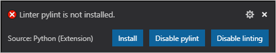
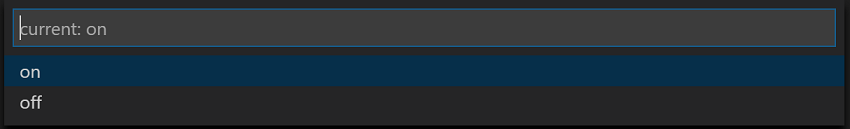
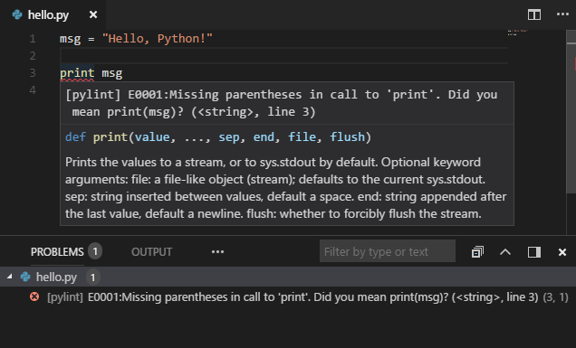

# Linting

- [Linting](#linting)
  - [简介](#简介)
  - [启用 linter](#启用-linter)
  - [禁用 linting](#禁用-linting)
  - [运行 linting](#运行-linting)
  - [linting 设置](#linting-设置)
    - [通用设置](#通用设置)
    - [特定 linter 配置](#特定-linter-配置)
  - [Pylint](#pylint)

2021-02-20, 11:43
***

## 简介

Linting 高亮 Python 代码中有问题的语法和风格，以辅助识别和纠正代码中的错误。例如，linting 会检测对未初始化或未定义变量的使用、对未定义函数的调用、括号缺失等各种错误。

VSCode 默认使用 Pylint 提供 linting 功能。

使用 **Python:Enable Linting** 命令开启或关闭所有 linting 功能。

## 启用 linter

提供 linting 功能的工具称为 linter。在 VS Code 中使用 **Python:Select Linter** 命令选择其它 linter。该命令将 `"python.linting.<linter>Enabled": true` 添加到配置文件中，其中 `<linter>` 为 linter 名称。

如果未安装选择的 linter， vscode 会弹窗提示：



> vscode 安装 linter 可能失败，此时可以使用 pip 手动女装，例如 `pip install pylint`。

## 禁用 linting

使用 **Python:Enable Linting** 命令禁用所有 linter。运行该命令出现下拉弹窗，显示当前 linting 状态，以及开关功能:



## 运行 linting

linting 在如下情况执行：

- 保存文件时自动执行
- 使用命令 **Python:Run Linting** 。

在 **Problems** 面板显示监测到的问题。悬停在问题上显示详细信息：



## linting 设置

### 通用设置

linting 设置保存在 `settings.json` 文件中，使用 **File > Preferences > Settings** 或 `Ctrl+,` 打开该文件。

| 特征                             | 配置项 (python.linting.) | 默认值                                         |
| -------------------------------- | ------------------------ | ---------------------------------------------- |
| 启用 Linting                     | enabled                  | true                                           |
| 保存文件时 Linting               | lintOnSave               | true                                           |
| 最大 linting 信息数              | maxNumberOfProblems      | 100                                            |
| Exclude file and folder patterns | ignorePatterns           | `[".vscode/*.py", "**/site-packages/**/*.py"]` |

**Python:Enable Linting** 命令用于修饰 `python.linting.enabled` 选项。

如果启用 `lintOnSave`，最好也启用 `files.autoSave` 选项。两者组合可以提供实时的 linting 提示。

### 特定 linter 配置

下表总结了可用的 Python linters 及其基本设置。

| Linter             | 包名称(pip install) | 默认状态 | 启用选项(python.linting.) | 参数设置（python.linting.） | 自定义路径设置(python.linting.) |
| ------------------ | ------------------- | -------- | ------------------------- | --------------------------- | ------------------------------- |
| Pylint             | pylint              | Enabled  | pylintEnabled             | pylintArgs                  | pylintPath                      |
| Flake8             | flake8              | Disabled | flake8Enabled             | flake8Args                  | flake8Path                      |
| mypy               | mypy                | Disabled | mypyEnabled               | mypyArgs                    | mypyPath                        |
| pydocstyle         | pydocstyle          | Disabled | pydocstyleEnabled         | pydocstyleArgs              | pydocstylePath                  |
| Pep8 (pycodestyle) | pep8                | Disabled | pep8Enabled               | pep8Args                    | pep8Path                        |
| prospector         | prospector          | Disabled | prospectorEnabled         | prospectorArgs              | prospectorPath                  |
| pylama             | pylama              | Disabled | pylamaEnabled             | pylamaArgs                  | pylamaPath                      |
| bandit             | bandit              | Disabled | banditEnabled             | banditArgs                  | banditPath                      |

使用 **Python: Select Linter** 命令选择 linter。也可以编辑配置文件，同时启用多个 linters，不过使用 **Select Linter** 会覆盖这种设置，所以如果需要多个 linters，不要使用该命令。

对每个 linter 的特异性参数，用空格分隔的参数字符串在 args 列表中单独列出。例如：

```json
"python.linting.pylintArgs": ["--reports", "12", "--disable-msg", "I0011"],
"python.linting.flake8Args": ["--ignore=E24,W504", "--verbose"]
"python.linting.pydocstyleArgs": ["--ignore=D400", "--ignore=D4"]
```

自定义路径一般用不着，vscode Python 扩展会根据 Python 解释器自动识别 linter 路径。除非需要使用不同版本的linter，例如使用的计时器为虚拟环境，但是你需要使用 global 环境中安装的 linter，此时就需要设置路径。

## Pylint
