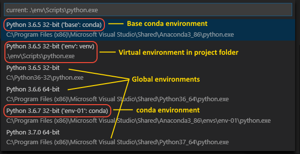

# Environment

Python 中的环境（Environment）是指 Python 程序运行的上下文。环境包括Python 解释器和安装的工具包组成。VS Code 的 Python 扩展针对不同环境提供了相应的集成功能。

# 选择和激活环境

Python 扩展默认使用在系统路径中找到的第一个 Python 解释器。如果找不到任何解释器，会发出警告。

在 macOS 上，如果使用的是 OS 上默认的 Python 解释器，也会发出警告。

以上的两种警告，都可以在 `settings` 中设置 `python.disableInstallationCheck` 为 `true` 关闭警告。

选择环境，可以使用 **Python:Select Interpreter** 命令：

在任何时候都可以切换环境，这样方便在不同的环境中测试代码。

**Python:Select Interpreter** 命令会显示可用的环境列表。如下所示：

