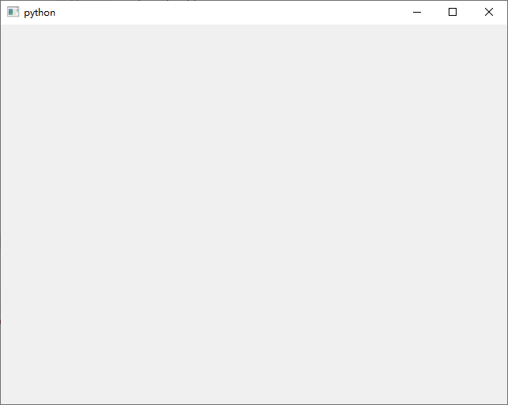
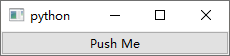
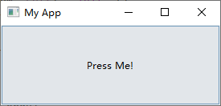
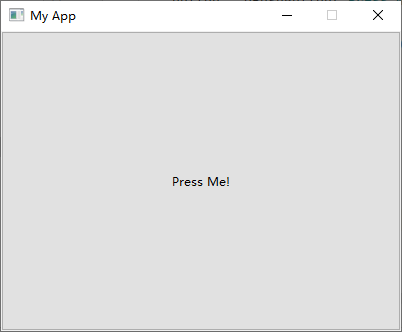

# 入门

- [入门](#入门)
  - [创建应用](#创建应用)
  - [主窗口](#主窗口)
  - [设置大小](#设置大小)

2021-05-28, 16:29
***

## 创建应用

下面创建一个简单的窗口：

```py
from PySide6.QtWidgets import QApplication, QWidget
import sys

# 对每个应用需要一个 QApplication 实例
app = QApplication(sys.argv)

# widget 作为窗口显示
window = QWidget()
# 默认隐藏，显示窗口
window.show()

# 开始事件循环
app.exec()**
```

运行后显示一个空白窗口：



在 Qt 中任何控件都可以作为窗口，例如将上面的 `QWidget` 替换为 `QPushButton`：

```py
from PySide6.QtWidgets import QApplication, QPushButton

app = QApplication()

window = QPushButton("Push Me")
window.show()

app.exec()
```



## 主窗口

不过在实际应用中，我们需要一个可以包含其他控件的主窗口，在 PySide 中 `QMainWindow` 作为窗口空间，添加了工具栏、菜单、状态栏等功能。

如果需要构建复杂的界面，一般推荐扩展 `QMainWindow` 类，在 `__init__` 中设置好界面，例在窗口中添加一个按钮：

```py
import sys

from PySide6.QtWidgets import QApplication, QMainWindow, QPushButton


class MainWindow(QMainWindow):
    def __init__(self):
        super(MainWindow, self).__init__()
        self.setWindowTitle("My App")
        button = QPushButton("Press Me!")
        self.setCentralWidget(button)


app = QApplication(sys.argv)

window = MainWindow()
window.show()

app.exec()
```



## 设置大小

Qt 以 `QSize` 定义尺寸，窗口默认以容纳其子控件的最小尺寸显示，下面设置窗口固定大小：

```py
import sys

from PySide6.QtCore import QSize
from PySide6.QtWidgets import QApplication, QMainWindow, QPushButton


class MainWindow(QMainWindow):
    def __init__(self):
        super(MainWindow, self).__init__()
        self.setWindowTitle("My App")
        button = QPushButton("Press Me!")
        self.setFixedSize(QSize(400, 300))  # 设置窗口大小
        self.setCentralWidget(button)


app = QApplication(sys.argv)
window = MainWindow()
window.show()

app.exec()
```



由于固定了尺寸，所有窗口山上的“最大化”按钮此时不能使用。

另还有 `setMinimumSize()` 和 `setMaximumSize()` 设置最小和最大尺寸。

