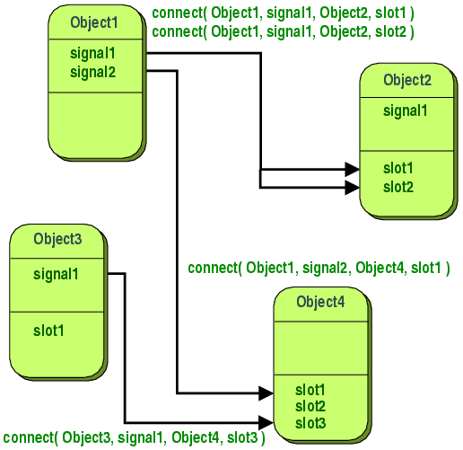
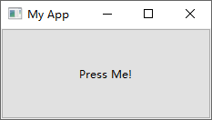
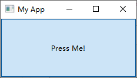

# 信号和槽

- [信号和槽](#信号和槽)
  - [概述](#概述)
  - [信号](#信号)
  - [事件](#事件)
  - [QPushButton 信号](#qpushbutton-信号)
  - [参考](#参考)

2021-05-28, 17:11
****

## 概述

处理事件是 GUI 程序必需的功能。事件由用户或系统产生，如点击鼠标、输入文本等。当调用 `QApplication.exec()` 方法时，应用进入主循环，主循环获取事件，并将其传递给特定的接收者。Qt 通过信号和槽（*signals and slots*）机制实现不同对象之间的通讯。

所有的 GUI 程序都是事件驱动的。应用程序对在其生命周期中生成的不同事件类型做出反应。在事件模型中，主要包含三个对象：

- 事件源，即产生事件的对象
- 事件本身，即包含事件信息的对象
- 事件目标

**信号**（signals）是控件发出的信息，如按下按钮会发出信号，文本框内容改变会发出信号。大多数信号是由用户操作产生。

**槽**（slots）用于接收信号。任何 Python 函数都可用作槽，即任何函数都可以接受信号，根据信号执行特定操作。

当特定事件发生时，会发出一个特定的信号。Qt 控件有许多预定义的信号，也可以通过扩展 Qt 类添加自定义的信号。槽（slot）是响应特定信号而调用的**函数**。



信号和槽机制是类型安全的：信号的签名必须与接收槽的签名匹配（槽的签名可能比信号更短，因为可以忽略一些参数）。基于字符串的 SIGNAL 和 SLOT 语法将在运行时匹配类型。

信号和槽是松耦合的：发出信号的类不知道也不关系哪个槽接收信号。Qt 的信号槽机制确保在信号连接到槽时，槽将在正确的时间使用信号的参数被调用。

`QObject` 的子类都可以包含信号槽。当对象以其他对象可能感兴趣的方式更改状态时，就会发出信号。

槽（slot）可以从来接收信号，但它们其实就是普通的函数。可以将任意数量的信号连接到单个槽，也可以将一个信号连接到任意数量的槽。甚至可以将一个信号连接到另一个信号（在发出第一个信号后立刻发出第二个信号）。

## 信号

当对象内部状态发生改变时，就会发出信号。信号是公共访问函数，因此可以从任何地方发出信号。不过我们建议只从定义信号的类及其子类发出信号。

当发出一个信号，与其相连的槽通常会立刻执行，就像调用一个普通函数一样。此时，信号和槽完全独立于 GUI 事件循环，一旦多有的槽返回，继续执行 `emit` 语句之后的代码。当排队连接时情况就略有不同，此时 `emit` 后面的代码立刻执行，而槽稍后执行。

如果多个槽连接一个信号，则在发出信号后，槽将按照它们连接的顺序依次执行。

信号由 moc（Meta-Object Compiler）自动生成，不返回值。

## 事件

用户与 Qt 应用程序每次交互都产生事件。有许多类型的事件，每一种代表特定的交互类型，Qt 以特定的类表示特定的交互类型。例如，鼠标点击控件产生 `QMoustEvent`，发送到 `.moustPressEvent` 事件处理器。事件处理器通过事件对象可以查看事件在哪发生、具体什么事件等。

通过覆盖父类方法

## QPushButton 信号

点击按钮，按钮 `QPushButton` 会产生信号。例如：

```py
import sys

from PySide6.QtWidgets import QApplication, QMainWindow, QPushButton


class MainWindow(QMainWindow):
    def __init__(self):
        super().__init__()
        self.setWindowTitle("My App")

        button = QPushButton("Press Me!")
        button.setCheckable(True)
        button.clicked.connect(self.the_button_was_clicked)

        self.setCentralWidget(button)

    def the_button_was_clicked(self):
        print("Clicked!")


if __name__ == '__main__':
    app = QApplication(sys.argv)
    window = MainWindow()
    window.show()
    sys.exit(app.exec())
```

说明：

- 按钮发出 `clicked` 信号
- `the_button_was_clicked()` 方法接收信号

另外，一个信号可以绑定多个槽，而且能够根据信号的状态筛选需要处理的信号，例如，对可切换状态的按钮，可以监听其切换状态：

```py
import sys

from PySide6.QtWidgets import QApplication, QMainWindow, QPushButton


class MainWindow(QMainWindow):
    def __init__(self):
        super().__init__()
        self.setWindowTitle("My App")

        button = QPushButton("Press Me!")
        button.setCheckable(True)

        button.clicked.connect(self.the_button_was_clicked)
        button.clicked.connect(self.the_button_was_toggled)

        self.setCentralWidget(button)

    def the_button_was_clicked(self):
        print("Clicked!")

    def the_button_was_toggled(self, checked):
        print("Checked?", checked)


if __name__ == '__main__':
    app = QApplication(sys.argv)
    window = MainWindow()
    window.show()
    sys.exit(app.exec())
```



当点击按钮时，切换到选择状态：



并在控制台输出：

```txt
Clicked!
Checked? True
```

## 参考

- [zetcode](https://zetcode.com/gui/pysidetutorial/eventsandsignals/)
- [Signals & Slots](https://doc.qt.io/qt-6/signalsandslots.html)
