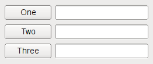
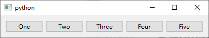
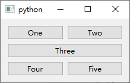
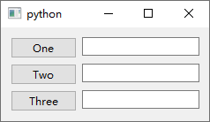
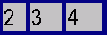
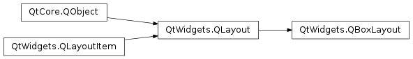
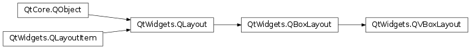

# Layout

- [Layout](#layout)
  - [简介](#简介)
  - [水平、垂直、网格和表单布局](#水平垂直网格和表单布局)
    - [通过代码创建布局](#通过代码创建布局)
    - [layout 使用技巧](#layout-使用技巧)
  - [添加控件](#添加控件)
    - [伸缩因子](#伸缩因子)
  - [QBoxLayout](#qboxlayout)
  - [QVboxLayout](#qvboxlayout)
    - [构造函数](#构造函数)
    - [使用](#使用)
  - [QFormLayout](#qformlayout)
  - [GridLayout](#gridlayout)
  - [参考](#参考)

2021-03-25, 15:08
*** **

## 简介

布局管理器具有如下功能：

- 设置子控件位置；
- 设置窗口合适的大小
- 内容更改时及时更新：
  - 子控件的字体、文本等
  - 隐藏和显式子控件
  - 移除子控件

布局管理器：

|Layout|说明|
|---|---|
|QBoxLayout|水平或垂直排列|
|QButtonGroup|用于分组按钮的容器|
|QFormLayout|管理输入控件及其相关标签|
|QGraphicsAnchor|在 Graphics 视图中将控件锚定在一起|
|QGridLayout|网格|
|QGroupBox|带标题的分组框|
|QHBoxLayout|水平|
|QLayout|布局管理器的基类|
|QLayoutItem|`QLayout` 操作的抽象条目|
|QSizePolicy|调整大小的策略|
|QSpacerItem|layout 中的空白|
|QStackedLayout|堆叠|
|QStackedWidget|堆叠|
|QVBoxLayout|垂直|
|QWidgetItem|表示控件的 layout 项|

## 水平、垂直、网格和表单布局

内置的布局管理器是便于使用，`QHBoxLayout`, `QVBoxLayout`, `QGridLayout` 和 `QFormLayout` 等，这些类继承 `QLayout`，而 `QLayout` 又继承自 `QObject`（不是 `QWidget`）。布局管理器负责控件的集合管理，通过相互嵌套，可以创建复杂的布局管理器。

- `QHBoxLayout` 水平排列控件


- `QVBoxLayout` 垂直排列控件


- `QGridLayout` 以二维网格的形式排列控件


- `QFormLayout` 以两列排列标签和字段



### 通过代码创建布局

```py
import sys

from PySide6.QtWidgets import QWidget, QPushButton, QHBoxLayout, QApplication

app = QApplication(sys.argv)

window = QWidget()

button1 = QPushButton("One")
button2 = QPushButton("Two")
button3 = QPushButton("Three")
button4 = QPushButton("Four")
button5 = QPushButton("Five")

layout = QHBoxLayout(window)
layout.addWidget(button1)
layout.addWidget(button2)
layout.addWidget(button3)
layout.addWidget(button4)
layout.addWidget(button5)

window.show()

app.exec()
```



使用 `QVBoxLayout` 的代码基本完全一致，替换一下布局类即可。

使用 `QGridLayout` 略有不同，因为需要同时指定行和列的位置：

```py
import sys

from PySide6.QtWidgets import QApplication, QPushButton, QWidget, QGridLayout

app = QApplication(sys.argv)

window = QWidget()
button1 = QPushButton("One")
button2 = QPushButton("Two")
button3 = QPushButton("Three")
button4 = QPushButton("Four")
button5 = QPushButton("Five")

layout = QGridLayout(window)
layout.addWidget(button1, 0, 0)  # 添加到 0 行 0 列
layout.addWidget(button2, 0, 1)  # 添加到 0 行 1 列
layout.addWidget(button3, 1, 0, 1, 2)  # 添加到 1 行 0 列，占据 1 行 2 列
layout.addWidget(button4, 2, 0)  # 添加到 2 行0列
layout.addWidget(button5, 2, 1)  # 添加到 2 行 1列

window.show()
app.exec()
```



`QFormLayout` 在每一行添加两个控件，通常是一个 `QLabel` 和一个 `QLineEdit`，以此来创建表单。在同一行添加 `QLabel` 和 `QLineEdit` 会自动将 `QLineEdit` 设置为 `QLabel` 的 buddy。例如：

```py
import sys

from PySide6.QtWidgets import QApplication, QPushButton, QWidget, QLineEdit, QFormLayout

app = QApplication(sys.argv)

window = QWidget()
button1 = QPushButton("One")
lineEdit1 = QLineEdit()
button2 = QPushButton("Two")
lineEdit2 = QLineEdit()
button3 = QPushButton("Three")
lineEdit3 = QLineEdit()

layout = QFormLayout(window)
layout.addRow(button1, lineEdit1)
layout.addRow(button2, lineEdit2)
layout.addRow(button3, lineEdit3)

window.show()
app.exec()
```



### layout 使用技巧

在使用布局时，在构建子控件时不需要传入父控件，布局管理器将自动重新设置子控件的父级（`QWidget.setParent()`）。

通过 `addLayout()` 可以为layout 添加 layout，从而实现 layout 的嵌套。

## 添加控件

向 layout 中添加控件后，布局过程如下：

1. 所有控件都会根据它们的 `QWidget.sizePolicy()` 和 `QWidget.sizeHint()` 分配一定空间；
2. 对伸缩因子大于 0 的控件，按伸缩因子为其分配空间；
3. 对伸缩因为为 0 的控件，只有其它控件都不再需要空间，才回为其分配额外空间；
4. 如果控件所得空间小于其最小尺寸，则重新分配其最小尺寸对应空间；
5. 如果空间所得空间大于其最大尺寸，则重新分配其最大尺寸对应空间。

### 伸缩因子

在创建控件时通常没有指定伸缩因子。在 layout 中布局控件时，会根据控件的 `QWidget.sizePolicy()` 和最小尺寸给它们一个共享空间。伸缩因子则根据比例给出空间。

假设我们用 `QHBoxLayout` 布局三个空阿金，不设置伸缩因子：


如果对每个控件设置伸缩因子，它们将按比例设置大小（但大于最小尺寸）：



## QBoxLayout



`QBoxLayout` 水平或垂直排列子部件。

`QBoxLayout` 将其从父布局或 `parentWidget()` 获得的空间划分为小框，然后每个框放置一个部件。

如果 `QBoxLayout` 的方向为 `Horizontal`，则方框以合适大小排成一行，每个部件至少获得 minimum size 空间，最多 maximum size 空间。额外空间根据 stretch 设置分配。


如果 `QBoxLayout` 是 `Vertical`，则方框垂直放置。


使用 `QBoxLayout` 最简单的方式是使用其子类 `QHBoxLayout` 创建水平布局，`QVBoxLayout` 创建垂直布局。也可以直接使用 `QBoxLayout` 创建，指定其方向为 `LeftToRight` , `RightToLeft` , `TopToBottom` 或 `BottomToTop` 。

如果 `QBoxLayout` 不是顶层布局，则必须先将其添加到另一个布局中才能对其进行操作。使用 `addLayout()` 添加。

添加部件方法：

- `addWidget()` 添加部件到 `QBoxLayout` 并设置 stretch 系数。
- `addSpacing()` 添加空部件，用于控制部件之间的距离。
- `addStretch()` 创建空的可伸缩的 box。
- `addLayout()` 添加另一个 `QLayout`。

使用 `insertWidget()`, `insertSpacing()`, `insertStretch()`, `insertLayout()` 在指定位置插入。

`QBoxLayout` 还包含两个边距设置选项：

- `setContentsMargins()` 设置 `QBoxLayout` 四个边的边距。
- `setSpacing()` 设置相邻空间之间的距离，还可以通过 `addSpacing()` 添加额外距离。

默认边距由样式确定，对 Qt 样式默认为 9，对 windows 样式默认为 11.


## QVboxLayout

`QVboxLayout` 用于创建垂直方框布局。



### 构造函数

```py
PySide6.QtWidgets.QVBoxLayout(parent)
```

- `parent`

`parent` 为父容器，即将该 `QVBoxLayout` 设置为 `parent` 的布局。

### 使用

```py
from PySide6.QtWidgets import QWidget, QPushButton, QVBoxLayout, QApplication

window = QWidget()
button1 = QPushButton("One")
button2 = QPushButton("Two")
button3 = QPushButton("Three")
button4 = QPushButton("Four")
button5 = QPushButton("Five")

layout = QVBoxLayout(window)
layout.addWidget(button1)
layout.addWidget(button2)
layout.addWidget(button3)
layout.addWidget(button4)
layout.addWidget(button5)

window.show()
```

## QFormLayout

`QFormLayout` 是一种简便的布局类，以两列铺设其子控件：

- 左侧为标签，一般为选项名称；
- 右侧为字段控件，如 LineEditor，复选框等。

一般这种两列布局直接使用 `QGridLayout` 就可以实现，`QFormLayout` 是一种更高级的替代方案，具有如下优点：

- 外观和平台保持一致；
- 支持对长行换行；
- 提供了创建字段-标签对的 API。

例如，`addRow()` 接受 `QString` 和 `QWidget` 创建一行，方法内部会自动根据文本创建 `QLabel`，并将 `QLabel` 设置为 `QWidget` 的 buddy。如下：

```py
formLayout = QFormLayout()
formLayout.addRow(self.tr("&Name:"), nameLineEdit)
formLayout.addRow(self.tr("&Email:"), emailLineEdit)
formLayout.addRow(self.tr("&Age:"), ageSpinBox)
setLayout(formLayout)
```

如果使用 `QGridLayout`，就要复杂许多：

```py
nameLabel = QLabel(self.tr("&Name:"))
nameLabel.setBuddy(nameLineEdit)

emailLabel = QLabel(self.tr("&Name:"))
emailLabel.setBuddy(emailLineEdit)

ageLabel = QLabel(self.tr("&Name:"))
ageLabel.setBuddy(ageSpinBox)

gridLayout = QGridLayout()
gridLayout.addWidget(nameLabel, 0, 0)
gridLayout.addWidget(nameLineEdit, 0, 1)
gridLayout.addWidget(emailLabel, 1, 0)
gridLayout.addWidget(emailLineEdit, 1, 1)
gridLayout.addWidget(ageLabel, 2, 0)
gridLayout.addWidget(ageSpinBox, 2, 1)
setLayout(gridLayout)
```

另外，`QFormLayout` 的默认样式，可以通过 `setLabelAlignment()`, `setFormAlignment()`, `setFieldGrowthPolicy()` 以及 `setRowWrapPolicy()` 设置。

## GridLayout

## 参考

- https://doc.qt.io/qt-6/layout.html
