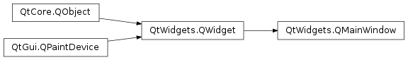

# QMainWindow

- [QMainWindow](#qmainwindow)
  - [简介](#简介)
  - [状态栏](#状态栏)

2021-03-26, 16:37
***

## 简介

`QMainWindow` 类如其名，为窗口类型，为UI程序提供框架。`QMainWindow` 自带有布局管理器，可以添加 `QToolBar`, `QDockWidget`, `QMenuBar` 以及 `QStatusBar`。布局中间可以放置其他控件，如下所示：

中间控件可以是 Qt 控件，如 `QTextEdit`，`QGraphicsView`，也可以是自定义控件，通过 `setCentralWidget()` 设置。

主窗口可以有一个或多个文档接口，将 `QMdiArea` 设置为中间控件创建 MDI 程序。

## 状态栏

可以通过 `setStatusBar()` 创建状态栏，不过在首次调用 `statusBar()` 时会自动创建一个。

