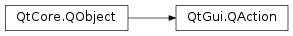

# QAction

- [QAction](#qaction)
  - [简介](#简介)
  - [应用](#应用)
  - [方法](#方法)
    - [triggered](#triggered)

2021-03-28, 11:26
***

## 简介

`QAction` 类提供了用户命令，这些命令可以添加到不同控件。



在 GUI 程序中，命令可以通过菜单、工具栏按钮和快捷键执行。用户希望不管用什么方式操作，执行的命令是相同的，因此抽象具体命令是有意义的。

`QAction` 可以添加到菜单和工具栏，并自动保持它们同步。例如，在文字处理程序中，如果用户按下工具栏的加粗按钮，则菜单栏中的加粗选项也自动被选中。

`QAction` 可以包含图标、菜单文本、快捷键、状态栏文本以及工具提示。大多数可以在构造函数中设置，也有专门的设置方法，如 `setIcon()`, `setText()`, `setIconText()`, `setShortcut()`, `setStatusTip()`, `setWhatsThis()`, `setTooltip()` 等。对菜单栏，可以通过 `setFont()` 方法设置单独的字体。

建议将 `QAction` 设置为使用它们窗口的子级，大多数情况设置为主窗口的子级。

## 应用

创建 `QAction` 后，需要将其添加到相关的菜单和工具栏，然后将其和执行该操作的槽连接。例如：

```cpp
const QIcon openIcon = QIcon::fromTheme("document-open", QIcon(":/images/open.png"));
QAction *openAct = new QAction(openIcon, tr("&Open..."), this);
openAct->setShortcuts(QKeySequence::Open);
openAct->setStatusTip(tr("Open an existing file"));
connect(openAct, &QAction::triggered, this, &MainWindow::open);
fileMenu->addAction(openAct);
fileToolBar->addAction(openAct);
```

`QAction` 通过控件的 `addAction()` 方法添加到控件。

## 方法

### triggered

注册控件的动作激活该方法，例如用户点击菜单、工具栏或者按下快捷键，调用 `trigger()` 也会激活该方法。