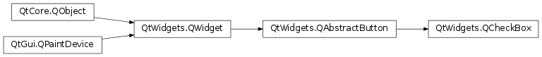
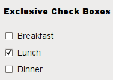
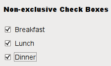

# Button

- [Button](#button)
  - [QAbstractButton](#qabstractbutton)
  - [快捷键](#快捷键)
  - [按钮状态](#按钮状态)
  - [按钮信号](#按钮信号)
    - [扩展 `QAbstractButton`](#扩展-qabstractbutton)
  - [QPushButton](#qpushbutton)
  - [QCheckBox](#qcheckbox)
    - [设置状态](#设置状态)
    - [分组](#分组)
  - [参考](#参考)

2021-05-28, 17:24
***

## QAbstractButton


`QAbstractButton` 是 button 控件的抽象基类，提供了按钮的共有功能。而其子类对用户具体操作，已经按钮的绘制进行个性化定制。

`QAbstractButton` 同时支持 pushButton 和 checkableButton。`QRadioButton` 和 `QCheckBox` 实现了 checkableButton，`QPushButton` 和 `QToolButton` 实现了 pushButton。

每个按钮都可以显示文本和图标。用 `setText()` 设置文本，用 `setIcon()` 设置图标。如果禁用了按钮，按钮外观会随之改变。

## 快捷键

如果按钮的文本带有 `&` 符号，则 `QAbstractButton` 会自动创建快捷键。例如：

```cpp
button = QPushButton(tr("Rock and Roll"), self)
```

此时使用 `Alt+C` 快捷键触发调用 `animateClick()`。

也可以通过 `setShortcut()` 方法设置快捷键。这对没有显示文本的按钮十分有用：

```cpp
button.setIcon(QIcon(":/images/print.png"))
button.setShortcut(tr("Alt+F7"))
```

Qt 提供的所有按钮 `QPushButton`, `QToolButton`, `QCheckBox` 和 `QRadioButton` 都可以同时显示文本和图标。

通过 `setDefault()` 和 `setAutoDefault()` 方法可以设置按钮为对话框中的默认按钮。

## 按钮状态

|属性|设置方法|查询方法|说明|
|---|---|---|---|
|checkable|`setCheckable()`|`isCheckable()`|是否可以选择|
|checked|`setChecked()`|`isChecked()`|是否处于选中状态|
|down|`setDown()`|`isDown()`|是否按下|

`QRadioButton` 和 `QCheckBox` 实现了复选（checkable）功能。

`QAbstractButton` 提供了查询按钮状态的大多数方法：

- `isChecked()` 按钮是否 checked。只有 checkable 按钮才有该状态；
- `isEnabled()` 按钮是否被按下；
- `setAutoRepeat()` 设置，如果用户按住按钮不放，按钮是否自动重复，通过 `autoRepeatDeley` 和 `autoRepeatInterval` 定义如何自动重复。

`isDown()` 和 `isChecked()` 的区别在于：用户点击 toggle 按钮，按钮首先进入 *pressed* 状态，，释放时进入 *checked* 状态；当用户再次点击，按钮先进入 *pressed* 状态，释放时进入 *unchecked* 状态。

## 按钮信号

`QAbstractButton` 提供了四种信号：

1. 鼠标光标在按钮内部时按钮鼠标左键触发；
2. 松开鼠标左键；
3. 按下鼠标左键后松开，按快捷键、调用 `click()` 或 `animateClick()`；
4. toggle 按钮状态改变触发 `toggled()`

### 扩展 `QAbstractButton`

要扩展 `QAbstractButton`，至少要重新实现按钮的绘制、文本以及像素图，通常还建议重新实现 `sizeHint()`，有时还需要重新实现 `hitButton()`，以确定是在按钮内部按下鼠标。

## QPushButton


`QPushButton` 提供了命令按钮功能。

## QCheckBox

`QCheckBox` 提供了一个带文本标签的复选框。



复选框 `QCheckBox` 是一个带“选中”和“未选中”两种状态的选项按钮。当选择或清除选择复选框时，复选框发出信号。可以通过 `isChecked()` 方法查询复选框是否处于选中状态。

除了“选中”和“未选中”这两种状态，`QCheckBox` 还可以提供第三种状态“无变化”。使用 `setTristate()`启用第三种状态，，使用 `checkState()` 查看当前切换状态。

和 `QPushButton` 一样，复选框可以显示文本和图标。图标使用 `setIcon()` 设置，文本可以在构造时设置，或使用 `setText()` 方法设置。在首选字符前加上 `&` 符号可以设置快捷键。例如：

```py
checkbox = QCheckBox("Case sensitive", self)
```

### 设置状态

```py
PySide6.QtWidgets.QCheckBox.setCheckState(state)
```

|Flag|说明|
|---|---|
|Qt.Checked|选中|
|Qt.Unchecked|未选择|
|Qt.PartiallyChecked|部分选择|

设置状态，如果不需要第三种状态，可以直接用 `setChecked()` 方法设置。这里 `Qt.PartiallyChecked` 就是所说的第三种状态，该状态下的复选框一般是灰色。

### 分组

`QButtonGroup` 可以将多个复选框分组，从而在多个复选框中实现独占式选择功能。

下图显示了“独占”和“非独占”分组复选项的差别：





“独占”式复选项，一组复选框中只能选择一个。

## 参考

- https://doc.qt.io/qtforpython/PySide6/QtWidgets/QAbstractButton.html
