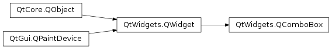

# QComboBox

## 简介



`QComboBox` 是按钮和弹窗列表的组合，以占用屏幕最小的方式为用户提供列表选项。

`QComboBox` 以最少的屏幕空间向用户以列表的形式呈现，展示当前选择的条目，点击按钮显示供选择的列表。并且也可以编辑，使用户可以修改列表中的项。

`QComboBox` 可以包含图片和字符串。`insertItem()` 和 `setItemText()` 可用于设置列表值。对可编辑 `QComboBox`，可以使用 `clearEditText()` 函数清除显示的文本，但不修改 `QComboBox` 的内容。

## 插入值

|Flag|说明|
|---|---|
|QComboBox.NoInsert|不插入|
|QComboBox.InsertAtTop|顶部插入|
|QComboBox.InsertAtCurrrent|替换当前选择项|
|QComboBox.InsertAtBottom|底部插入|
|QComboBox.InsertAfterCurrent|当前项后面|
|QComboBox.InsertBeforeCurrent|当前项前面|
|QComboBox.InsertAlphabetically|按字母顺序|


## 实例

```py
import sys

from PySide6.QtWidgets import QApplication, QComboBox, QMainWindow


class MainWindow(QMainWindow):
    def __init__(self):
        super(MainWindow, self).__init__()
        self.setWindowTitle("My App")
        box = QComboBox()
        box.addItems(["One", "Two", "Three"])

        box.currentIndexChanged.connect(self.index_changed)
        box.currentTextChanged.connect(self.text_changed)

        self.setCentralWidget(box)

    def index_changed(self, i):
        print(i)

    def text_changed(self, s):
        print(s)


if __name__ == '__main__':
    app = QApplication(sys.argv)
    window = MainWindow()
    window.show()
    sys.exit(app.exec())
```

