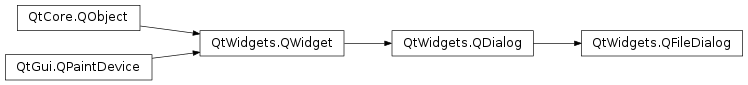

# QDialog

- [QDialog](#qdialog)
  - [简介](#简介)
    - [模态对话框](#模态对话框)
    - [返回值](#返回值)
  - [QFontDialog](#qfontdialog)
  - [QFileDialog](#qfiledialog)
    - [创建 QFileDialog](#创建-qfiledialog)
    - [FileMode](#filemode)
    - [过滤器](#过滤器)
    - [视图模式](#视图模式)
    - [选择文件](#选择文件)
  - [参考](#参考)

2021-06-28, 16:08
****

## 简介

`QDialog` 是对话框窗口的基类。对话框是顶层窗口，主要用于短期任务以及和用户的短暂通讯。`QDialog` 可以为模态或非模态。

### 模态对话框

### 返回值

模态对话框通常用于需要返回值的情况，例如，确定用户是按 **OK** 还是 **Cancel**。对话框可以通过 `accept()` 或 `reject()` slots 关闭，`exec()` 相应返回 `Accepted` 或 `Rejected`。`exec()` 方法返回对话框的结果。

## QFontDialog

`QFontDialog` 提供字体选择对话框。


通过静态方法 `getFont()` 创建对话框：

```cpp
bool ok;
QFont font = QFontDialog::getFont(
                &ok, QFont("Helvetica [Cronyx]", 10), this);
if (ok) {
    // the user clicked OK and font is set to the font the user selected
} else {
    // the user canceled the dialog; font is set to the initial
    // value, in this case Helvetica [Cronyx], 10
}
```

## QFileDialog

`QFileDialog` 提供选择文件和文件夹的对话框。



### 创建 QFileDialog

创建 `QFileDialog` 的最简单方式是使用静态方法：

```cpp
fileName = QFileDialog::getOpenFileName(this,
    tr("Open Image"), "/home/jana", tr("Image Files (*.png *.jpg *.bmp)"));
```

该对话框显示初始目录 "/home/jana" 中匹配 "Image Files (*.png *.jpg *.bmp)" 文件。对话框的父级为 `this`，窗口标题设置为 `"Open Image"`。

如果要使用多个过滤器，可以用两个**分号**分隔过滤器，例如：

```cpp
"Images (*.png *.xpm *.jpg);;Text files (*.txt);;XML files (*.xml)"
```

也可以不使用静态函数创建，然后调用 `setFileMode()` 设置模式：

```cpp
QFileDialog dialog(this);
dialog.setFileMode(QFileDialog::AnyFile);
```

这里使用 `AnyFile` 模式，表示可以选择任意文件，包括不存在的文件，所以适合于保存文件。

### FileMode

`fileMode` 属性指定对话框的操作模式，即用户期望选择的对象类型。

`FileMode` 指定用户在文件对话框中可以选择的内容。 即用户点击 OK 时返回的内容：

|常量|描述|
|---|---|
|`QFileDialog.AnyFile`|任意文件，包括不存在的文件，适合于保存文件|
|`QFileDialog.ExistingFile`|已有文件|
|`QFileDialog.Directory`|目录|
|`QFileDialog.ExitingFiles`|多个文件|

### 过滤器

使用 `setNameFilter()` 设置文件过滤器。例如：

```cpp
dialog.setNameFilter(tr("Images (*.png *.xpm *.jpg)"))
```

过滤器 `"Images (*.png *.xpm *.jpg)"` 表示只显示后缀为 `png`, `xpm` 或 `jpg` 的文件。

通过 `setNameFilters()` 方法可以设置多个过滤器。

使用 `selectNameFilter()` 设置默认过滤器。

### 视图模式

文件对话框有两种视图模式：

- `List`，以文件和目录名称的列表呈现当前目录内容；
- `Detail`，也是展示文件和目录列表，但是额外提供了文件大小、修改日期。

设置视图模式：

```cpp
dialog.setViewMode(QFileDialog.Detail)
```

### 选择文件

选择文件方法：

```cpp
fileNames = QStringList()
if dialog.exec():
    fileNames = dialog.selectedFiles()
```

`selectedFiles` 返回选择的文件绝对路径字符串列表。如果没有选择文件，或者模式不是 `ExistingFiles` 或 `ExistingFile`，则返回视图中的当前路径。

另外，对话框的工作目录可以通过 `setDirectory()` 设置。当前目录中的文件可以使用 `selectFile()` 函数选择。

## 参考

- https://doc.qt.io/qt-6/qfiledialog.html
