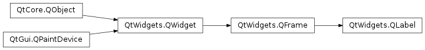

# QLabel

- [QLabel](#qlabel)
  - [简介](#简介)
  - [对齐选项](#对齐选项)
  - [创建](#创建)
  - [显示图片](#显示图片)

2021-05-31, 13:08
@Jiawei Mao
***

## 简介

`QLabel` 用于显示文本或图像的控件。没有提供用户交互功能。label 的外观可以通过多种方式设置.



`QLabel` 可以包含如下内容：

|内容|设置方法|参数类型|
|---|---|---|
|纯文本|`setText()`|`QString`|
|富文本|`setText()`|包含富文本的 `QString`|
|像素图|`setPixmap()`|`QPixmap`|
|电影|`setMovie()`|`QMovie`|
|数值|`setNum()`|*int* 或 *double*，自动转换为文本显示|
|空|`clear()`|默认空文本|

`QLabel` 常用作交互控件的标签。

## 对齐选项

对图片和文本，label 默认左对齐、垂直居中显示。

label 包含内容的位置可以通过 `setAlignment()` 和 `setIndent()` 进行调整。文本内容可以使用 `setWordWrap()` 设置换行。例如，下面创建一个 sunken 样式的的面板，包含两行右下对齐的文本：

```cpp
label = QLabel(self)
label.setFrameStyle(QFrame.Panel | QFrame.Sunken)
label.setText("first line\nsecond line")
label.setAlignment(Qt.AlignBottom | Qt.AlignRight)
```

- 水平对齐选项

|Flag|说明|
|---|---|
|Qt.AlignLeft|左对齐|
|Qt.AlignRight|右对齐|
|Qt.AlignCenter|水平居中|
|Qt.AlignJustify|两端对齐|

- 垂直对齐选项

|Flag|说明|
|---|---|
|Qt.AlignTop|顶端对齐|
|Qt.AlignBottom|底部对齐|
|Qt.AlignVCenter|垂直居中|

不同对齐选项通过 `|` 组合，垂直或对齐 flag 只能使用一个：

```py
align_top_left = Qt.AlignLeft | Qt.AlignTop
```


## 创建

- 创建时指定文本

```py
label = QLabel("Hello")
```

- 创建后设置文本

```py
label = QLabel("1") # The label is created with the text 1
label.setText("2")  # The label now shows 2
```


## 显示图片

使用 `.setPixmap()` 方法设置待显示的图片，图片为 `QPixmap` 实例。例如：

```py
label.setPixmap(QPixmap('otje.jpg'))
```

