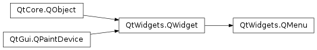
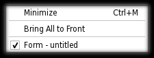

# QMenu

- [QMenu](#qmenu)
  - [简介](#简介)
  - [Actions](#actions)

2021-06-01, 10:01
***

## 简介

`QMenu` 类提供了一个用于菜单栏、上下文菜单和弹出菜单等的菜单部件。

使用 `addMenu()` 将菜单插入菜单栏中，上下文菜单一般通过快捷键或鼠标右键弹出。它们可以通过 `popup()` 异步执行，也可以与 `exec()` 同步执行。

## Actions

菜单由一系列的操作（`Action`）组成。操作通过 `addAction()`, `addActions()` 以及 `insertAction()` 等函数添加操作。Action 一般垂直显示，并由 `QStyle` 渲染。另外，`Action` 可以包含文本标签，还可以在左侧显示图标，并且可以设置快捷键。

菜单已有的操作可以通过 `actions()` 方法查询。

`Action` 有四种：

- 分隔符（separator），通过 `addSeparator()` 添加
- 子菜单（submenu），通过 `addMenu()` 添加
- 控件（widget）
- 执行操作的 Action

当插入操作项时，通常需要指定接收器和插槽。