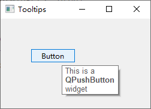

# QToolTip

## 简介

QToolTip 类为控件提供提示功能。

可以直接通过控件的 `setToolTip()` 函数设置。

也可以为控件的不同位置设置不同的提示，

## 方法

### setFont

```py
static PySide6.QtWidgets.QToolTip.setFont(arg__1)
```

静态方法，设置字体。

## 实例

```py
import sys

from PySide6 import QtWidgets, QtGui


class Example(QtWidgets.QWidget):
    def __init__(self):
        super().__init__()
        self.initUI()

    def initUI(self):
        QtWidgets.QToolTip.setFont(QtGui.QFont('SansSerif', 10))
        self.setToolTip("This is a <b>QWidget</b> widget")
        btn = QtWidgets.QPushButton("Button", self)
        btn.setToolTip("This is a <b>QPushButton</b> widget")
        btn.resize(btn.sizeHint())
        btn.move(50, 50)

        self.setGeometry(300, 300, 250, 150)
        self.setWindowTitle("Tooltips")
        self.show()


def main():
    app = QtWidgets.QApplication(sys.argv)
    ex = Example()
    sys.exit(app.exec_())


if __name__ == '__main__':
    main()
```


