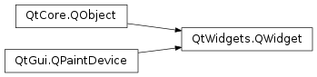
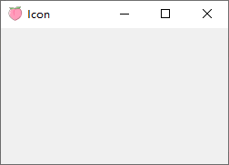

# QWidget

- [QWidget](#qwidget)
  - [简介](#简介)
  - [父、子控件](#父子控件)
  - [复合控件](#复合控件)
  - [自定义控件和绘制](#自定义控件和绘制)
  - [尺寸](#尺寸)
  - [事件](#事件)
  - [属性](#属性)
    - [样式表](#样式表)
    - [透明和双缓冲](#透明和双缓冲)
  - [函数](#函数)
    - [设置图标](#设置图标)

2021-03-26, 12:11
***

## 简介

`QWidget` 是所有 GUI 对象的基类。



控件（widget）是用户界面的基本单元，能够接受来自鼠标、键盘以及其它来自窗口系统的事件，并在屏幕上绘制自己。每个控件都是矩形的，并按照 Z 轴（垂直屏幕）顺序排列，如果前面有控件遮挡，后面会被裁剪部分。

没有嵌入父控件的空间称为窗口（window）。每个窗口通常包含一个框架（frame）和标题栏，标题栏可以通过设置合适的窗口标签（window flags）去掉。在 Qt 中，`QMainWindow`以及 `QDialog` 的子类为常见的窗口类型。

每个控件的构造函数接受一到两个标准参数：

- `QWidget *parent = nullptr` 为新控件的父控件。如果为 `None`（默认），则新控件为窗口；如果不是，则是某个父控件的子控件，限制在父控件范围之内。
- `Qt::WindowFlags f = { }` 设置窗口 flag。

`QWidget` 有许多成员函数，不过需要没有实际功能，而是尤其子类，如 `QLabel`, `QPushButton` 等提供实现。

## 父、子控件

没有父窗口的控件具有独立窗口，对这些控件可以使用 `setWindowTitle()` 设置窗口标题，使用 `setWindowIcon()` 设置图标。

非窗口控件统称为**子控件**，在父控件内显示。Qt 中大部分控件作为子控件使用。例如，按钮可以作为顶层窗口显示，但是大部分都是作为其它窗口内的一个控件使用，如 `QDialog`。


上图显示了 `QGroupBox`，在其中包含许多子控件，由 `QGridLayout` 控制布局。

## 复合控件

当一个控件用作其它子控件的容器时，就称其为**复合控件**。上图就是个复合控件。

复合控件可以通过两种方式创建：

- 创建一个控件，向其中添加其它子控件。
- 扩展自有标准控件，如 `QWidget` 或 `WFrame`，添加必要的布局管理器和子控件。大部分 Qt 实例都采用这种方式。

## 自定义控件和绘制

`QWidget` 是 `QPaintDevice` 的子类，因此可以通过 `QPainter` 类自定义绘制内容。控件以自带函数执行所有的绘制操作，在需要重新绘制时被调动。

## 尺寸

在实现一个新的控件时，推荐重新实现 `sizeHint()` 以提供默认尺寸，实现 `setSizePolicy()` 设置尺寸调整策略。

默认情况下，没有提供 size hint 的复合控件会根据其子控件所需的空间调整大小。

尺寸调整策略有助于布局管理器调整控件大小。默认尺寸策略推荐控件的首选尺寸，在大多数情况足够使用。

## 事件

用户操作触发事件，控件对事件进行相应。Qt 通过调用特定的事件处理函数将事件以 `QEvent` 实例的形式传递给控件。

如果控件只包含一个子控件，则几乎不需要实现事件处理函数。如果你处理鼠标点击事件，则在控件的 `mousePressEvent()` 中调用事件处理函数。

下面对 `QWidget` 常用事件进行总结：

|事件|触发条件|
|---|---|
|`resizeEvent()`|调整大小|
|`mousePressEvent()`|光标在控件内时按下鼠标|
|`mouseReleaseEvent()`|释放鼠标按钮|
|`mouseDoubleClickEvent()`|双击鼠标|
|`keyPressEvent()`|

## 属性

### 样式表

除了每个平台自带样式，也可以使用样式表个性化设置控件。

### 透明和双缓冲

从 Qt 4.0 开始，`QWidget` 会自动双缓冲其渲染，所以不再需要手动写双缓冲代码来避免画面闪烁。

从 Qt 4.1 开始，只要未设置 `WA_PaintOnScreen`，在默认情况下父组件内容就会传播到其子组件。自定义控件可以利用该特性更新不规则区域。

## 函数

|函数|功能|
|---|---|
|resize|设置大小|
|setGeometry(x, y, w, h)||
|setWindowIcon()|设置程序图标|
|setWindowTitle|设置窗口标题|
|show|显示控件，等价于 `showFullScreen()`, `showMaximized()` 或 `setVisible(true)`|

### 设置图标

```py
import sys
from PySide6 import QtWidgets, QtGui


class Example(QtWidgets.QWidget):
    def __init__(self):
        super().__init__()
        self.initUI()

    def initUI(self):
        self.setGeometry(300, 300, 250, 150)
        self.setWindowTitle("Icon")
        self.setWindowIcon(QtGui.QIcon('peach.svg'))
        self.show()


def main():
    app = QtWidgets.QApplication(sys.argv)
    ex = Example()
    sys.exit(app.exec_())


if __name__ == "__main__":
    main()
```

