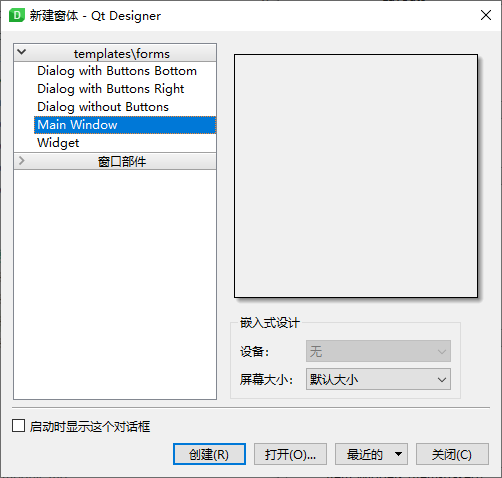
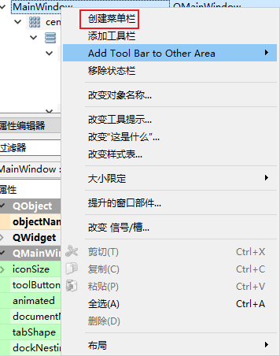
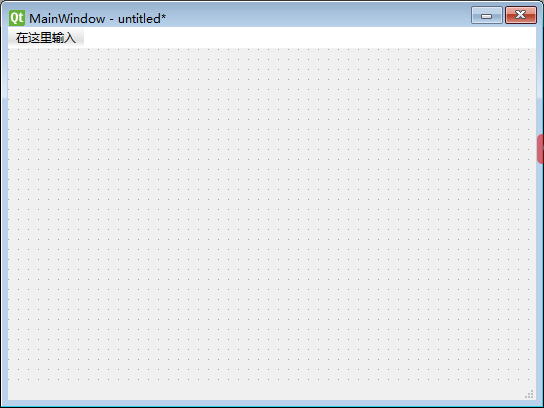
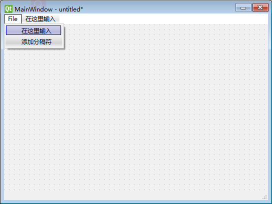

# 创建 Main Window

- [创建 Main Window](#创建-main-window)
  - [简介](#简介)
  - [菜单](#菜单)
    - [创建菜单](#创建菜单)

2021-06-07, 15:43
@author Jiawei Mao
***

## 简介

Qt Designer 可用于创建不同种类的用户界面，对每种类型提供有对应的模板。主窗口模板包含菜单栏、工具栏和停靠部件。

创建主窗口方式如下：

如果移除了菜单栏，后续依然可以在主窗口右键打开上下文菜单创建菜单：

## 菜单

在 `Type Here`（在这里输入）处输入菜单名称，就可以直接创建菜单。

### 创建菜单

双键 `Type Here` 进入编辑模式，即可以输入菜单名称，例如创建一个 `File` 菜单：

插入 `&` 使得后面的字符作为菜单的助记符。
