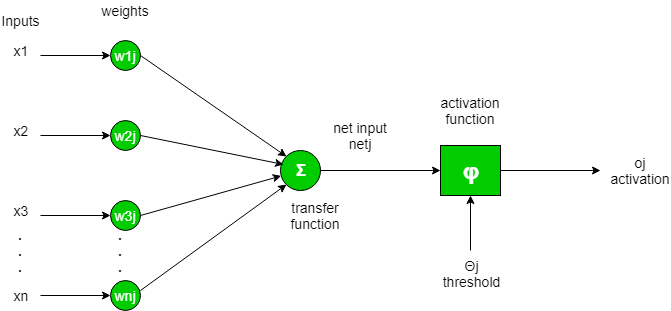
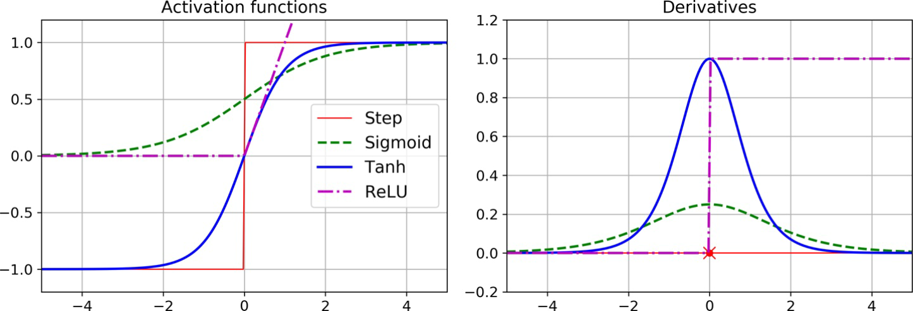
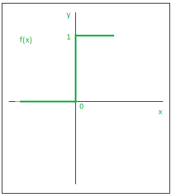
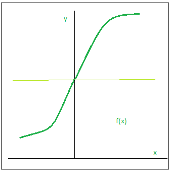
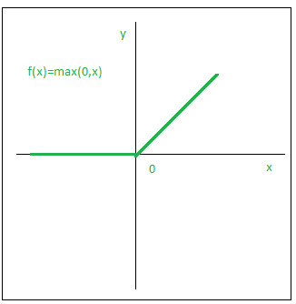

# Activation Function

- [Activation Function](#activation-function)
  - [简介](#简介)
  - [激活函数选择](#激活函数选择)
  - [阶梯函数（step function）](#阶梯函数step-function)
  - [S 函数（Sigmoid function）](#s-函数sigmoid-function)
  - [双曲正切函数](#双曲正切函数)
  - [ReLU](#relu)
  - [softplus](#softplus)

## 简介

如下所示，人工神经元会计算其输入的加权总和，并添加一个偏差项（bias）：

以数学函数描述就是：

$$output=\sum(weight*input)+bias$$

对计算的输出值，就需要通过激活函数决定，是否激活下一个神经元。

## 激活函数选择

对回归模型：

- 在构建多层感知机（multilayer Perceptron, MLP）回归模型时，为了输出任何范围的值，输出 neutrons 一般不需要激活函数。
- 如果需要保证输出为正数，则可以在输出层使用 ReLU 函数。
- 也可以使用 softplus 激活函数以保证正值输出。
- 如果需要输出值在指定范围，则可以使用逻辑函数或双曲正切函数。

## 阶梯函数（step function）

阶梯函数是一种最简单的激活函数，如果大于一个阈值，则激活神经元，否则不激活，以数学函数描述：

$$
f(x) = \begin{cases}
    1 &\text{if } x\ge 0 \\
    0 &\text{if } x\lt 0
\end{cases}
$$

下图是阶跃函数的图形表示：

## S 函数（Sigmoid function）

S 函数是使用最广泛的激活函数，其定义如下：

$$
\sigma(z)=\frac{1}{1+exp(-z)}
$$

图示如下：

这是一种连续可微的光滑函数。它相对阶跃函数和线性函数最大的优点就是它是非线性的。

## 双曲正切函数

双曲正切函数（hyperbolic tangenet）和 S 函数一样，也是S-形、连续可微，但是它输出值在 (-1, 1) 之间，不像 S 函数为 (0,1) 之间。这使得每层的输出或多或少集中在 0 附近，这通常有助于收敛。

$$
tanh(z) = 2\sigma(2z)-1
$$

## ReLU

整流线性单元函数（Reactified Linear Unit function, ReLU）。它应用也十分广泛，定义如下：

$$
f(x)=max(0,x)
$$

与其它激活函数相比，ReLU 最大的优点是，当低于某个阈值时，全部转换为0.

ReLU 函数也是连续函数，但是在 z=0 不可微，可能导致梯度下降来回反弹。然而实践证明，ReLU 工作非常好，而且具有计算快速的优势，因此它经常是默认选项。

最终要的是，ReLU 没有最大输出值，这有助于减少梯度下降中的一些问题。

## softplus

softplus 可以看作 ReLU 的平滑版：

$$
softplus(z)=log(1+exp(z))
$$

当 z 为负数时函数值接近0，当 z 为正数时函数值接近 z。

