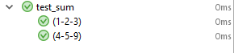

# pytest

- [pytest](#pytest)
  - [安装 pytest](#安装-pytest)
  - [命名规则](#命名规则)
  - [assert](#assert)
  - [浮点数对比](#浮点数对比)
  - [pytest 运行后退出代码](#pytest-运行后退出代码)
  - [抛出异常](#抛出异常)
  - [fixtures](#fixtures)
    - [fixture 示例](#fixture-示例)
    - [fixture 可以 request 其它 fixture](#fixture-可以-request-其它-fixture)
    - [fixture 可重复使用](#fixture-可重复使用)
    - [autouse fixture](#autouse-fixture)
    - [setup](#setup)
    - [teardown](#teardown)
    - [fixture scope](#fixture-scope)
  - [测试函数标记](#测试函数标记)
    - [mark 参数化测试](#mark-参数化测试)
    - [跳过测试](#跳过测试)
  - [测试分组](#测试分组)
  - [捕获 stdout/stderr 输出](#捕获-stdoutstderr-输出)
    - [默认行为](#默认行为)
  - [运行命令选项](#运行命令选项)
  - [参考](#参考)

2021-03-23, 13:47
@Jiawei Mao
***

## 安装 pytest

- 安装 pytest

```bash
pip install -U pytest
```

- 查看 pytest 版本

```bash
pytest --version
```

## 命名规则

pytest 根据如下规则查找测试：

| scope | 规则                             |
| ----- | -------------------------------- |
| 模块  | `test_*.py` 或 `*_test.py`       |
| 类    | `Test`开头，不带 `__init__` 方法 |
| 函数  | `test_` 开头                     |

## assert

`pytest` 没有专门的 Assert 函数，所有断言都是通过 `assert` 执行。例如：

```py
# content of test_assert1.py
def f():
    return 3


def test_function():
    assert f() == 4
```

## 浮点数对比

通过 `approx` 函数比对：

```py
from pytest import approx

def test_simple():
    assert 0.1 + 0.2 == approx(0.3)

def test_seq():
    assert (0.1 + 0.2, 0.2 + 0.4) == approx((0.3, 0.6))

def test_dict():
    assert {'a': 0.1 + 0.2, 'b': 0.2 + 0.4} == approx({'a': 0.3, 'b': 0.6})
```

`approx` 函数的默认精度为 1e-6，如果需要调整精度，可以通过如下方式：

```py
assert 1.0001 == approx(1, rel=1e-3)
assert 1.0001 == approx(1, abs=1e-3)
assert 1 + 1e-8 == approx(1, rel=1e-6, abs=1e-12)
```

解释：

- `rel` 用于指定相对偏差
- `abs` 用于指定绝对偏差
- 同时指定 `rel` 和 `abs`，则取范围更大的一个。

其他对比浮点数的方法

```py
math.isclose(a,b,rel_tol=1e-9,abs_tol=0.0)`
numpy.isclose(a,b,rtol=1e-5,atol=1e-8)`
```

## pytest 运行后退出代码

| 代码 | 说明                   |
| ---- | ---------------------- |
| 0    | 所有测试运行通过       |
| 1    | 部分测试运行没通过     |
| 2    | 测试被用户打断         |
| 3    | 运行测试时发生内部错误 |
| 4    | pytest命令行使用错误   |
| 5    | 没有找到任何测试       |

## 抛出异常

通过 `pytest.raises` 指定抛出的异常，例如：

```py
def test_raise_exception():
    with pytest.raises(ZeroDivisionError):
        1 / 0
```

通过如下方式可以访问异常信息：

```py
def test_excep_info():
    with pytest.raises(RuntimeError) as expInfo:
        def f():
            f()

        f()
    assert "maximum recursion" in str(expInfo.value)
```

其中，`expInfo` 是 `ExceptionInfo` 实例，对抛出的异常进行了包装，主要包含 `.type`, `.value` 和 `.traceback` 这三个有用的属性。

## fixtures

fixture为测试提供可靠的重复运行的代码。用于执行测试前初始化和测试后的清理工作，类似于xUnit风格的setup/teaddown函数。包括如下类型：

- 测试模块代码运行前后
- 测试类运行前后
- 测试方法运行前后

pytest 进入测试时，会先查看测试函数签名中的参数，然后搜索与这些参数相同名称的 fixture，如果找到，pytest 会运行这些 fixture，如果有返回值，捕获返回值并将其作为参数传递给测试函数。

### fixture 示例

```py
import pytest


class Fruit:
    def __init__(self, name):
        self.name = name
        self.cubed = False

    def cube(self):
        self.cubed = True


class FruitSalad:
    def __init__(self, *fruit_bowl):
        self.fruit = fruit_bowl
        self._cube_fruit()

    def _cube_fruit(self):
        for fruit in self.fruit:
            fruit.cube()


# Arrange
@pytest.fixture
def fruit_bowl():
    return [Fruit("apple"), Fruit("banana")]


def test_fruit_salad(fruit_bowl):
    # Act
    fruit_salad = FruitSalad(*fruit_bowl)

    # Assert
    assert all(fruit.cubed for fruit in fruit_salad.fruit)
```

在该示例中，`test_fruit_salad` 需要 `fruit_bowl`，当 pytest 看到方法签名 `test_fruit_salad(fruit_bowl)`，会先执行 `fruit_bowl` fixture 函数，并将其返回值传递给 `test_fruit_salad`。

如果手动该过程，大致过程人如下：

```py
def fruit_bowl():
    return [Fruit("apple"), Fruit("banana")]


def test_fruit_salad(fruit_bowl):
    # Act
    fruit_salad = FruitSalad(*fruit_bowl)

    # Assert
    assert all(fruit.cubed for fruit in fruit_salad.fruit)


# Arrange
bowl = fruit_bowl()
test_fruit_salad(fruit_bowl=bowl)
```

### fixture 可以 request 其它 fixture

pytest 的 fixture 系统十分灵活，它允许我们将复杂的需求转换为简单的函数，依次指定依赖项：

```py
# contents of test_append.py
import pytest


# Arrange
@pytest.fixture
def first_entry():
    return "a"


# Arrange
@pytest.fixture
def order(first_entry):
    return [first_entry]


def test_string(order):
    # Act
    order.append("b")

    # Assert
    assert order == ["a", "b"]
```

对 fixture 指定所需 fixture 和 test 一样。如果手动执行该过程，大致如下：

```py
def first_entry():
    return "a"


def order(first_entry):
    return [first_entry]


def test_string(order):
    # Act
    order.append("b")

    # Assert
    assert order == ["a", "b"]


entry = first_entry()
the_list = order(first_entry=entry)
test_string(order=the_list)
```

### fixture 可重复使用

### autouse fixture

"Autouse" fixture 所有测试自动依赖，不需要通过参数显式指定。使用 `autouse=True` 指定。

```py
# contents of test_append.py
import pytest


@pytest.fixture
def first_entry():
    return "a"


@pytest.fixture
def order(first_entry):
    return []


@pytest.fixture(autouse=True)
def append_first(order, first_entry):
    return order.append(first_entry)


def test_string_only(order, first_entry):
    assert order == [first_entry]


def test_string_and_int(order, first_entry):
    order.append(2)
    assert order == [first_entry, 2]
```

其中 `append_first` 是 autousee fixture。因为是自动执行，两个测试都受其影响。

### setup

下面演示测试方法运行前后的fixture：

```py
import pytest

@pytest.fixture
def empty_list():
    """Returns a list with length 0"""
    return []

@pytest.fixture
def long_list():
    return [1, 2, 3]

def test_empty_list(empty_list):
    assert len(empty_list) == 0

def test_long_list(long_list):
    assert len(long_list) == 3
```

说明：

- 上面定义了两个 fixture, `empty_list` 和 `long_list`
- fixture 通过参数的形式传递给测试函数，参数名和 fixture 名相同
- 优点，不用反复执行初始化工作
- 在测试类中定义方式相同

### teardown

pytest 支持在对应 fixture 运行出 scope，执行清理工作。使用 `yield` 而非 `return`，`yield` 之后的代码作为 teardown 执行。例：

```py
import smtplib
import pytest

@pytest.fixture(scope="module")
def smtp():
    smtp = smtplib.SMTP("smtp.gmail.com", 587, timeout=5)
    yield smtp  # provide the fixture value
    print("teardown smtp")
    smtp.close()
```

`print` 和 `smtp.close()` 语句在模块最后一个测试结束后执行。

如果设置 `scope="function"`，则该 feature 在每个测试方法前后运行。

如果结合 `yield` 和 `with` 语句，则更为简洁：

```py
@pytest.fixture(scope="module")
def smtp():
    with smtplib.SMTP("smtp.gmail.com", 587, timeout=5) as smtp:
        yield smtp  # provide the fixture value
```

在测试结束后，`smpt` 在 `with`语句结束后自动关闭。

### fixture scope


## 测试函数标记

通过 `pytest.mark` 设置测试函数的元数据（metadata）。pytest 包含的内置标记有：

| mark          | 功能                                                    |
| ------------- | ------------------------------------------------------- |
| `skip`        | 跳过测试                                                |
| `skipif`      | 根据指定条件，跳过测试                                  |
| `xfail`       | 直接失败测试，如某个特性还没实现，或者某个 bug 还没修复 |
| `parametrize` | 参数化测试，mark 只作用于测试，对 fixture 无效          |

### mark 参数化测试

`pytest.mark.parametrize` 用于参数化测试，为单个测试提供多个测试参数。

```py
@pytest.mark.parametrize("va1,va2,sumValue", [
    (1, 2, 3),
    (4, 5, 9)
])
def test_sum(va1, va2, sumValue):
    assert va1 + va2 == sumValue
```

上面提供了两种参数，测试被运行两次，如下：



### 跳过测试

`pytest.mark.skip` 用于跳过测试。例：

```py
@pytest.mark.skip(reason="no way of currenly testing this")
def test_unknown():
    pass
```

根据满足条件，跳过测试：

```py
@pytest.mark.skipif(sys.version_info>(3,5))
```

pytest -k multiply
跳过命名包含 multiply 的测试

@pytest.mark.windows
@pytest.mark.mac
为方法设置标签

pytest -m mac
运行包含 mac 标签的方法

## 测试分组

将测试放在类中：

```py
class TestClass(object):
    def test_one(self):
        x = "this"
        assert 'h' in x

    def test_two(self):
        x = "hello"
        assert hasattr(x, 'check')
```

不需要扩展任何类，只需要测试类以 Test 开头，pytest就可以发现并运行该测试类。

## 捕获 stdout/stderr 输出

### 默认行为

测试执行过程中任何 `stdout` 和 `stderr` 输出都被捕获。如果 test 或 setup 方法失败，其对应捕获的输出和traceback会输出。（该行为可以通过 `--show-capture` 命令选项设置）

## 运行命令选项

## 参考

- [官方文档](https://docs.pytest.org/en/latest/contents.html)
- [简易教程](http://pythontesting.net/framework/pytest/pytest-introduction/)
- [Tutorial](https://semaphoreci.com/community/tutorials/testing-python-applications-with-pytest)
