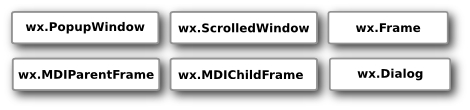
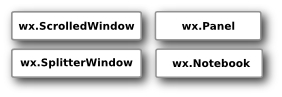
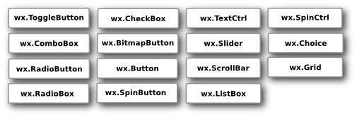
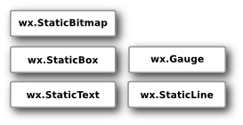
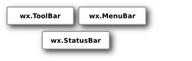
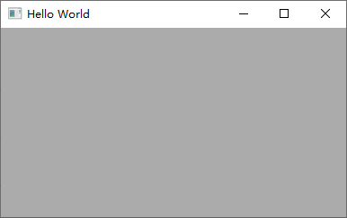

# wxPython 简介

- [wxPython 简介](#wxpython-简介)
  - [简介](#简介)
  - [wxPython API](#wxpython-api)
  - [安装](#安装)
  - [Hello World](#hello-world)

2021-03-24, 18:55
***

## 简介

[wxPython](https://wxpython.org/)是一个跨平台的 Python GUI 工具包。wxPython 对跨平台的 C++ GUI 组件库 wxWidgets 进行包装，形成 Python 模块。

wxPython Phoenix 是一个全新的 wxPython 实现，以实现更好、更快。相对原来的 wxPython版本，Phoenix 在速度、可维护性和可扩展性方面都得到了提高。

wxPython Phoenix 和 wxPython Classic 不完全兼容。

wxPython 包含五个基本模块：


- `Controls` 提供常见的 GUI 组件
- `Core` 包含开发中用到的常见类
- `GDI` (Graphics Device Interface) 包含一系列用于在组件上绘图的类，包括字体、颜色、刷子、图片等相关功能
- `Misc` 包含一些杂项
- `Windows` 包含各种窗口类，如 `Panel`, `Dialog`, `Frame` 等

## wxPython API

Base Widgets，一般不直接使用：


顶层 Widgets：



容器：



动态组件：



静态组件：



其它组件：




## 安装

通过 pip 安装 wxPython:

```
pip install -U wxPython
```

## Hello World

```py
import wx

app = wx.App(False)  # Create a new app, don't redirect stdout/stderr to a window.
frame = wx.Frame(None, wx.ID_ANY, "Hello World")  # A Frame is a top-level window.
frame.Show(True)  # Show the frame.

app.MainLoop()
```


